# DER (Diagrama Entidad-Relación)

Este documento mantiene el DER del proyecto a mano, usando **Mermaid** como motor de renderizado.

## Diagrama (Mermaid ER)

### Versión agrupada (paquetes + colores + cardinalidades)

> Nota: Mermaid `erDiagram` no soporta bien “paquetes” y colores. Para eso usamos `flowchart` con `subgraph` + `classDef`.

```mermaid
%%{init: {"theme":"base","themeVariables":{"fontFamily":"ui-sans-serif, system-ui, -apple-system, Segoe UI, Roboto, Helvetica, Arial"}}}%%
flowchart TB
  %% ================
  %% Styles
  %% ================
  classDef core fill:#F2F8FF,stroke:#2563EB,stroke-width:1px,color:#0B1B3A;
  classDef social fill:#F5F3FF,stroke:#7C3AED,stroke-width:1px,color:#1F1147;
  classDef auth fill:#FFF7ED,stroke:#F97316,stroke-width:1px,color:#3A1C00;
  classDef owner fill:#ECFDF5,stroke:#10B981,stroke-width:1px,color:#003325;
  classDef chat fill:#FDF2F8,stroke:#DB2777,stroke-width:1px,color:#3A0A1E;
  classDef infra fill:#F8FAFC,stroke:#334155,stroke-width:1px,color:#0F172A;

  %% ================
  %% Vertical view: package map (high-level)
  %% ================
  CORE_PKG["Core"]
  SOCIAL_PKG["Social"]
  AUTH_PKG["Auth"]
  OWNER_PKG["Owner"]
  CHAT_PKG["Chat/AI"]

  class CORE_PKG core
  class SOCIAL_PKG social
  class AUTH_PKG auth
  class OWNER_PKG owner
  class CHAT_PKG chat

  CORE_PKG -->|"feeds"| SOCIAL_PKG
  AUTH_PKG -->|"secures"| CORE_PKG
  OWNER_PKG -->|"moderates/owns"| CORE_PKG
  CHAT_PKG -->|"personalizes"| CORE_PKG

  %% ==========================
  %% Core (vertical, readable)
  %% ==========================
  subgraph CORE["Core (Restaurantes / Platos / Reviews)"]
    direction TB
    USERS["users<br/><small>PK: id<br/>UNIQUE: email, handle?<br/>role, display_name</small>"]
    CATEGORIES["categories<br/><small>PK: id<br/>UNIQUE: slug</small>"]
    RESTAURANTS["restaurants<br/><small>PK: id<br/>UNIQUE: slug<br/>FK: category_id?, created_by<br/>claim: claimed_by_user_id?</small>"]
    MENUS["menus<br/><small>PK: id<br/>FK: restaurant_id (UNIQUE)</small>"]
    DISHES["dishes<br/><small>PK: id<br/>FK: restaurant_id, created_by<br/>computed: name_normalized</small>"]
    DISH_REVIEWS["dish_reviews<br/><small>PK: id<br/>FK: dish_id, user_id<br/>anon: is_anonymous</small>"]
    DISH_REVIEW_PROS_CONS["dish_review_pros_cons<br/><small>PK: id<br/>FK: dish_review_id</small>"]
    DISH_REVIEW_TAGS["dish_review_tags<br/><small>PK: id<br/>FK: dish_review_id</small>"]
    DISH_REVIEW_IMAGES["dish_review_images<br/><small>PK: id<br/>FK: dish_review_id</small>"]
    WANT_TO_TRY_DISHES["want_to_try_dishes<br/><small>PK: (user_id, dish_id)</small>"]
    RESTAURANT_RATING_DIMENSIONS["restaurant_rating_dimensions<br/><small>PK: id<br/>UNIQUE: (restaurant_id,user_id,dimension)</small>"]
    RESTAURANT_PROS_CONS["restaurant_pros_cons<br/><small>PK: id</small>"]
    VISIT_DIARY_ENTRIES["visit_diary_entries<br/><small>PK: id<br/>FK: restaurant_id, created_by</small>"]
    RESERVATION_CLICKS["reservation_clicks<br/><small>PK: id<br/>FK: restaurant_id<br/>FK: user_id?</small>"]
    IMAGES["images (polimórfica)<br/><small>PK: id<br/>(entity_type, entity_id)</small>"]
  end

  %% ==========================
  %% Social (vertical)
  %% ==========================
  subgraph SOCIAL["Social / Moderación"]
    direction TB
    FOLLOWS["follows<br/><small>PK: (follower_id, following_id)<br/>no-self-follow</small>"]
    LIKES["likes<br/><small>PK: (user_id, review_id)</small>"]
    COMMENTS["comments<br/><small>PK: id<br/>FK: review_id,user_id<br/>self FK: parent_comment_id?<br/>soft-delete: removed_at?</small>"]
    COMMENT_LIKES["comment_likes<br/><small>PK: (user_id, comment_id)</small>"]
    BOOKMARKS["bookmarks<br/><small>PK: (user_id, review_id)</small>"]
    NOTIFICATIONS["notifications<br/><small>PK: id<br/>FK: recipient_user_id, actor_user_id<br/>read: read_at?</small>"]
    REPORTS["reports (polimórfico)<br/><small>PK: id<br/>(entity_type, entity_id)</small>"]
  end

  %% ==========================
  %% Auth (vertical)
  %% ==========================
  subgraph AUTH["Auth / Seguridad"]
    direction TB
    REFRESH_TOKENS["refresh_tokens<br/><small>PK: jti<br/>FK: user_id</small>"]
    PASSWORD_RESET_TOKENS["password_reset_tokens<br/><small>PK: id<br/>FK: user_id<br/>UNIQUE: token_hash<br/>single-use: consumed_at?</small>"]
    EMAIL_VERIFICATION_TOKENS["email_verification_tokens<br/><small>PK: id<br/>FK: user_id<br/>UNIQUE: token_hash<br/>single-use: consumed_at?</small>"]
  end

  %% ==========================
  %% Owner (vertical)
  %% ==========================
  subgraph OWNER["Owner / Claim / Contenido"]
    direction TB
    RESTAURANT_CLAIMS["restaurant_claims<br/><small>PK: id<br/>FK: restaurant_id, claimant_user_id<br/>review: reviewed_by_admin_id?</small>"]
    RESTAURANT_OFFICIAL_PHOTOS["restaurant_official_photos<br/><small>PK: id<br/>FK: restaurant_id<br/>FK: uploaded_by_user_id?</small>"]
    DISH_REVIEW_OWNER_RESPONSES["dish_review_owner_responses<br/><small>PK: review_id (FK)<br/>1 response per review</small>"]
  end

  %% ==========================
  %% Chat/AI (vertical)
  %% ==========================
  subgraph CHAT["Chat / Perfil / Embeddings"]
    direction TB
    CHAT_CONVERSATIONS["chat_conversations<br/><small>PK: id<br/>FK: user_id?<br/>FK: restaurant_scope_id?</small>"]
    CHAT_MESSAGES["chat_messages<br/><small>PK: id<br/>FK: conversation_id</small>"]
    USER_TASTE_PROFILES["user_taste_profiles<br/><small>PK: user_id (FK)<br/>1:1 optional</small>"]
    DISH_REVIEW_EMBEDDINGS["dish_review_embeddings<br/><small>PK: dish_review_id (FK)<br/>1:1 optional</small>"]
    DISH_EMBEDDINGS["dish_embeddings<br/><small>PK: dish_id (FK)<br/>1:1 optional</small>"]
  end

  %% ================
  %% Apply styles
  %% ================
  %% NOTE: keep class assignments short; some renderers choke on very long lists.
  class USERS core
  class CATEGORIES core
  class RESTAURANTS core
  class MENUS core
  class DISHES core
  class DISH_REVIEWS core
  class DISH_REVIEW_PROS_CONS core
  class DISH_REVIEW_TAGS core
  class DISH_REVIEW_IMAGES core
  class WANT_TO_TRY_DISHES core
  class RESTAURANT_RATING_DIMENSIONS core
  class RESTAURANT_PROS_CONS core
  class VISIT_DIARY_ENTRIES core
  class RESERVATION_CLICKS core

  class IMAGES infra

  class FOLLOWS social
  class LIKES social
  class COMMENTS social
  class COMMENT_LIKES social
  class BOOKMARKS social
  class NOTIFICATIONS social
  class REPORTS social

  class REFRESH_TOKENS auth
  class PASSWORD_RESET_TOKENS auth
  class EMAIL_VERIFICATION_TOKENS auth

  class RESTAURANT_CLAIMS owner
  class RESTAURANT_OFFICIAL_PHOTOS owner
  class DISH_REVIEW_OWNER_RESPONSES owner

  class CHAT_CONVERSATIONS chat
  class CHAT_MESSAGES chat
  class USER_TASTE_PROFILES chat
  class DISH_REVIEW_EMBEDDINGS chat
  class DISH_EMBEDDINGS chat

  %% ================
  %% Relationships (cardinalities)
  %% Cardinality legend:
  %% 1, 0..1, 0..*, 1..*
  %% ================

  %% Categories / Restaurants
  CATEGORIES -- "categorizes (1 → 0..*)" --> RESTAURANTS

  %% Users create restaurants and dishes (FK created_by)
  USERS -- "creates (1 → 0..*)" --> RESTAURANTS
  USERS -- "creates (1 → 0..*)" --> DISHES

  %% Restaurant → Dish
  RESTAURANTS -- "has dishes (1 → 0..*)" --> DISHES

  %% Restaurant → Menu (one-to-one optional)
  RESTAURANTS -- "has menu (1 → 0..1)" --> MENUS

  %% Dish → Reviews
  DISHES -- "has reviews (1 → 0..*)" --> DISH_REVIEWS
  USERS -- "writes reviews (1 → 0..*)" --> DISH_REVIEWS

  %% Review details
  DISH_REVIEWS -- "has pros/cons (1 → 0..*)" --> DISH_REVIEW_PROS_CONS
  DISH_REVIEWS -- "has tags (1 → 0..*)" --> DISH_REVIEW_TAGS
  DISH_REVIEWS -- "has images (1 → 0..*)" --> DISH_REVIEW_IMAGES

  %% Wishlist (join table)
  USERS -- "wants to try (1 → 0..*)" --> WANT_TO_TRY_DISHES
  DISHES -- "is wanted (1 → 0..*)" --> WANT_TO_TRY_DISHES

  %% Restaurant ratings/pros-cons/diary/clicks
  RESTAURANTS -- "has dimension ratings (1 → 0..*)" --> RESTAURANT_RATING_DIMENSIONS
  USERS -- "rates (1 → 0..*)" --> RESTAURANT_RATING_DIMENSIONS
  RESTAURANTS -- "has pros/cons (1 → 0..*)" --> RESTAURANT_PROS_CONS
  RESTAURANTS -- "has diary entries (1 → 0..*)" --> VISIT_DIARY_ENTRIES
  USERS -- "creates diary entries (1 → 0..*)" --> VISIT_DIARY_ENTRIES
  RESTAURANTS -- "has reservation clicks (1 → 0..*)" --> RESERVATION_CLICKS
  USERS -- "clicks (0..1 → 0..*)" --> RESERVATION_CLICKS

  %% Social
  USERS -- "follows (1 → 0..*)" --> FOLLOWS
  USERS -- "likes reviews (1 → 0..*)" --> LIKES
  DISH_REVIEWS -- "is liked (1 → 0..*)" --> LIKES

  DISH_REVIEWS -- "has comments (1 → 0..*)" --> COMMENTS
  USERS -- "writes comments (1 → 0..*)" --> COMMENTS
  COMMENTS -- "replies (0..1 → 0..*)" --> COMMENTS

  USERS -- "likes comments (1 → 0..*)" --> COMMENT_LIKES
  COMMENTS -- "is liked (1 → 0..*)" --> COMMENT_LIKES

  USERS -- "bookmarks (1 → 0..*)" --> BOOKMARKS
  DISH_REVIEWS -- "is bookmarked (1 → 0..*)" --> BOOKMARKS

  USERS -- "receives notifications (1 → 0..*)" --> NOTIFICATIONS

  %% Auth tokens
  USERS -- "has refresh tokens (1 → 0..*)" --> REFRESH_TOKENS
  USERS -- "has reset tokens (1 → 0..*)" --> PASSWORD_RESET_TOKENS
  USERS -- "has verification tokens (1 → 0..*)" --> EMAIL_VERIFICATION_TOKENS

  %% Owner / claims
  RESTAURANTS -- "has claims (1 → 0..*)" --> RESTAURANT_CLAIMS
  USERS -- "submits claim (1 → 0..*)" --> RESTAURANT_CLAIMS
  USERS -- "reviews claim (0..1 → 0..*)" --> RESTAURANT_CLAIMS

  RESTAURANTS -- "has official photos (1 → 0..*)" --> RESTAURANT_OFFICIAL_PHOTOS
  USERS -- "uploads official photo (0..1 → 0..*)" --> RESTAURANT_OFFICIAL_PHOTOS

  DISH_REVIEWS -- "has owner response (1 → 0..1)" --> DISH_REVIEW_OWNER_RESPONSES
  USERS -- "authors owner response (0..1 → 0..*)" --> DISH_REVIEW_OWNER_RESPONSES

  %% Chat / profiles / embeddings
  USERS -- "opens chat (0..1 → 0..*)" --> CHAT_CONVERSATIONS
  RESTAURANTS -- "scopes chat (0..1 → 0..*)" --> CHAT_CONVERSATIONS
  CHAT_CONVERSATIONS -- "has messages (1 → 0..*)" --> CHAT_MESSAGES

  USERS -- "has taste profile (1 → 0..1)" --> USER_TASTE_PROFILES
  DISH_REVIEWS -- "has embedding (1 → 0..1)" --> DISH_REVIEW_EMBEDDINGS
  DISHES -- "has embedding (1 → 0..1)" --> DISH_EMBEDDINGS

  %% Polymorphic tables (documented, not strict FKs)
  %% - IMAGES points to multiple entities via (entity_type, entity_id)
  %% - REPORTS points to review/comment/user via (entity_type, entity_id)
```



### Versión “plana” (Mermaid ER)

```mermaid
erDiagram
  USERS {
    uuid id PK
    citext email "UNIQUE"
    string password_hash
    string display_name
    string avatar_url
    citext handle "UNIQUE NULL"
    string bio
    string location
    enum user_role role
    datetime created_at
    datetime updated_at
    datetime email_verified_at "NULL"
  }

  CATEGORIES {
    int id PK
    string slug "UNIQUE"
    string name
    string description "NULL"
    string image_url "NULL"
    int display_order
  }

  RESTAURANTS {
    uuid id PK
    string slug "UNIQUE"
    string name
    text description "NULL"
    string location_name
    string city "NULL"
    numeric latitude "NULL"
    numeric longitude "NULL"
    int category_id FK
    text cover_image_url "NULL"
    string google_place_id "NULL"
    text website "NULL"
    string phone_number "NULL"
    text google_maps_url "NULL"
    smallint price_level "NULL"
    jsonb opening_hours "NULL"
    numeric google_rating "NULL"
    int google_user_ratings_total "NULL"
    jsonb google_photos "NULL"
    text editorial_summary "NULL"
    string editorial_summary_lang "NULL"
    text[] cuisine_types "NULL"
    datetime google_cached_at "NULL"
    text reservation_url "NULL"
    string reservation_provider "NULL"
    jsonb reservation_partner_meta "NULL"
    uuid claimed_by_user_id FK
    datetime claimed_at "NULL"
    numeric computed_rating
    int review_count
    uuid created_by FK
    datetime created_at
    datetime updated_at
  }

  MENUS {
    int id PK
    uuid restaurant_id FK "UNIQUE"
    string image_url
    date upload_date
    datetime updated_at
  }

  DISHES {
    uuid id PK
    uuid restaurant_id FK
    string name
    text name_normalized
    text description "NULL"
    string cover_image_url "NULL"
    enum price_tier price_tier "NULL"
    numeric computed_rating
    int review_count
    uuid created_by FK
    datetime created_at
    text editorial_blurb "NULL"
    string editorial_blurb_lang "NULL"
    string editorial_blurb_source "NULL"
    datetime editorial_cached_at "NULL"
  }

  DISH_REVIEWS {
    uuid id PK
    uuid dish_id FK
    uuid user_id FK
    date date_tasted
    time time_tasted "NULL"
    text note
    numeric rating
    enum portion_size portion_size "NULL"
    bool would_order_again "NULL"
    string visited_with "NULL"
    bool is_anonymous
    smallint presentation "NULL"
    smallint value_prop "NULL"
    smallint execution "NULL"
    datetime created_at
    datetime updated_at
  }

  DISH_REVIEW_PROS_CONS {
    int id PK
    uuid dish_review_id FK
    enum dish_review_pros_cons_type type
    string text
  }

  DISH_REVIEW_TAGS {
    int id PK
    uuid dish_review_id FK
    string tag
  }

  DISH_REVIEW_IMAGES {
    uuid id PK
    uuid dish_review_id FK
    string url
    string alt_text "NULL"
    int display_order
    datetime uploaded_at
  }

  WANT_TO_TRY_DISHES {
    uuid user_id PK, FK
    uuid dish_id PK, FK
    datetime created_at
  }

  RESTAURANT_RATING_DIMENSIONS {
    int id PK
    uuid restaurant_id FK
    uuid user_id FK
    enum rating_dimension dimension
    numeric score
  }

  RESTAURANT_PROS_CONS {
    int id PK
    uuid restaurant_id FK
    uuid user_id FK
    enum pros_cons_type type
    string text
  }

  VISIT_DIARY_ENTRIES {
    int id PK
    uuid restaurant_id FK
    date visit_date
    text diary_text
    uuid created_by FK
    datetime created_at
  }

  RESERVATION_CLICKS {
    bigint id PK
    uuid restaurant_id FK
    uuid user_id FK "NULL"
    string provider "NULL"
    datetime clicked_at
    text referrer "NULL"
    jsonb utm "NULL"
    text session_id "NULL"
  }

  IMAGES {
    uuid id PK
    enum entity_type entity_type
    uuid entity_id
    string url
    string alt_text "NULL"
    int display_order
    datetime uploaded_at
  }

  RESTAURANT_OFFICIAL_PHOTOS {
    uuid id PK
    uuid restaurant_id FK
    string url
    string alt_text "NULL"
    int display_order
    uuid uploaded_by_user_id FK "NULL"
    datetime created_at
  }

  DISH_REVIEW_OWNER_RESPONSES {
    uuid review_id PK, FK
    uuid owner_user_id FK "NULL"
    text body
    datetime created_at
    datetime updated_at
  }

  FOLLOWS {
    uuid follower_id PK, FK
    uuid following_id PK, FK
    datetime created_at
  }

  LIKES {
    uuid user_id PK, FK
    uuid review_id PK, FK
    datetime created_at
  }

  COMMENTS {
    uuid id PK
    uuid review_id FK
    uuid user_id FK
    uuid parent_comment_id FK "NULL"
    string body
    datetime created_at
    datetime updated_at
    datetime removed_at "NULL"
  }

  COMMENT_LIKES {
    uuid user_id PK, FK
    uuid comment_id PK, FK
    datetime created_at
  }

  BOOKMARKS {
    uuid user_id PK, FK
    uuid review_id PK, FK
    datetime created_at
  }

  NOTIFICATIONS {
    uuid id PK
    uuid recipient_user_id FK
    uuid actor_user_id FK
    string kind
    uuid target_review_id FK "NULL"
    uuid target_user_id FK "NULL"
    uuid target_restaurant_id FK "NULL"
    uuid target_comment_id FK "NULL"
    string text
    datetime created_at
    datetime read_at "NULL"
  }

  REPORTS {
    uuid id PK
    uuid reporter_user_id FK "NULL"
    string entity_type
    uuid entity_id
    string reason
    string status
    datetime created_at
  }

  REFRESH_TOKENS {
    string jti PK
    uuid user_id FK
    datetime expires_at
    datetime revoked_at "NULL"
    datetime created_at
  }

  PASSWORD_RESET_TOKENS {
    bigint id PK
    uuid user_id FK
    string token_hash "UNIQUE"
    datetime expires_at
    datetime created_at
    datetime consumed_at "NULL"
  }

  EMAIL_VERIFICATION_TOKENS {
    bigint id PK
    uuid user_id FK
    string token_hash "UNIQUE"
    datetime expires_at
    datetime created_at
    datetime consumed_at "NULL"
  }

  RESTAURANT_CLAIMS {
    uuid id PK
    uuid restaurant_id FK
    uuid claimant_user_id FK
    string status
    string verification_method
    jsonb verification_payload "NULL"
    text[] evidence_urls "NULL"
    string contact_email "NULL"
    datetime submitted_at
    datetime reviewed_at "NULL"
    uuid reviewed_by_admin_id FK "NULL"
    text rejection_reason "NULL"
    datetime expires_at "NULL"
  }

  CHAT_CONVERSATIONS {
    uuid id PK
    uuid user_id FK "NULL"
    enum chat_agent agent
    string title "NULL"
    uuid restaurant_scope_id FK "NULL"
    datetime started_at
    datetime last_message_at
  }

  CHAT_MESSAGES {
    uuid id PK
    uuid conversation_id FK
    string role
    text content "NULL"
    jsonb tool_calls "NULL"
    jsonb tool_result "NULL"
    int input_tokens "NULL"
    int output_tokens "NULL"
    datetime created_at
  }

  USER_TASTE_PROFILES {
    uuid user_id PK, FK
    enum taste_pillar dominant_pillar "NULL"
    jsonb top_neighborhoods
    jsonb top_categories
    enum price_band avg_price_band "NULL"
    jsonb favorite_tags
    jsonb preferred_hours
    jsonb allergies
    int version
    int review_count_at_last_compute
    datetime updated_at
  }

  DISH_REVIEW_EMBEDDINGS {
    uuid dish_review_id PK, FK
    vector embedding
    datetime updated_at
  }

  DISH_EMBEDDINGS {
    uuid dish_id PK, FK
    vector embedding
    string source_text_hash
    datetime updated_at
  }

  %% Core relations
  CATEGORIES ||--o{ RESTAURANTS : categorizes
  USERS ||--o{ RESTAURANTS : creates
  USERS ||--o{ DISHES : creates
  RESTAURANTS ||--o{ DISHES : has
  RESTAURANTS ||--|| MENUS : has
  DISHES ||--o{ DISH_REVIEWS : has
  USERS ||--o{ DISH_REVIEWS : writes

  %% Review detail
  DISH_REVIEWS ||--o{ DISH_REVIEW_PROS_CONS : has
  DISH_REVIEWS ||--o{ DISH_REVIEW_TAGS : has
  DISH_REVIEWS ||--o{ DISH_REVIEW_IMAGES : has
  DISH_REVIEWS ||--o| DISH_REVIEW_OWNER_RESPONSES : owner_response

  %% Restaurant aggregates / diaries / clicks
  RESTAURANTS ||--o{ RESTAURANT_RATING_DIMENSIONS : rated_by
  USERS ||--o{ RESTAURANT_RATING_DIMENSIONS : rates
  RESTAURANTS ||--o{ RESTAURANT_PROS_CONS : has
  RESTAURANTS ||--o{ VISIT_DIARY_ENTRIES : diary
  RESTAURANTS ||--o{ RESERVATION_CLICKS : clicks

  %% Social / moderation
  USERS ||--o{ FOLLOWS : follower
  USERS ||--o{ FOLLOWS : following
  USERS ||--o{ LIKES : likes
  DISH_REVIEWS ||--o{ LIKES : liked
  DISH_REVIEWS ||--o{ COMMENTS : commented_on
  USERS ||--o{ COMMENTS : writes
  COMMENTS ||--o{ COMMENT_LIKES : liked
  USERS ||--o{ COMMENT_LIKES : likes
  USERS ||--o{ BOOKMARKS : saves
  DISH_REVIEWS ||--o{ BOOKMARKS : saved
  USERS ||--o{ NOTIFICATIONS : receives
  USERS ||--o{ NOTIFICATIONS : acts
  RESTAURANTS ||--o{ NOTIFICATIONS : targets
  DISH_REVIEWS ||--o{ NOTIFICATIONS : targets
  COMMENTS ||--o{ NOTIFICATIONS : targets

  %% Wishlist
  USERS ||--o{ WANT_TO_TRY_DISHES : wants
  DISHES ||--o{ WANT_TO_TRY_DISHES : wanted

  %% Auth tokens
  USERS ||--o{ REFRESH_TOKENS : has
  USERS ||--o{ PASSWORD_RESET_TOKENS : has
  USERS ||--o{ EMAIL_VERIFICATION_TOKENS : has

  %% Claims / owner content
  RESTAURANTS ||--o{ RESTAURANT_CLAIMS : claimed
  USERS ||--o{ RESTAURANT_CLAIMS : claimant
  USERS ||--o{ RESTAURANT_CLAIMS : reviewed_by
  RESTAURANTS ||--o{ RESTAURANT_OFFICIAL_PHOTOS : official_photos
  USERS ||--o{ RESTAURANT_OFFICIAL_PHOTOS : uploads

  %% Chat
  USERS ||--o{ CHAT_CONVERSATIONS : chats
  RESTAURANTS ||--o{ CHAT_CONVERSATIONS : scope
  CHAT_CONVERSATIONS ||--o{ CHAT_MESSAGES : has
  USERS ||--|| USER_TASTE_PROFILES : profile

  %% Embeddings
  DISH_REVIEWS ||--|| DISH_REVIEW_EMBEDDINGS : embeds
  DISHES ||--|| DISH_EMBEDDINGS : embeds

  %% Polymorphic images note:
  %% IMAGES.entity_id points to multiple entities depending on IMAGES.entity_type
```

## Notas de modelado

- **Relación polimórfica (`images`)**: `images.entity_type` + `images.entity_id` apunta a distintas entidades según el tipo (no hay FKs directas a `restaurants`, `dishes`, etc.).
- **Nullable vs migrations**: este DER refleja el **estado actual de los modelos** (no necesariamente el “NOT NULL” original de migraciones antiguas).

## Catálogo de entidades (atributos + comportamientos)

> “Comportamientos” acá significa **reglas del dominio/modelo** (unicidad, soft-delete, polimorfismo, 1:1, cascadas, restricciones de integridad), no lógica de UI.

### Core (Restaurantes / Platos / Reviews)

- **`users`**
  - **Atributos**: `id (PK)`, `email (UNIQUE)`, `handle (UNIQUE, NULL)`, `role`, `display_name`, `avatar_url`, `bio`, `location`, `email_verified_at`, `created_at`, `updated_at`
  - **Comportamientos**:
    - **Roles**: `admin | critic | user`
    - **Email verificado**: `email_verified_at != NULL`

- **`categories`**
  - **Atributos**: `id (PK)`, `slug (UNIQUE)`, `name`, `description`, `image_url`, `display_order`
  - **Comportamientos**: **clasifica** restaurantes (relación 1 → 0..*)

- **`restaurants`**
  - **Atributos**: `id (PK)`, `slug (UNIQUE)`, `name`, `description`, `location_name`, `city`, `lat/lng`, `category_id (FK, NULL)`, `created_by (FK users)`, `claimed_by_user_id (FK users, NULL)`, `claimed_at`, `computed_rating`, `review_count`, `created_at`, `updated_at`, (campos Google/Reservas)
  - **Comportamientos**:
    - **Claim (owner)**: `claimed_by_user_id` indica restaurante reclamado (si existe)
    - **Menú 1:1 opcional** con `menus` (por `restaurant_id UNIQUE`)

- **`menus`**
  - **Atributos**: `id (PK)`, `restaurant_id (FK, UNIQUE)`, `image_url`, `upload_date`, `updated_at`
  - **Comportamientos**: **un menú por restaurante** (1 → 0..1)

- **`dishes`**
  - **Atributos**: `id (PK)`, `restaurant_id (FK)`, `name`, `name_normalized (computed)`, `description`, `price_tier`, `cover_image_url`, `created_by (FK users)`, `computed_rating`, `review_count`, `created_at`, (campos editoriales)
  - **Comportamientos**:
    - `name_normalized` se deriva (computed) para búsqueda/normalización

- **`dish_reviews`**
  - **Atributos**: `id (PK)`, `dish_id (FK)`, `user_id (FK)`, `date_tasted`, `time_tasted`, `note`, `rating`, `portion_size`, `would_order_again`, `visited_with`, `is_anonymous`, `presentation/value_prop/execution`, `created_at`, `updated_at`
  - **Comportamientos**:
    - **Dimensiones** (`presentation`, `value_prop`, `execution`) restringidas a rangos (checks)
    - **Anonimato**: `is_anonymous=true` oculta identidad en capa app

- **`dish_review_pros_cons`**
  - **Atributos**: `id (PK)`, `dish_review_id (FK)`, `type (pro|con)`, `text`
  - **Comportamientos**: lista de pros/cons por review (1 → 0..*)

- **`dish_review_tags`**
  - **Atributos**: `id (PK)`, `dish_review_id (FK)`, `tag`
  - **Comportamientos**: tags libres por review (1 → 0..*)

- **`dish_review_images`**
  - **Atributos**: `id (PK)`, `dish_review_id (FK)`, `url`, `alt_text`, `display_order`, `uploaded_at`
  - **Comportamientos**: imágenes ordenables por review

- **`want_to_try_dishes`**
  - **Atributos**: `(user_id, dish_id) (PK compuesta, FKs)`, `created_at`
  - **Comportamientos**: **wishlist**; PK compuesta evita duplicados

- **`restaurant_rating_dimensions`**
  - **Atributos**: `id (PK)`, `restaurant_id (FK)`, `user_id (FK)`, `dimension`, `score`
  - **Comportamientos**: **UNIQUE** por `(restaurant_id, user_id, dimension)` (una nota por dimensión)

- **`restaurant_pros_cons`**
  - **Atributos**: `id (PK)`, `restaurant_id (FK)`, `user_id (FK)`, `type (pro|con)`, `text`
  - **Comportamientos**: pros/cons a nivel restaurante

- **`visit_diary_entries`**
  - **Atributos**: `id (PK)`, `restaurant_id (FK)`, `visit_date`, `diary_text`, `created_by (FK users)`, `created_at`
  - **Comportamientos**: diario de visitas por restaurante

- **`reservation_clicks`**
  - **Atributos**: `id (PK)`, `restaurant_id (FK)`, `user_id (FK, NULL)`, `provider`, `clicked_at`, `referrer`, `utm (JSON)`, `session_id`
  - **Comportamientos**: tracking de CTA “reservar”; puede ser anónimo (`user_id NULL`)

- **`images` (polimórfica)**
  - **Atributos**: `id (PK)`, `entity_type`, `entity_id`, `url`, `alt_text`, `display_order`, `uploaded_at`
  - **Comportamientos**:
    - **Polimórfica**: `entity_type + entity_id` apuntan a distintas entidades según el tipo (sin FK estricta)

### Social / Moderación

- **`follows`**
  - **Atributos**: `(follower_id, following_id) (PK compuesta)`, `created_at`
  - **Comportamientos**: relación asimétrica; **no-self-follow** (check)

- **`likes`**
  - **Atributos**: `(user_id, review_id) (PK compuesta)`, `created_at`
  - **Comportamientos**: un like por usuario por review (no duplicados)

- **`comments`**
  - **Atributos**: `id (PK)`, `review_id (FK)`, `user_id (FK)`, `parent_comment_id (FK self, NULL)`, `body`, `created_at`, `updated_at`, `removed_at (NULL)`
  - **Comportamientos**:
    - **Thread**: `parent_comment_id` habilita respuesta; `removed_at` es **soft-delete**

- **`comment_likes`**
  - **Atributos**: `(user_id, comment_id) (PK compuesta)`, `created_at`
  - **Comportamientos**: un like por usuario por comment

- **`bookmarks`**
  - **Atributos**: `(user_id, review_id) (PK compuesta)`, `created_at`
  - **Comportamientos**: “guardados”; sin duplicados

- **`notifications`**
  - **Atributos**: `id (PK)`, `recipient_user_id (FK)`, `actor_user_id (FK)`, `kind`, `target_* (FKs, NULL)`, `text`, `created_at`, `read_at (NULL)`
  - **Comportamientos**: inbox; `read_at` marca leída; `kind` limitado por check

- **`reports` (polimórfico)**
  - **Atributos**: `id (PK)`, `reporter_user_id (FK, NULL)`, `entity_type`, `entity_id`, `reason`, `status`, `created_at`
  - **Comportamientos**:
    - **Polimórfico**: reporta `review|comment|user` via `(entity_type, entity_id)`
    - `reporter_user_id` puede ser NULL para sobrevivir borrado de cuenta (SET NULL)

### Auth / Seguridad

- **`refresh_tokens`**
  - **Atributos**: `jti (PK)`, `user_id (FK)`, `expires_at`, `revoked_at (NULL)`, `created_at`
  - **Comportamientos**: revocación via `revoked_at`

- **`password_reset_tokens`**
  - **Atributos**: `id (PK)`, `user_id (FK)`, `token_hash (UNIQUE)`, `expires_at`, `created_at`, `consumed_at (NULL)`
  - **Comportamientos**: single-use via `consumed_at`; se almacena hash (no token plano)

- **`email_verification_tokens`**
  - **Atributos**: `id (PK)`, `user_id (FK)`, `token_hash (UNIQUE)`, `expires_at`, `created_at`, `consumed_at (NULL)`
  - **Comportamientos**: single-use via `consumed_at`; se almacena hash

### Owner / Claim / Contenido

- **`restaurant_claims`**
  - **Atributos**: `id (PK)`, `restaurant_id (FK)`, `claimant_user_id (FK)`, `status`, `verification_method`, `verification_payload (JSON, NULL)`, `evidence_urls (array, NULL)`, `contact_email`, `submitted_at`, `reviewed_at`, `reviewed_by_admin_id (FK, NULL)`, `rejection_reason`, `expires_at`
  - **Comportamientos**:
    - **Workflow**: `pending → verifying → verified/rejected → revoked` (valores en app; DB es string)
    - Auditoría de revisión via `reviewed_*`

- **`restaurant_official_photos`**
  - **Atributos**: `id (PK)`, `restaurant_id (FK)`, `url`, `alt_text`, `display_order`, `uploaded_by_user_id (FK, NULL)`, `created_at`
  - **Comportamientos**: fotos oficiales separadas de fotos de comensales

- **`dish_review_owner_responses`**
  - **Atributos**: `review_id (PK, FK)`, `owner_user_id (FK, NULL)`, `body`, `created_at`, `updated_at`
  - **Comportamientos**: **máximo 1 respuesta por review** (PK = `review_id`)

### Chat / Perfil / Embeddings

- **`chat_conversations`**
  - **Atributos**: `id (PK)`, `user_id (FK, NULL)`, `agent`, `title (NULL)`, `restaurant_scope_id (FK, NULL)`, `started_at`, `last_message_at`
  - **Comportamientos**: permite chat anónimo (`user_id NULL`); scope a restaurante para agente Business

- **`chat_messages`**
  - **Atributos**: `id (PK)`, `conversation_id (FK)`, `role`, `content (NULL)`, `tool_calls (JSON, NULL)`, `tool_result (JSON, NULL)`, `input_tokens/output_tokens (NULL)`, `created_at`
  - **Comportamientos**: persiste tool calls/result para replay/auditoría

- **`user_taste_profiles`**
  - **Atributos**: `user_id (PK, FK)`, `dominant_pillar (NULL)`, `top_neighborhoods (JSON)`, `top_categories (JSON)`, `avg_price_band (NULL)`, `favorite_tags (JSON)`, `preferred_hours (JSON)`, `allergies (JSON)`, `version`, `review_count_at_last_compute`, `updated_at`
  - **Comportamientos**:
    - **1:1 opcional** con `users` (puede no existir)
    - `allergies` es **solo declarado** (no inferido)

- **`dish_review_embeddings`**
  - **Atributos**: `dish_review_id (PK, FK)`, `embedding (vector)`, `updated_at`
  - **Comportamientos**: **1:1 opcional** con review; se recomputa en create/update

- **`dish_embeddings`**
  - **Atributos**: `dish_id (PK, FK)`, `embedding (vector)`, `source_text_hash`, `updated_at`
  - **Comportamientos**: **1:1 opcional** con dish; `source_text_hash` evita recomputes

