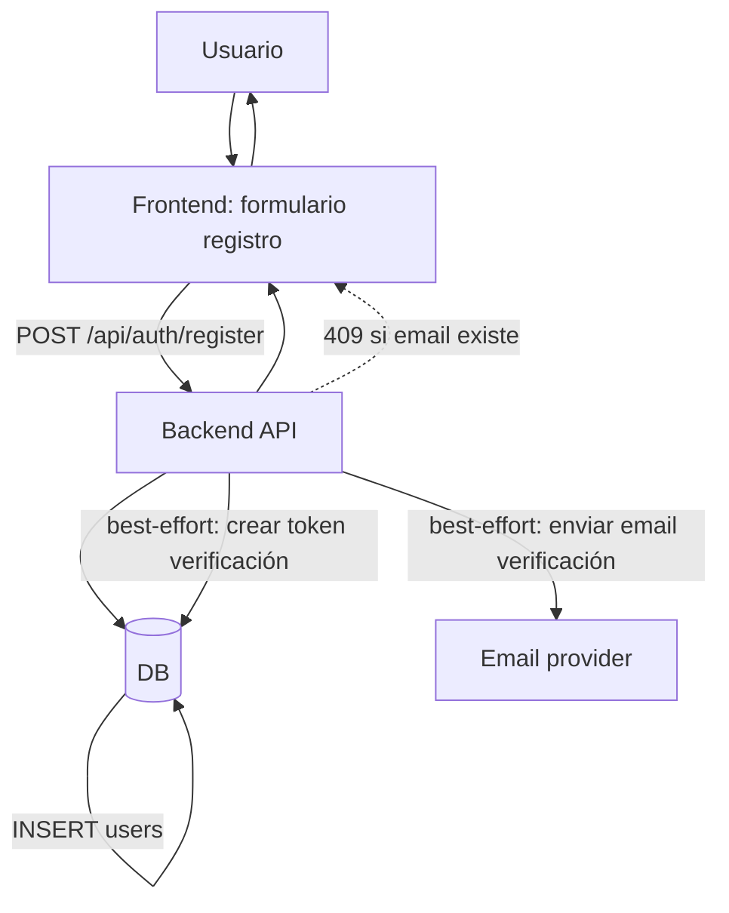
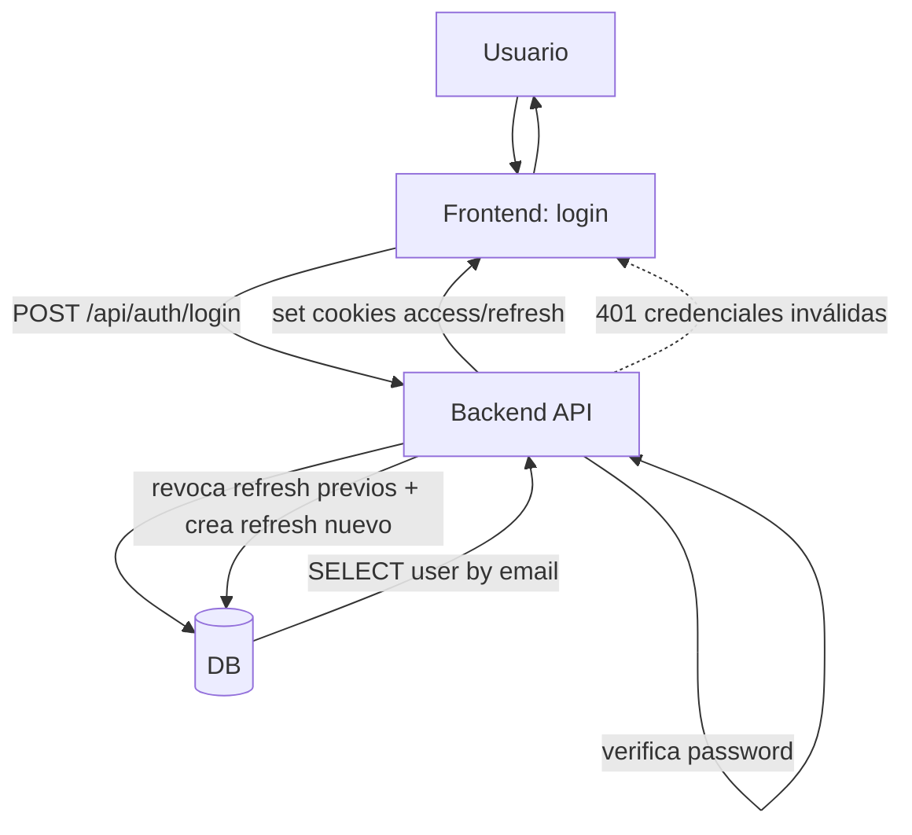
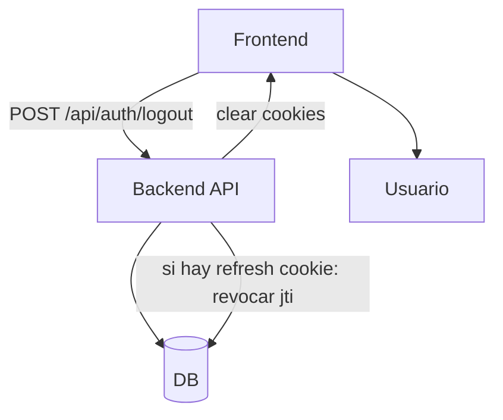
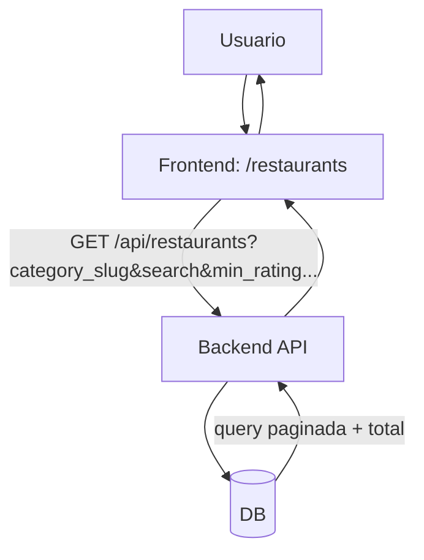

# Casos de uso (flujogramas)

Este documento reúne los **casos de uso principales** del proyecto y sus **flujogramas** en Mermaid.

## Índice de casos de uso

### Autenticación y cuenta
- **CU-01** Registro (crear cuenta)
- **CU-02** Login (iniciar sesión) + cookies
- **CU-03** Refresh token (rotación de sesión)
- **CU-04** Logout (cerrar sesión)
- **CU-05** Verificar email (token de verificación)
- **CU-06** Olvidé mi contraseña (solicitar reset, no filtra existencia)
- **CU-07** Resetear contraseña (token single-use + revocar sesiones)

### Exploración de contenido
- **CU-08** Listar restaurantes (filtros/paginación)
- **CU-09** Ver detalle de restaurante (incluye enrichment lazy de Google)
- **CU-10** Listar platos de un restaurante + ver detalle de plato
- **CU-11** Listar reviews de un plato

### Creación/edición de contenido (critic/admin o usuario)
- **CU-12** Crear restaurante (dedup por `google_place_id` + slug único)
- **CU-13** Crear plato (admin/critic)
- **CU-14** “Compose”: sugerir plato existente vs crear nuevo (anti-duplicados)
- **CU-15** Crear review (con pros/cons, tags, imágenes; recalcula agregados)
- **CU-16** Editar review (solo autor; recalcula agregados)
- **CU-17** Borrar review (autor o admin; recalcula agregados)

### Social
- **CU-18** Like / Unlike review (idempotente + notificación)
- **CU-19** Guardar / Quitar guardado (bookmarks) + listar guardados
- **CU-20** Comentar una review (anti-spam + notificación)
- **CU-21** Responder a un comentario (máx. 2 niveles + notificaciones)
- **CU-22** Editar / Borrar comentario (editar: autor; borrar: autor o admin; soft-delete)
- **CU-23** Seguir / Dejar de seguir usuario (idempotente + notificación)
- **CU-24** Notificaciones: listar + marcar leída + marcar todas

### Owner / B2B (claim + contenido oficial)
- **CU-25** Reclamar restaurante (claim pending; bloqueos por duplicado/owner existente)
- **CU-26** Verificar claim por email-token (domain_email) → aprobar claim
- **CU-27** Owner dashboard: listar reviews del restaurante
- **CU-28** Owner: crear/editar/borrar respuesta a review (1 por review)
- **CU-29** Owner: subir/eliminar fotos oficiales (cap 5)

### Asistente (chat)
- **CU-30** Chat (enviar mensaje + historial; respuesta del modelo)
- **CU-31** Sommelier multimodal: identificar plato por foto y matchear contra el catálogo

---

## Flujogramas (Mermaid)

### CU-01 Registro (crear cuenta)



### CU-02 Login (iniciar sesión) + cookies



### CU-03 Refresh token (rotación de sesión)

```mermaid
flowchart TB
  FE[Frontend] -->|POST /api/auth/refresh (cookie refresh)| API[Backend API]
  API --> DB[(DB)]
  API -->|valida JWT refresh + jti| API
  API -->|marca refresh anterior como revoked_at| DB
  API -->|crea nuevo refresh row + JWTs| DB
  API -->|set cookies nuevas| FE

  API -.->|401 missing/invalid/expired| FE
  API -.->|401 reuse detectado => revoca todas| DB
```

### CU-04 Logout (cerrar sesión)



### CU-05 Verificar email (token de verificación)

```mermaid
flowchart TB
  U[Usuario] -->|clic link email| FE[Frontend: verify-email page]
  FE -->|POST /api/auth/verify-email/{token}| API[Backend API]
  API --> DB[(DB)]
  API -->|consume token (single-use)| DB
  API -->|set email_verified_at| DB
  API --> FE

  API -.->|400 token inválido/expirado| FE
```

### CU-06 Olvidé mi contraseña (solicitar reset)

```mermaid
flowchart TB
  U[Usuario] --> FE[Frontend: forgot password]
  FE -->|POST /api/auth/forgot-password| API[Backend API]
  API --> DB[(DB)]
  API -->|si email existe: crea token reset + email| EMAIL[Email provider]
  API -->|si NO existe: NO revela (igual 204)| FE
  FE --> U
```

### CU-07 Resetear contraseña (token single-use + revocar sesiones)

```mermaid
flowchart TB
  U[Usuario] --> FE[Frontend: reset-password page]
  FE -->|POST /api/auth/reset-password| API[Backend API]
  API --> DB[(DB)]
  API -->|valida token_hash + exp + consumed_at| DB
  API -->|update password_hash| DB
  API -->|consume token (consumed_at)| DB
  API -->|revoca todos los refresh_tokens activos| DB
  API --> FE

  API -.->|400 token inválido/expirado| FE
```

### CU-08 Listar restaurantes (filtros/paginación)



### CU-09 Ver detalle de restaurante (lazy Google enrichment)

```mermaid
flowchart TB
  U[Usuario] --> FE[Frontend: /restaurants/{slug}]
  FE -->|GET /api/restaurants/{slug}| API[Backend API]
  API --> DB[(DB)]
  API -->|carga detail| DB
  API -->|si google_place_id && cache stale: encola refresh| BG[Background task]
  BG -->|abre nueva sesión| DB
  BG -->|llama Google Places| GOOGLE[Google Places]
  BG -->|persist fields + google_cached_at| DB
  API --> FE

  API -.->|404 not found (o slug redirect)| FE
```

### CU-10 Platos: listar por restaurante + ver detalle

```mermaid
flowchart TB
  FE[Frontend] -->|GET /api/restaurants/{slug}/dishes| API[Backend API]
  API --> DB[(DB)]
  API -->|verifica restaurant| DB
  API --> FE

  FE -->|GET /api/dishes/{dish_id}| API
  API --> DB
  API --> FE
```

### CU-11 Listar reviews de un plato

```mermaid
flowchart TB
  FE[Frontend] -->|GET /api/dishes/{dish_id}/reviews| API[Backend API]
  API --> DB[(DB)]
  API -->|verifica dish existe| DB
  API -->|carga reviews + relaciones| DB
  API --> FE

  API -.->|404 dish not found| FE
```

### CU-12 Crear restaurante (admin/critic) con dedup + slug único

```mermaid
flowchart TB
  U[Critic/Admin] --> FE[Frontend: AddRestaurantModal]
  FE -->|GET /api/restaurants/match-candidates| API[Backend API]
  API --> DB[(DB)]
  API --> FE

  FE -->|POST /api/restaurants| API
  API -->|require_role admin/critic| API
  API --> DB
  API -->|si google_place_id ya existe: retornar existente (200)| FE
  API -->|si no: intentar INSERT con slug; retry si colisión| DB
  API --> FE

  API -.->|409 slug no asignable| FE
  API -.->|404 category no existe (si se envía)| FE
```

### CU-13 Crear plato (admin/critic)

```mermaid
flowchart TB
  U[Critic/Admin] --> FE[Frontend: AddDishModal]
  FE -->|POST /api/restaurants/{slug}/dishes| API[Backend API]
  API -->|require_role admin/critic| API
  API --> DB[(DB)]
  API -->|verifica restaurant| DB
  API -->|INSERT dish (created_by=current_user)| DB
  API --> FE

  API -.->|404 restaurant not found| FE
```

### CU-14 Compose: sugerir plato vs crear nuevo (anti-duplicados)

```mermaid
flowchart TB
  U[Usuario] --> FE[Frontend: Compose]
  FE -->|GET /api/dishes/search (autocomplete)| API[Backend API]
  API --> DB[(DB)]
  API --> FE

  FE -->|GET /api/dishes/suggest-similar (antes de crear)| API
  API --> DB
  API -->|si hay candidatos: mostrar "¿quisiste decir...?"| FE
  API -->|si vacío: habilitar crear nuevo| FE
```

### CU-15 Crear review (recalcula agregados)

```mermaid
flowchart TB
  U[Usuario autenticado] --> FE[Frontend: Review form]
  FE -->|POST /api/dishes/{dish_id}/reviews| API[Backend API]
  API -->|auth required| API
  API --> DB[(DB)]
  API -->|verifica dish + obtiene restaurant_id| DB
  API -->|INSERT dish_reviews| DB
  API -->|INSERT pros_cons/tags/images| DB
  API -->|recompute dish rating| SVC1[Rating service]
  SVC1 --> DB
  API -->|recompute restaurant rating| SVC2[Rating service]
  SVC2 --> DB
  API --> FE

  API -.->|404 dish not found| FE
```

### CU-16 Editar review (solo autor; recalcula agregados)

```mermaid
flowchart TB
  U[Usuario autenticado] --> FE[Frontend]
  FE -->|PUT /api/dish-reviews/{review_id}| API[Backend API]
  API -->|auth required| API
  API --> DB[(DB)]
  API -->|verifica review existe| DB
  API -->|si no es autor: 403| FE
  API -->|UPDATE fields + replace pros_cons/tags/images| DB
  API -->|recompute dish & restaurant| DB
  API --> FE
```

### CU-17 Borrar review (autor o admin; recalcula agregados)

```mermaid
flowchart TB
  U[Usuario autenticado] --> FE[Frontend]
  FE -->|DELETE /api/dish-reviews/{review_id}| API[Backend API]
  API --> DB[(DB)]
  API -->|si no autor y no admin: 403| FE
  API -->|DELETE review| DB
  API -->|recompute dish & restaurant| DB
  API --> FE
```

### CU-18 Like / Unlike review (idempotente + notificación)

```mermaid
flowchart TB
  U[Usuario autenticado] --> FE[Frontend: Like]
  FE -->|POST /api/reviews/{review_id}/like| API[Backend API]
  API --> DB[(DB)]
  API -->|si no existe like: INSERT| DB
  API -->|record like notification| DB
  API -->|return counts| FE

  FE -->|DELETE /api/reviews/{review_id}/like| API
  API --> DB
  API -->|si existe: DELETE| DB
  API -->|return counts| FE
```

### CU-19 Guardar / Quitar guardado + listar guardados

```mermaid
flowchart TB
  U[Usuario autenticado] --> FE[Frontend: Save]
  FE -->|POST /api/reviews/{review_id}/save| API[Backend API]
  API --> DB[(DB)]
  API -->|idempotente: INSERT si no existe| DB
  API --> FE

  FE -->|DELETE /api/reviews/{review_id}/save| API
  API --> DB
  API -->|DELETE si existe| DB
  API --> FE

  FE -->|GET /api/users/me/bookmarks| API
  API --> DB
  API -->|hidrata FeedItems| DB
  API --> FE
```

### CU-20 Comentar una review (anti-spam + notificación)

```mermaid
flowchart TB
  U[Usuario autenticado] --> FE[Frontend: Comment composer]
  FE -->|POST /api/reviews/{review_id}/comments| API[Backend API]
  API --> DB[(DB)]
  API -->|anti-spam: max URLs + duplicados window| API
  API -->|INSERT comment| DB
  API -->|record comment notification| DB
  API -->|commit + re-fetch counts| DB
  API --> FE

  API -.->|400 demasiados links| FE
  API -.->|429 duplicado| FE
```

### CU-21 Responder comentario (máx 2 niveles + notificaciones)

```mermaid
flowchart TB
  U[Usuario autenticado] --> FE[Frontend: Reply]
  FE -->|POST /api/comments/{comment_id}/replies| API[Backend API]
  API --> DB[(DB)]
  API -->|valida parent existe y no es reply| API
  API -->|anti-spam| API
  API -->|INSERT reply| DB
  API -->|record reply notification (dueño parent)| DB
  API -->|record comment notification (dueño review)| DB
  API --> FE

  API -.->|400 no responder a respuesta| FE
```

### CU-22 Editar / Borrar comentario (soft-delete)

```mermaid
flowchart TB
  U[Usuario autenticado] --> FE[Frontend]
  FE -->|PATCH /api/comments/{comment_id}| API[Backend API]
  API --> DB[(DB)]
  API -->|si no autor: 403| FE
  API -->|anti-spam si cambia body| API
  API -->|UPDATE body| DB
  API --> FE

  FE -->|DELETE /api/comments/{comment_id}| API
  API --> DB
  API -->|si no autor y no admin: 403| FE
  API -->|soft-delete: set removed_at| DB
  API --> FE
```

### CU-23 Seguir / Dejar de seguir usuario (idempotente + notificación)

```mermaid
flowchart TB
  U[Usuario autenticado] --> FE[Frontend: Follow]
  FE -->|POST /api/users/{id_or_handle}/follow| API[Backend API]
  API --> DB[(DB)]
  API -->|resolve user por UUID/handle| DB
  API -->|si self: 400| FE
  API -->|idempotente: INSERT si no existe| DB
  API -->|record follow notification| DB
  API --> FE

  FE -->|DELETE /api/users/{id_or_handle}/follow| API
  API --> DB
  API -->|DELETE si existe| DB
  API --> FE
```

### CU-24 Notificaciones (listar + marcar leída + marcar todas)

```mermaid
flowchart TB
  U[Usuario autenticado] --> FE[Frontend: Notifications]
  FE -->|GET /api/notifications| API[Backend API]
  API --> DB[(DB)]
  API -->|page(cursor,limit)| DB
  API --> FE

  FE -->|POST /api/notifications/{id}/read| API
  API --> DB
  API -->|set read_at| DB
  API --> FE

  FE -->|POST /api/notifications/read-all| API
  API --> DB
  API -->|bulk update read_at| DB
  API --> FE
```

### CU-25 Reclamar restaurante (crear claim)

```mermaid
flowchart TB
  U[Usuario autenticado] --> FE[Frontend: ClaimForm]
  FE -->|POST /api/restaurants/{slug}/claims| API[Backend API]
  API --> DB[(DB)]
  API -->|404 si restaurant no existe| FE
  API -->|409 si ya hay claim abierto del user| FE
  API -->|409 si restaurant ya tiene owner verificado| FE
  API -->|si method=domain_email: genera email_token en payload| API
  API -->|INSERT restaurant_claims (pending)| DB
  API --> FE
```

### CU-26 Verificar claim por email-token (domain_email)

```mermaid
flowchart TB
  U[Usuario] -->|clic link email token| FE[Frontend]
  FE -->|POST /api/claims/verify-email-token/{token}| API[Backend API]
  API --> DB[(DB)]
  API -->|SELECT claim por token en verification_payload| DB
  API -->|rota token (single-use)| DB
  API -->|approve_claim: status verified + set restaurants.claimed_by_user_id| DB
  API --> FE

  API -.->|404 token no existe| FE
```

### CU-27 Owner dashboard: listar reviews del restaurante (verified owner)

```mermaid
flowchart TB
  U[Owner verificado] --> FE[Frontend: OwnerDashboard]
  FE -->|GET /api/restaurants/{slug}/owner/reviews| API[Backend API]
  API --> DB[(DB)]
  API -->|assert_verified_owner| DB
  API -->|SELECT reviews + LEFT JOIN owner_response| DB
  API -->|return items + pending_count| FE
```

### CU-28 Owner: upsert/borrar respuesta a review (1 por review)

```mermaid
flowchart TB
  U[Owner verificado] --> FE[Frontend]
  FE -->|PUT /api/dish-reviews/{review_id}/owner-response| API[Backend API]
  API --> DB[(DB)]
  API -->|resolve restaurant_id via review->dish| DB
  API -->|assert_verified_owner| DB
  API -->|UPSERT (PK review_id)| DB
  API --> FE

  FE -->|DELETE /api/dish-reviews/{review_id}/owner-response| API
  API --> DB
  API -->|assert_verified_owner| DB
  API -->|DELETE row| DB
  API --> FE
```

### CU-29 Owner: subir/eliminar fotos oficiales (cap 5)

```mermaid
flowchart TB
  U[Owner verificado] --> FE[Frontend]
  FE -->|POST /api/restaurants/{slug}/official-photos| API[Backend API]
  API --> DB[(DB)]
  API -->|assert_verified_owner| DB
  API -->|count photos; si >=5 => 409| FE
  API -->|INSERT official photo (url ya subida)| DB
  API --> FE

  FE -->|DELETE /api/restaurants/{slug}/official-photos/{photo_id}| API
  API --> DB
  API -->|assert_verified_owner| DB
  API -->|DELETE photo| DB
  API --> FE
```

### CU-30 Chat (mensaje + historial → respuesta del modelo)

```mermaid
flowchart TB
  U[Usuario] --> FE[Frontend: Chat UI]
  FE -->|POST /api/chat {message, history}| API[Backend API]
  API --> DB[(DB)]
  API -->|get_chat_response(message, history)| SVC[Chat service]
  SVC --> LLM[Proveedor LLM]
  LLM --> SVC
  SVC --> API
  API --> FE

  API -.->|502 si falla proveedor| FE
```

### CU-31 Sommelier multimodal: identificar plato por foto

```mermaid
flowchart TB
  U[Comensal autenticado] --> FE[Frontend: ChatDrawer + 📎]
  FE -->|valida tipo + tamaño| FE
  FE -->|multipart: file + entity_type=chat_attachment| UP[POST /api/images/upload]
  UP --> DB[(DB: images)]
  UP -->|{url: /uploads/abc.jpg}| FE
  FE -->|message = "[foto: /uploads/abc.jpg] texto"| API[POST /api/chat/stream]
  API --> AGENT[AgentLoop Sommelier]
  AGENT -->|identify_dish_from_photo photo_url=…| TOOL[Tool: vision + embed + search]
  TOOL -->|lee bytes desde disk UPLOAD_DIR o fetch httpx| TOOL
  TOOL -->|asyncio.gather paralelo| VIS[Gemini 2.5 Flash vision]
  TOOL -->|asyncio.gather paralelo| EMB[Gemini Embedding 2 multimodal]
  VIS -->|tags + visible_ingredients + plating_style| TOOL
  EMB -->|vec 768 en MISMO espacio que dish_embeddings| TOOL
  TOOL -->|execute_dish_search query_vector=image_vector| DB2[(Postgres + pgvector)]
  DB2 -->|top-N dishes filtrados por alergias| TOOL
  TOOL -->|matches + detected + matched_via=multimodal_image_embedding| AGENT
  AGENT -->|recommend_dishes dish_ids=[..]| AGENT
  AGENT -->|SSE: card + text editorial| FE
  FE --> U

  TOOL -.->|image embed falla pero vision ok: fallback text-embed de tags| EMB
  EMB -.->|matched_via=vision_tags_text_embedding| TOOL

  TOOL -.->|sin signals + sin vector: no_signal=true| AGENT
  AGENT -.->|texto "no se deja leer la foto"| FE
  TOOL -.->|GEMINI_API_KEY ausente: vision_unavailable=true| AGENT

  UP -.->|401 si no auth| FE
```

**Notas**:

- Solo logueado: el uploader exige `get_current_user`, así que el
  botón 📎 está oculto para sesiones anónimas.
- La foto la sube el FE ANTES del mensaje, por eso `entity_id` puede
  ser un UUID generado en el cliente cuando todavía no hay
  `conversation_id` (primer turno).
- El prefijo `[foto: <url>]` es la convención FE↔system prompt: sin
  él, el agente no sabe que la URL es un adjunto.
- **Multimodal directo**: gemini-embedding-2 mapea texto e imagen al
  mismo espacio semántico, así que el image-vector se compara
  directo contra los `dish_embeddings` texto-derivados sin paso
  intermedio. La cadena previa (vision → tags string →
  text-embedding) quedó como fallback resiliente cuando el image
  embed falla.
- **Vision sigue activa**: aunque no participa del matching, su
  output (`detected.*`) alimenta la respuesta editorial del agente
  ("se ve a un ramen estilo shoyu con chashu y huevo marinado").
- El tool es **data-only** (no emite card por sí mismo) — sigue el
  patrón `search_dishes` → `recommend_dishes` para que el agente
  decida la curaduría editorial antes de mostrar cards.
- Re-usa filtros de alergia compartiendo `execute_dish_search` con
  `make_search_dishes_tool` (helper extraído en este PR).

