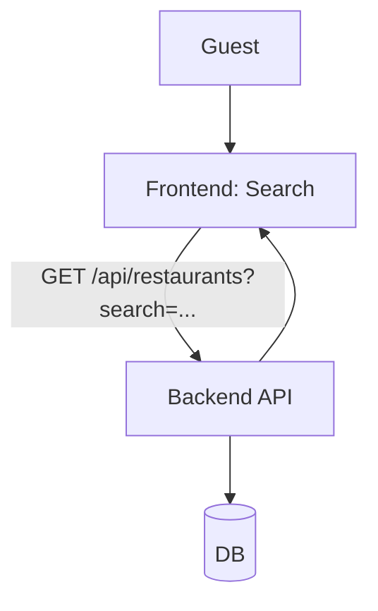
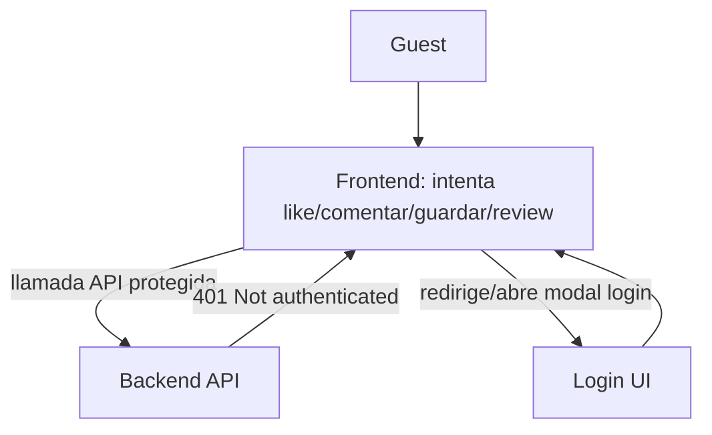
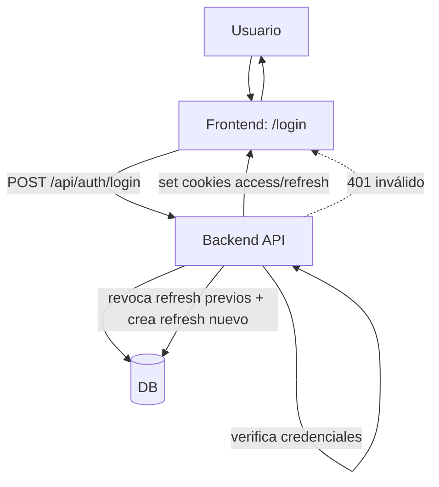
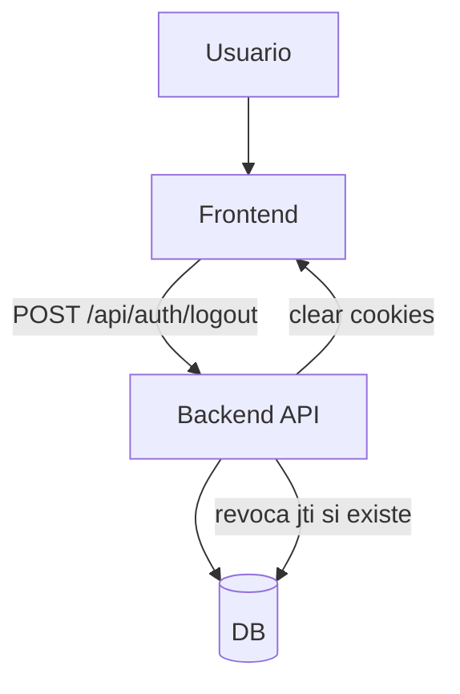
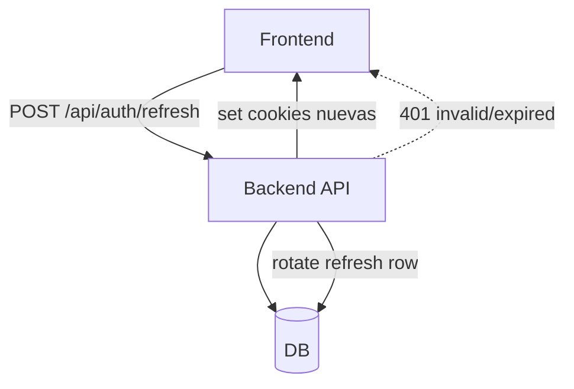

# Casos de uso por sesión (Guest vs Logueado vs Owner)

Este documento separa los casos de uso según el **estado de sesión** del usuario:

- **Guest (no logueado)**
- **Usuario logueado**
- **Owner (dueño verificado)**

> Nota: Muchos flujos son los mismos que `docs/casos_uso.md`, pero acá están reorganizados “en vertical” por rol/sesión para que no se mezclen.

## Índice

### Guest (no logueado)
- **G-01** Explorar home / feed público
- **G-02** Buscar restaurantes
- **G-03** Ver detalle de restaurante (incluye enrichment lazy)
- **G-04** Ver detalle de plato + reviews
- **G-05** Verificar email (desde link)
- **G-06** Olvidé mi contraseña (solicitar reset)
- **G-07** Resetear contraseña (desde link)
- **G-08** Chat público
- **G-09** Intentar acción protegida → pedir login

### Usuario logueado (no owner)
- **U-01** Login + cookies
- **U-02** Logout
- **U-03** Refresh de sesión (rotación refresh token)
- **U-04** Crear review (y editar/borrar la propia)
- **U-05** Like / Unlike review
- **U-06** Guardar / Quitar guardado + ver guardados
- **U-07** Comentar / Responder / Editar / Borrar comentario (soft-delete)
- **U-08** Seguir / Dejar de seguir usuario
- **U-09** Notificaciones (listar + marcar leída + marcar todas)
- **U-10** Reclamar restaurante (crear claim)

### Owner (dueño verificado)
- **O-01** Owner dashboard: listar reviews del restaurante
- **O-02** Owner: responder review (upsert) / borrar respuesta (1 por review)
- **O-03** Owner: subir/eliminar fotos oficiales (cap 5)

---

## Guest (no logueado)

### G-01 Explorar home / feed público

```mermaid
flowchart TB
  G[Guest] --> FE[Frontend: Home/Feed]
  FE -->|GET feed endpoints públicos (si aplica)| API[Backend API]
  API --> DB[(DB)]
  API --> FE
  FE --> G
```

### G-02 Buscar restaurantes



### G-03 Ver detalle de restaurante (lazy enrichment Google)

```mermaid
flowchart TB
  G[Guest] --> FE[Frontend: /restaurants/{slug}]
  FE -->|GET /api/restaurants/{slug}| API[Backend API]
  API --> DB[(DB)]
  API -->|load detail| DB
  API -->|si cache stale: encola refresh| BG[Background task]
  BG --> DB
  BG --> GOOGLE[Google Places]
  GOOGLE --> BG
  BG --> DB
  API --> FE

  API -.->|404 si no existe| FE
```

### G-04 Ver detalle de plato + reviews

```mermaid
flowchart TB
  G[Guest] --> FE[Frontend: /dishes/{id}]
  FE -->|GET /api/dishes/{dish_id}| API[Backend API]
  API --> DB[(DB)]
  API --> FE

  FE -->|GET /api/dishes/{dish_id}/reviews| API
  API --> DB
  API --> FE
```

### G-05 Verificar email (desde link)

```mermaid
flowchart TB
  G[Guest] -->|clic link email| FE[Frontend: /verify-email/{token}]
  FE -->|POST /api/auth/verify-email/{token}| API[Backend API]
  API --> DB[(DB)]
  API -->|consume token + set email_verified_at| DB
  API --> FE

  API -.->|400 token inválido/expirado| FE
```

### G-06 Olvidé mi contraseña (solicitar reset)

```mermaid
flowchart TB
  G[Guest] --> FE[Frontend: /forgot-password]
  FE -->|POST /api/auth/forgot-password| API[Backend API]
  API --> DB[(DB)]
  API -->|204 siempre (no leak)| FE
  API -->|si email existe: crea token + envía email| EMAIL[Email provider]
```

### G-07 Resetear contraseña (desde link)

```mermaid
flowchart TB
  G[Guest] --> FE[Frontend: /reset-password/{token}]
  FE -->|POST /api/auth/reset-password| API[Backend API]
  API --> DB[(DB)]
  API -->|valida token_hash + exp + consumed_at| DB
  API -->|update password_hash| DB
  API -->|consume token| DB
  API -->|revoca refresh_tokens activos| DB
  API --> FE

  API -.->|400 token inválido/expirado| FE
```

### G-08 Chat público

```mermaid
flowchart TB
  G[Guest] --> FE[Frontend: Chat widget]
  FE -->|POST /api/chat {message, history}| API[Backend API]
  API --> DB[(DB)]
  API --> SVC[chat_service]
  SVC --> LLM[Proveedor LLM]
  LLM --> SVC
  SVC --> API
  API --> FE

  API -.->|502 si falla proveedor| FE
```

### G-09 Intentar acción protegida → pedir login



---

## Usuario logueado (no owner)

### U-01 Login + cookies



### U-02 Logout



### U-03 Refresh de sesión (rotación refresh token)



### U-04 Crear review (y editar/borrar la propia)

```mermaid
flowchart TB
  U[Usuario] --> FE[Frontend: Review form]
  FE -->|POST /api/dishes/{dish_id}/reviews| API[Backend API]
  API -->|auth required| API
  API --> DB[(DB)]
  API -->|INSERT review + extras| DB
  API -->|recompute dish + restaurant rating| DB
  API --> FE

  FE -->|PUT /api/dish-reviews/{review_id}| API
  API -->|403 si no autor| FE
  API -->|UPDATE + recompute| DB
  API --> FE

  FE -->|DELETE /api/dish-reviews/{review_id}| API
  API -->|403 si no autor y no admin| FE
  API -->|DELETE + recompute| DB
  API --> FE
```

### U-05 Like / Unlike review (idempotente)

```mermaid
flowchart TB
  U[Usuario] --> FE[Frontend]
  FE -->|POST /api/reviews/{review_id}/like| API[Backend API]
  API --> DB[(DB)]
  API -->|INSERT si no existe| DB
  API -->|record like notification| DB
  API --> FE

  FE -->|DELETE /api/reviews/{review_id}/like| API
  API --> DB
  API -->|DELETE si existe| DB
  API --> FE
```

### U-06 Guardar / Quitar guardado + ver guardados

```mermaid
flowchart TB
  U[Usuario] --> FE[Frontend]
  FE -->|POST /api/reviews/{review_id}/save| API[Backend API]
  API --> DB[(DB)]
  API -->|INSERT bookmark si no existe| DB
  API --> FE

  FE -->|DELETE /api/reviews/{review_id}/save| API
  API --> DB
  API -->|DELETE si existe| DB
  API --> FE

  FE -->|GET /api/users/me/bookmarks| API
  API --> DB
  API -->|hidrata FeedItems| DB
  API --> FE
```

### U-07 Comentar / Responder / Editar / Borrar comentario (soft-delete)

```mermaid
flowchart TB
  U[Usuario] --> FE[Frontend]
  FE -->|POST /api/reviews/{review_id}/comments| API[Backend API]
  API -->|anti-spam| API
  API --> DB[(DB)]
  API -->|INSERT comment + notifications| DB
  API --> FE

  FE -->|POST /api/comments/{comment_id}/replies| API
  API -->|400 si parent ya es reply| FE
  API -->|anti-spam + notifications| DB
  API --> FE

  FE -->|PATCH /api/comments/{comment_id}| API
  API -->|403 si no autor| FE
  API -->|UPDATE body| DB
  API --> FE

  FE -->|DELETE /api/comments/{comment_id}| API
  API -->|403 si no autor y no admin| FE
  API -->|soft delete removed_at| DB
  API --> FE
```

### U-08 Seguir / Dejar de seguir usuario

```mermaid
flowchart TB
  U[Usuario] --> FE[Frontend]
  FE -->|POST /api/users/{id_or_handle}/follow| API[Backend API]
  API --> DB[(DB)]
  API -->|400 si self-follow| FE
  API -->|INSERT follow si no existe + notification| DB
  API --> FE

  FE -->|DELETE /api/users/{id_or_handle}/follow| API
  API --> DB
  API -->|DELETE si existe| DB
  API --> FE
```

### U-09 Notificaciones (listar + marcar leída + marcar todas)

```mermaid
flowchart TB
  U[Usuario] --> FE[Frontend: /notifications]
  FE -->|GET /api/notifications| API[Backend API]
  API --> DB[(DB)]
  API --> FE

  FE -->|POST /api/notifications/{id}/read| API
  API --> DB
  API -->|set read_at| DB
  API --> FE

  FE -->|POST /api/notifications/read-all| API
  API --> DB
  API -->|bulk update read_at| DB
  API --> FE
```

### U-10 Reclamar restaurante (crear claim)

```mermaid
flowchart TB
  U[Usuario] --> FE[Frontend: ClaimForm]
  FE -->|POST /api/restaurants/{slug}/claims| API[Backend API]
  API --> DB[(DB)]
  API -->|409 si claim abierto| FE
  API -->|409 si ya hay owner verificado| FE
  API -->|INSERT claim pending| DB
  API --> FE
```

---

---

## Owner (dueño verificado)

> **Separación visual**: esta sección agrupa exclusivamente flujos donde el usuario actúa como **dueño verificado** (o está en camino a serlo vía claim).

### O-00 Verificar claim por email-token (domain_email) → aprobar claim

```mermaid
flowchart TB
  O[Owner (aún no verificado)] -->|clic link token en email| FE[Frontend]
  FE -->|POST /api/claims/verify-email-token/{token}| API[Backend API]
  API --> DB[(DB)]
  API -->|buscar claim por token en verification_payload| DB
  API -->|si no existe: 404| FE
  API -->|rotar token (single-use)| DB
  API -->|approve_claim: status=verified + set restaurants.claimed_by_user_id| DB
  API --> FE
```

### O-01 Owner dashboard: listar reviews del restaurante

```mermaid
flowchart TB
  O[Owner verificado] --> FE[Frontend: /restaurants/{slug}/owner]
  FE -->|GET /api/restaurants/{slug}/owner/reviews| API[Backend API]
  API --> DB[(DB)]
  API -->|assert_verified_owner| DB
  API -->|SELECT reviews + has_owner_response| DB
  API --> FE

  API -.->|403 si no es owner verificado| FE
```

### O-02 Responder review (upsert) / borrar respuesta (1 por review)

```mermaid
flowchart TB
  O[Owner verificado] --> FE[Frontend]
  FE -->|PUT /api/dish-reviews/{review_id}/owner-response| API[Backend API]
  API --> DB[(DB)]
  API -->|resolve restaurant_id| DB
  API -->|assert_verified_owner| DB
  API -->|UPSERT (PK=review_id)| DB
  API --> FE

  FE -->|DELETE /api/dish-reviews/{review_id}/owner-response| API
  API --> DB
  API -->|assert_verified_owner| DB
  API -->|DELETE row| DB
  API --> FE
```

### O-03 Fotos oficiales (cap 5): subir / eliminar

```mermaid
flowchart TB
  O[Owner verificado] --> FE[Frontend]
  FE -->|POST /api/restaurants/{slug}/official-photos| API[Backend API]
  API --> DB[(DB)]
  API -->|assert_verified_owner| DB
  API -->|count; si >= 5 => 409| FE
  API -->|INSERT official photo| DB
  API --> FE

  FE -->|DELETE /api/restaurants/{slug}/official-photos/{photo_id}| API
  API --> DB
  API -->|assert_verified_owner| DB
  API -->|DELETE photo| DB
  API --> FE
```

