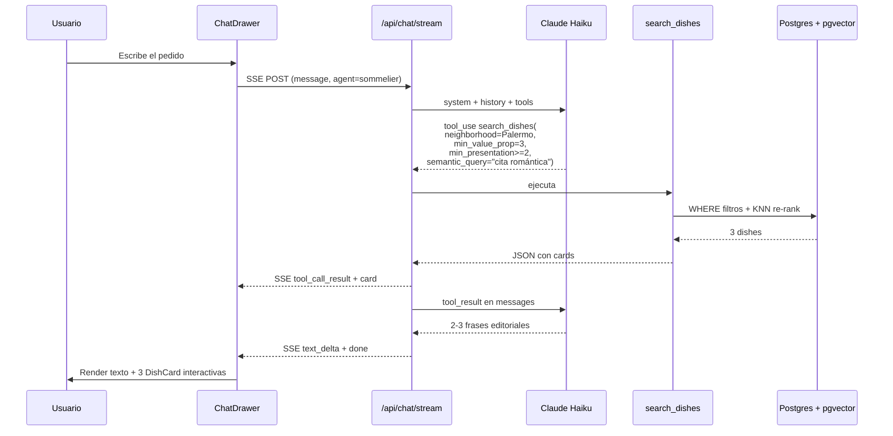
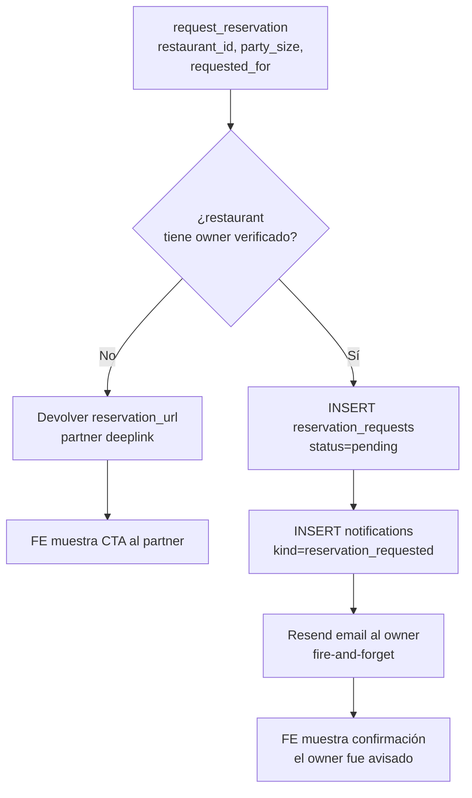
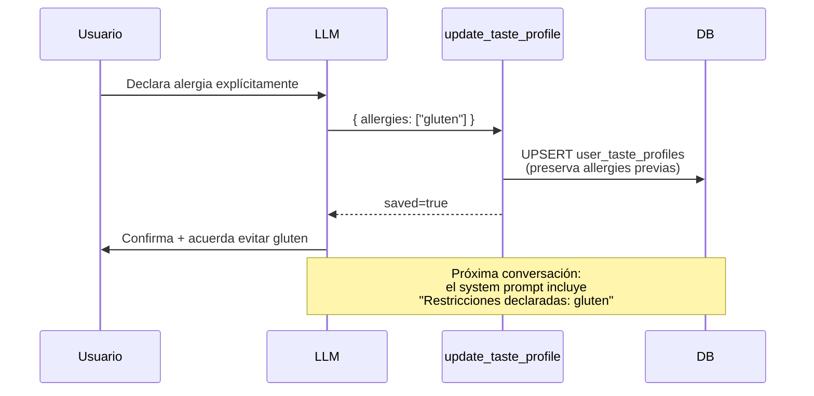
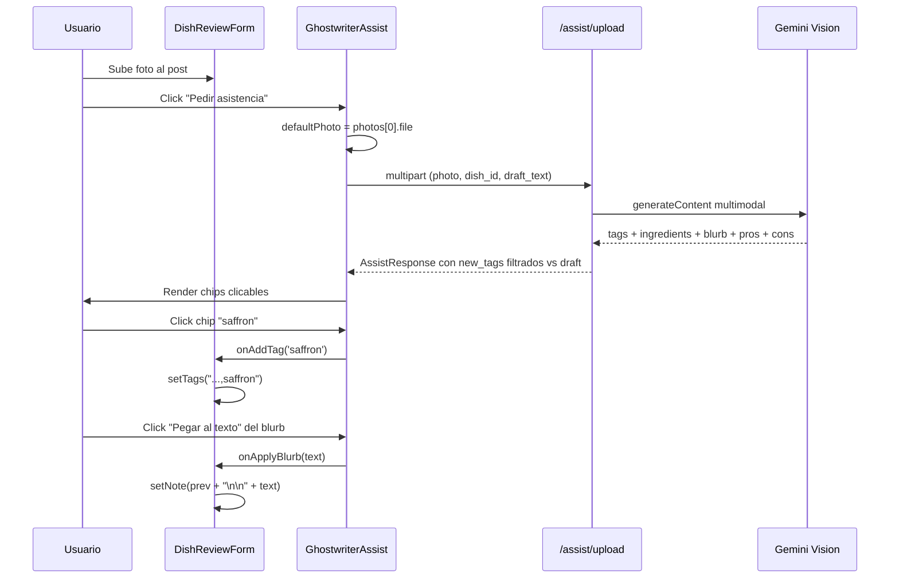
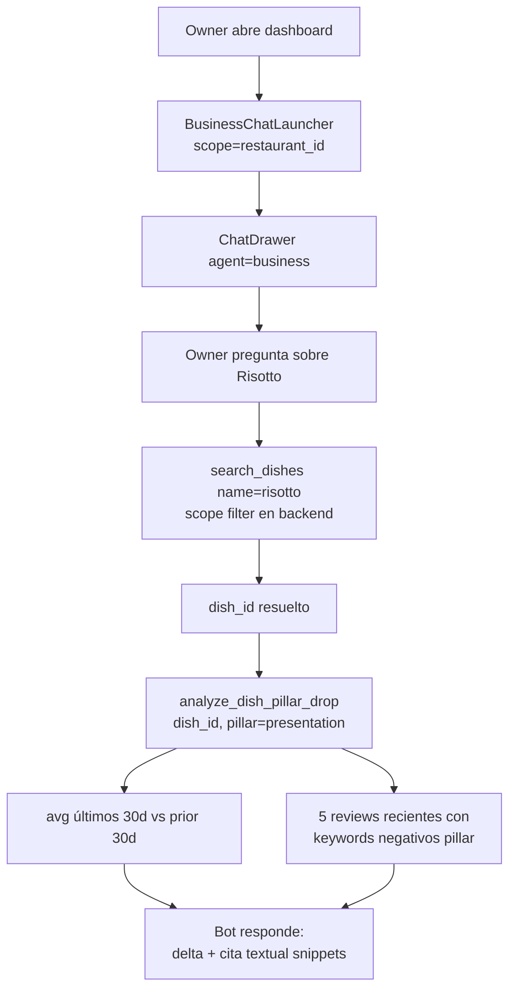
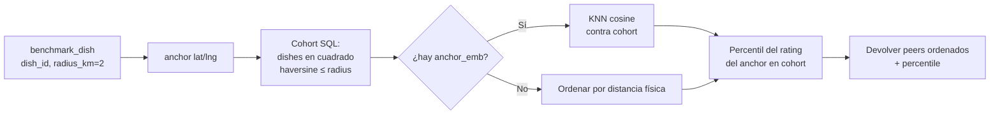

# Chatbot CritiComida — funcionalidades vigentes

Este documento es la **memoria viva del chatbot**. Cada vez que se
agrega, modifica o retira una capacidad del chatbot, esta página tiene
que actualizarse en el mismo PR. No es un changelog: describe el
estado actual, no la historia.

> Los servicios de IA subyacentes (Gemini embeddings, Gemini Vision,
> Claude tool use, perfil de gustos, etc.) viven en
> [`ia_services.md`](./ia_services.md). Acá nos enfocamos en el
> **producto** — qué hace el chatbot desde la perspectiva del usuario.

---

## Última actualización

- **Fecha**: 2026-05-05
- **Fases entregadas**: Fase 0 (núcleo agentic), Fase 1 (Sommelier),
  Fase 2 (Ghostwriter), Fase 3 (Business).
- **Cambios recientes**:
  - **Memoria persistente del owner (Fase 5)**. Tabla
    `owner_chat_preferences` (separada de `owner_notification_preferences`,
    distinto producto) con `(user_id, restaurant_id)` UNIQUE y campos
    `tone_preference`, `kpi_focus` (jsonb), `language_preference`.
    Service en `owner_chat_preferences_service.py` con `get` y
    `upsert` partial-update. El `chat_service.stream_chat` inyecta el
    bloque "Preferencias del owner" al system prompt cuando hay fila.
    Tool `update_owner_preferences(tone?, language?, kpi_focus?)` que
    el agente llama cuando el owner pide algo persistente
    ("siempre…", "de ahora en más…"). El cambio aplica desde la
    PRÓXIMA sesión — el turno actual sigue con el state inicial.
    `suggest_review_response` con `tone='match_brand'` ahora resuelve
    contra `tone_preference` real (antes caía a professional con nota
    F5). Few-shot 7 enseña el patrón de persistencia y la diferencia
    con pedidos one-off ("esta vez…"). Limitación conocida: con
    Gemini 3.1 Flash Lite Preview el agente a veces confirma
    verbalmente sin disparar el tool — se mitigaría con un toggle UI
    complementario o con un modelo más adherente (roadmap).
  - **Reglas anti-alucinación 8-10** en `business.md` + 5 casos eval
    nuevos (precios, nombres de reviewers, ventas, hora del día,
    contexto externo). Cierra Fase 6 del plan de calidad. Las reglas
    listan explícitamente las dimensiones que el toolbelt NO surface
    (precio, identidad de reseñadores, hora del día, ventas,
    contexto fuera del scope geográfico) y mandan al agente decir
    "no tengo ese dato" en vez de aproximar. Bonus: bug fix del
    runner de evals — `response_must_not_contain` ahora hace
    substring match (antes usaba `re.search`, que interpretaba `$`
    y otros chars como anchors regex). Pass rate suite (49 casos):
    49/49 = 100% en último run, 48/49 estable considerando flakes.
  - **Nuevo tool `compare_to_baseline`** cierra la Fase 4 de
    insight-tools. Comparación focalizada de UNA métrica
    (`rating` / `review_count` / `sentiment_score` / `response_rate`)
    contra UN baseline (`prior_period` / `all_time` / `competition`).
    Para `competition` reusa la lógica geográfica de `benchmark_dish`:
    encuentra restaurantes en `radius_km` (default 2.0), calcula
    cohort_avg y `percentile`. Cohort < 3 dispara nota explicativa
    (sin afirmar un percentil ruidoso). Fechas opcionales (default
    últimos 30 días) — saca presión al LLM cuando el owner pregunta
    sin especificar período. Schema con `populate_by_name=True` y
    `validation_alias` acepta tanto `from_date`/`to_date` como `from`/
    `to`, y el `vs` también acepta `baseline`/`target_baseline`/
    `compared_to` como aliases naturales que el LLM tiende a usar.
    Few-shot 6 en `business.md` ilustra el patrón comparativo.
  - **Nuevo tool `suggest_review_response`** en el toolbelt del
    Business. **No** llama un LLM dedicado — devuelve contexto
    estructurado (texto de la reseña + plato + guía de tono + reglas
    duras) y el agente redacta el draft en su próximo turno usando
    ese payload. El `review_id` siempre viene de un `list_reviews`
    previo; nunca se le pide al owner. Si el LLM omite `tone`, el
    handler lo infiere del sentiment de la reseña (negative →
    apologetic, positive → warm, neutral → professional). Few-shot 5
    en `business.md` enseña el patrón list_reviews + suggest +
    redacción + bilingüismo (meta-texto en idioma del owner; draft
    en idioma de la reseña original).
  - **Nuevo tool `summarize_reviews_period`** en el toolbelt del
    Business (`backend/app/services/chat/tools/insights.py`). Devuelve
    agregados pre-calculados sobre las reseñas en un rango de fechas:
    total_reviews, rating avg + distribución, sentiment by_label +
    score, response rate. Cada dimensión incluye **delta vs el período
    anterior de igual duración** (calculado automáticamente). Resuelve
    el problema clásico de hacer que el LLM compute promedios y
    porcentajes a mano sobre `list_reviews` — fuente común de
    alucinación numérica. El prompt instruye a usar este tool siempre
    que el owner pida un panorama temporal y a llamar `list_reviews`
    *después* solo para citar reseñas puntuales.
  - **4 diálogos de referencia (few-shots)** al final de
    `business.md`: composición multi-tool con números, recovery
    silencioso de tool error, clarificación cuando hay ambigüedad
    real, y consistencia de idioma en pt. Refuerzan el patrón vía
    imitación, no vía reglas adicionales. Pass rate sobre el suite
    expandido: **105/105 = 100% × 3 corridas** (sin regresión vs
    baseline pre-few-shots).
  - **Eval suite expandida a 35 casos / 14 categorías**
    (`backend/tests/chat/evals/datasets/business.yaml`):
    polyglot lookup, sentiment+responded combos, sort variations,
    date filters, rating range, limit, dish filter, empty results,
    anti-handback, anti-hallucination, multi-tool composition,
    out-of-scope, language consistency. Tres mejoras al sistema
    descubiertas y arregladas durante la expansión:
    Pydantic enum case-insensitive (LLM emite mayúsculas a veces),
    `get_dish_detail` con error graceful en vez de KeyError, y
    runner case-insensitive en string equality.
  - **Switch a `gemini-3.1-flash-lite-preview` como default global**
    para Sommelier y Business. Decisión guiada por la suite de evals:
    Lite Preview pegó **24/24 = 100% pass** en tres corridas con
    latencia promedio 22.7s, contra 23/24 (95.8%) y 36s de Gemini 2.5
    Flash, y contra 21/24 (87.5%) y 165s de Gemini 3.1 Pro Preview
    (Pro pierde por gastar mucho budget en thinking y devolver tool
    calls inconsistentes en este flow). Override por agente disponible
    vía `CHAT_MODEL_B2C` / `CHAT_MODEL_B2B`.
  - **Suite de evals end-to-end del agente Business**
    (`backend/tests/chat/evals/`). 8 casos cubriendo lookup multilingüe
    (es/en/pt), sentiment+responded combo, sort, dish filter,
    anti-handback y language consistency. Gateada por `RUN_CHAT_EVALS=1`
    para no quemar tokens en CI normal. Sirve como "capa 3" del patrón
    de defensa: prompt + tool contract + suite que mide
    objetivamente.
  - **Contrato lingüístico estricto en `list_reviews`**. Las tablas
    de sinónimos (`_RESPONDED_SYNONYMS`, `_SENTIMENT_SYNONYMS`,
    `_SORT_SYNONYMS`) y el silent fallback con `notes` se reemplazaron
    por un modelo Pydantic con enums (`backend/app/services/chat/tools/_schemas.py`).
    El LLM hace la traducción NL → enum en cualquier idioma; valores
    inválidos disparan `{"error": ..., "details": [...]}` y el agent
    loop reintenta. Ver [Contrato de tools — escalabilidad lingüística](#contrato-de-tools--escalabilidad-lingüística).
  - Bypass de admin en el gate del Business chat para soporte / moderación.
  - El launcher flotante global se oculta dentro de `/restaurants/{slug}/owner` para evitar confusión con el bloque embebido del Business.
  - Tool `rank_my_dishes` agregada al Business — rankea el menú propio por rating, volumen o pilar.
  - Sentiment automático en reseñas (Gemini Flash). El dashboard del owner muestra badge y filtros por sentimiento.
  - Refactor del toolbelt del Business: los antiguos `list_pending_reviews` quedaron unificados en un solo `list_reviews(responded_status?, sentiment?, sort?, limit?)`. Patrón paramétrico — un tool componible cubre cualquier pregunta sobre las reseñas sin sumar uno nuevo por caso de uso.
  - **Contrato defensivo de tools**: `analyze_dish_pillar_drop` y `benchmark_dish` ahora aceptan `dish_name` además de `dish_id`. Resuelven el nombre internamente con scope al restaurante; ante múltiples matches devuelven `candidates` para que el agente desambigüe; ante cero matches devuelven `menu_peek` con los platos reales del restaurante para que ofrezca alternativas. El agente nunca debería pedirle un ID al owner — y aunque el LLM intente, el tool no se lo permite.
- **Pendiente / no cubierto**: ver [Roadmap conocido](#roadmap-conocido).

---

## Arquitectura en una pantalla

Tres agentes que comparten el mismo motor (`AgentLoop` →
`backend/app/services/chat/agent_loop.py`). Cada agente tiene su
**system prompt** propio, su **toolbelt** propio, y puede correr sobre
un **modelo distinto**:

| Agente        | Audiencia       | Modelo por defecto                  | Surface UI                                         |
|---------------|-----------------|-------------------------------------|----------------------------------------------------|
| `sommelier`   | Usuario común   | `gemini-3.1-flash-lite-preview`     | Drawer global (botón flotante en toda la app)      |
| `ghostwriter` | Usuario común   | `gemini-3.1-flash-lite-preview`     | Panel inline en el formulario de reseñas + drawer  |
| `business`    | Owner verificado| `gemini-3.1-flash-lite-preview`     | Sección embebida en `/restaurants/{slug}/owner`    |

Toda conversación se persiste en `chat_conversations` + `chat_messages`
(incluyendo tool calls + tool results) por usuario. El usuario puede
borrar su historial; un `DELETE /api/chat/conversations/{id}` también
sirve para "olvidame".

El usuario logueado lleva además un **perfil de gustos** estructurado
(`user_taste_profiles`) que se inyecta en el system prompt del Sommelier
y del Ghostwriter — saludos personalizados, atender alergias declaradas,
sesgos del pilar dominante. Detalles en [`ia_services.md`](./ia_services.md).

---

## 1) Sommelier — usuario crítico (B2C)

**Punto de entrada**: botón flotante (`ChatLauncher`) visible en todas
las páginas. Abre un drawer/sheet que en mobile ocupa 90vh y en desktop
es un panel derecho de ~440px.

### Qué puede hacer hoy

| Capacidad | Tool subyacente | Notas |
|-----------|-----------------|-------|
| Saludo personalizado por `display_name` | — | Auto cuando hay sesión iniciada. |
| Buscar platos con filtros estructurados | `search_dishes` | Barrio (substring de `location_name`), ciudad, bbox geográfico, mínimos por pilar (1-3), categoría, `max_price_tier`. |
| Re-rankear semánticamente con un "mood" | `search_dishes(semantic_query)` | El LLM extrae filtros duros, KNN sobre embeddings dentro del subset. Cae a ranking estructurado si Gemini no está configurado. |
| Mostrar detalle de un plato (top reseñas + pros/cons) | `get_dish_detail` | Para profundizar antes de decidir. |
| Guardar plato en deseados | `add_to_wishlist` | Reusa `WantToTryDish`; idempotente. Requiere login. |
| Abrir el mapa con bbox/centro/dishes pinned | `open_in_map` | Devuelve struct para que la UI haga deeplink a `/mapa`. |
| Crear ruta de platos (compartible) | `create_dish_route` | Crea `dish_lists` + `dish_list_items` con slug único. Por defecto `is_public=true`. URL pública en `/listas/{slug}` con metadata OG para WhatsApp/Twitter. |
| Pedir reserva en un restaurante | `request_reservation` | Si el restaurante tiene owner verificado: row en `reservation_requests` + notification + email. Si no: hand-off al `reservation_url` partner. |
| Anotar alergias / horarios declarados | `update_taste_profile` | Sólo cuando el usuario lo dice explícito. Allergias **nunca** se infieren. |

### Cards visuales

Cuando el bot llama una tool, la UI renderiza:

- `search_dishes` → grilla de `DishCard` con CTAs "Guardar", "Ver en mapa", "Sumar a ruta".
- `open_in_map` → `MapEmbed` con CTA al mapa.
- `create_dish_route` → `RouteCard` con link público y "Copiar link".
- Otros tools → confirmaciones cortas (texto del bot describe el resultado).

### Lo que el Sommelier NO hace todavía

- No genera reseñas escritas (eso es Ghostwriter).
- No abre la cámara para subir foto (sólo links a fotos existentes en la DB).
- No hace cross-restaurant comparisons profundas (eso es Business).
- No se acuerda de items del wishlist en futuras conversaciones más
  allá de lo que el `taste_profile` infiere.

---

## 2) Ghostwriter — usuario crítico (B2C)

**Punto de entrada principal**: botón "Pedir asistencia al Ghostwriter"
en el formulario de creación / edición de reseñas
(`DishReviewForm.tsx`). Reusa la primera foto que el usuario haya
subido al post; si no hay, expone un input file inline. La foto subida
desde el panel del Ghostwriter se inserta automáticamente al post
(dedupe por `name+size+lastModified`).

> El Ghostwriter también puede invocarse desde el chat global cuando
> el usuario adjunta un photo URL. Por ahora ese flujo está disponible
> via tool (`suggest_tags_from_photo`) pero no tiene UI dedicada en el
> drawer; la entrada principal sigue siendo el formulario de reseña.

### Qué puede hacer hoy

| Capacidad | Tool subyacente | Notas |
|-----------|-----------------|-------|
| Detectar tags visuales del plato | `suggest_tags_from_photo` | Gemini Vision (`gemini-2.5-flash`). Devuelve hasta 6 tags lowercase sin "#". |
| Identificar ingredientes visibles | mismo | Hasta 6 ingredientes únicos (sin enumerar variantes del mismo). |
| Sugerir un *plating style* | mismo | Enum: `minimalist|family-style|deconstructed|rustic|classic`. |
| Sugerir una frase editorial corta | mismo | 1-2 frases, ≤200 caracteres, tono CritiComida (sin "delicioso", "espectacular"). |
| Sugerir 0-2 pros y 0-2 cons | mismo | Bullets puntuales ≤60 caracteres c/u. |
| Distinguir tags inéditos vs ya en draft | endpoint `/assist` | El backend devuelve `new_tags` filtrando contra el `draft_text` del usuario. |
| Tolerar respuesta truncada de Gemini | parser custom | Si `finishReason=MAX_TOKENS`, reconstruimos JSON parcial cerrando comillas/brackets. |

### Comportamiento UX

- El usuario clickea cada chip que adopta. Los chips usados quedan
  tachados (no se duplican); los `new_tags` se resaltan en azafrán.
- Pegar el blurb al campo `note` se hace con un click ("Pegar al texto"
  agrega doble salto de línea si ya había contenido).
- "Probar otra foto" → reabre el file picker y agrega esa foto al post
  también (siempre y cuando no esté duplicada).

### Lo que el Ghostwriter NO hace todavía

- No firma puntajes (estrellas, pilares) por la persona — sólo asiste.
- No edita texto existente del usuario; sólo concatena.
- No corre sobre videos ni reels.
- No tiene catálogo curado de tags (los nuevos se persisten tal cual).

---

## 3) Business — owner verificado (B2B)

**Punto de entrada**: bloque "Pregúntale a CritiComida" embebido en
`/restaurants/{slug}/owner`. El gate del endpoint usa
`assert_verified_owner` (`backend/app/services/claim_service.py`), que
acepta dos perfiles:

1. `claimed_by_user_id == current_user.id` (el dueño real).
2. `current_user.role == UserRole.admin` (soporte / moderación,
   bypass deliberado para debug). El panel del owner ya muestra el
   banner *"Estás viendo este panel como admin"* en este caso.

> Defense in depth: cada tool del Business re-valida que el `dish_id`
> recibido pertenezca al `restaurant_scope_id`. Ni un owner ni un
> admin pueden filtrar a un competidor manipulando los argumentos
> del tool.

### Qué puede hacer hoy

| Capacidad | Tool subyacente | Notas |
|-----------|-----------------|-------|
| Resolver platos por nombre | `search_dishes` | Mismo motor que el Sommelier, pero scopeado. |
| Ver detalle de un plato propio | `get_dish_detail` | Top reseñas + pros/cons. |
| Rankear los platos del menú propio | `rank_my_dishes` | Sort por `rating`, `review_count`, o promedio de un pilar. Filtro `min_review_count` (default 1) para no coronar dishes con una sola reseña. |
| Diagnosticar caída de un pilar | `analyze_dish_pillar_drop` | Compara avg de N días vs prior window. Trae snippets de hasta 5 reseñas recientes con keywords negativos relacionadas al pilar (presentación, ejecución, costo/beneficio). Acepta `dish_name` (texto libre del owner) además de `dish_id` — resuelve el nombre internamente y, si hay múltiples matches o ninguno, devuelve candidatos / `menu_peek` para que el agente disambigüe sin pedirle el ID al humano. |
| Benchmark contra competencia local | `benchmark_dish` | Cohort dentro de un radio (default 2 km, max 25 km). Re-rankea por similitud semántica vía `dish_embeddings`. Devuelve percentil del rating del dish + lista de comparables ordenados por proximidad semántica. Mismo contrato amistoso: acepta `dish_name` o `dish_id`. |
| Listar reseñas (cualquier corte) | `list_reviews` | Tool único componible. Filtros: `responded_status` (`any`/`pending`/`responded`), `sentiment` (`any`/`positive`/`neutral`/`negative`), `sort` (`recent`/`oldest`/`most_negative`). Cubre "qué me falta responder", "última positiva", "más negativas", "qué decían las negativas que ya contesté", etc. — sin necesidad de un tool por pregunta. |
| Recibir notificaciones de reservas | tabla `reservation_requests` + tipo `notification.kind='reservation_requested'` + email Resend | Disparado cuando un usuario llama `request_reservation` desde el Sommelier. |

### Reglas editoriales del agente Business

Forzadas vía system prompt:

- Reportar deltas con signo y muestra explícita ("2.6 → 2.1, -0.5; 9 reseñas en 30 días").
- Advertir cuando la muestra es chica (`< 3` reseñas).
- Citar fragmentos textuales de reseñas sin inventar.
- **Nunca** sugerir cambiar precios, recetas o staff. El bot
  diagnostica; el owner decide.
- Si el owner pide cosas del Sommelier (recomendar lugares para
  comer), explicar y derivar.

### Lo que Business NO hace todavía

- No responde reseñas por el owner (sólo las lista).
- No genera respuestas sugeridas.
- No expone series temporales completas (sólo dos windows: actual + prior).
- No analiza menú entero ni cohort de platos del propio restaurante.
- No conecta con datos de reservas históricas / no predice no-shows.
- No calcula proyecciones de ingreso ni elasticidad de precios.

---

## Casos de uso end-to-end

Los flujogramas usan [Mermaid](https://mermaid.js.org/) — GitHub,
GitLab y VS Code los renderizan nativamente.

### CU-CHAT-1 — Sommelier: ganga 3/3 en barrio para una cita

> *"Buscame una ganga 3/3 en Palermo con presentación increíble para
> una cita."*



**Resultado UX**: el usuario ve 3 cards con CTAs "Guardar / Mapa /
Sumar a ruta / Reservar" y un texto editorial corto del bot
contextualizando por qué esos platos.

### CU-CHAT-2 — Sommelier: armar y compartir una ruta

> *"Armame una ruta de 3 platos ganadores en el centro para el
> domingo."*

```mermaid
flowchart LR
    A[Usuario pide ruta] --> B[search_dishes<br/>neighborhood=Centro]
    B --> C[3 dish_ids]
    C --> D[create_dish_route<br/>name, dish_ids, is_public=true]
    D --> E[INSERT dish_lists<br/>+ dish_list_items]
    E --> F[Devolver slug + public_url]
    F --> G[FE renderiza RouteCard<br/>con botón Copiar link]
    G --> H[/listas/{slug}<br/>página pública SSR/]
```

**Resultado UX**: card en el chat con la ruta + URL pública
compartible que abre una página con metadata OG (WhatsApp / Twitter
muestran preview correcto).

### CU-CHAT-3 — Sommelier: pedir reserva con notificación al owner

> *"Reservame una mesa para 4 personas mañana 21:00 en Eretz."*



**Notas de privacidad**: el row guarda `owner_user_id` en snapshot; si
el owner pierde el claim después, el request queda trazable.

### CU-CHAT-4 — Sommelier: declarar alergia (única vía)

> *"Soy celíaco, tenelo en cuenta para próximas sugerencias."*



**Regla dura**: el LLM nunca puede setear alergias por inferencia.
Sólo cuando el usuario lo dice con palabras claras.

### CU-CHAT-5 — Ghostwriter: foto compartida con el post



**Caso inverso** (foto se sube desde el panel del Ghostwriter): la
foto se mirror-ea al state del post via `onPhotoUploaded`, con dedupe
por `name+size+lastModified`.

### CU-CHAT-6 — Business: diagnóstico de pilar

> *"¿Por qué bajó el puntaje de presentación del Risotto este mes?"*



**Defense in depth**: el tool `analyze_dish_pillar_drop` re-valida que
`dish.restaurant_id == restaurant_scope_id`. Imposible que el owner
analice un dish ajeno aunque el LLM intente.

### CU-CHAT-7 — Business: benchmark contra competencia

> *"¿Cómo rinde mi hamburguesa frente a la competencia a 2 km?"*



**Resultado UX**: el bot dice "estás en el percentil 35: 65% de los
platos comparables están mejor rankeados" y lista 3-8 dishes vecinos.

---

## Defensa contra hand-backs (regresar la pelota al usuario)

Los LLMs a veces "se rinden" y le piden al humano datos técnicos
(`dish_id`, "el nombre exacto", etc.) en lugar de resolver con tools.
Tres capas combinadas para no depender solo del prompt:

1. **Contrato defensivo del tool**. Tools que necesitan un ID interno
   aceptan *también* el input amistoso (`dish_name` además de
   `dish_id`) y resuelven internamente. Tres respuestas estructuradas:
   match único (ejecuta), `needs_disambiguation: true` con
   `candidates`, o `error: "no_match"` con `menu_peek` real del
   restaurante. Helper compartido en
   `backend/app/services/chat/tools/business.py::_resolve_dish_in_scope`.
2. **Regla #0 del system prompt**. Cada agente arranca su prompt con
   "NUNCA pidas IDs al humano" más la receta para cada respuesta del
   tool. El prompt es backup del tool, no fuente única de verdad.
3. **Audit en producción**. Script
   `python -m app.scripts.audit_chat_handoffs --since 7d` cuenta
   cuántos turnos del assistant terminan sin llamar ningún tool y
   contienen frases de hand-back ("necesito saber", "indicame el
   ID"). Wirear a cron diario con `--threshold 0.05` para que falle
   cuando el rate sube. Es el indicador de que aparece un flow nuevo
   sin las dos primeras capas aplicadas.

---

## Contrato de tools — escalabilidad lingüística

Los tools del chatbot soportan owners que hablan español, inglés y
portugués (más cualquier idioma que el LLM entienda). Para que el
contrato escale sin mantenimiento por idioma, **los tools definen
semántica, no vocabulario**:

- Cada parámetro categórico se define como **enum estricto** vía un
  modelo Pydantic en `backend/app/services/chat/tools/_schemas.py`.
  El JSONSchema que viaja a Anthropic incluye `enum: [...]` y
  `additionalProperties: false`.
- La descripción del parámetro está en español neutro y describe
  *qué significa* cada valor, no qué palabras lo invocan.
- La traducción `"todavía no respondí"` / `"haven't replied"` /
  `"ainda não"` → `responded_status='pending'` es trabajo del LLM,
  que ya es nativamente políglota. **No hay tablas de sinónimos en
  los tools.**
- Si el LLM pasa un valor fuera del enum, Anthropic lo rechaza
  server-side; si llega igual, `model_validate` levanta
  `ValidationError` y el handler retorna `{"error": ..., "details":
  [...]}`. El agent loop reenvía eso al modelo, que corrige y
  reintenta en el mismo turno. **Cero fallback silencioso, cero
  array `notes` que se leakea al owner.**

**Caso de referencia (mayo 2026)**. Un owner preguntó *"¿qué reseñas
todavía no respondí?"* y la respuesta del Business le mostraba el
mensaje "la opción `responded_status='no'` no fue reconocida por el
sistema". El bot estaba leakeando `notes` internas porque la tabla de
sinónimos no aceptaba `'no'` y el handler hacía silent fallback. El
fix correcto no fue agregar `'no'` a la tabla — fue eliminar la tabla
entera y mover la traducción NL → enum al LLM, que la hace gratis en
cualquier idioma. Patrón replicable: si te encontrás agregando una
nueva entrada a un dict de sinónimos, la decisión está mal — borralo
y dejá que el LLM lo resuelva.

Pendiente: las preferencias del owner (`update_owner_preferences`,
roadmap Fase 5) van a permitirle al owner fijar `language_preference`
explícito; mientras tanto el agente responde en el idioma en que le
hablan.

---

## Persistencia y privacidad

- Conversaciones se guardan por `conversation_id` (uuid). Anonimas
  permitidas (sin `user_id`); en ese caso no hay perfil de gustos ni
  recall entre sesiones.
- Cada usuario puede listar (`GET /api/chat/conversations/me`) y
  borrar (`DELETE /api/chat/conversations/{id}`) sus chats.
- El `taste_profile` se construye sólo a partir de las reseñas que el
  usuario publicó. El usuario puede consultarlo y borrarlo (TODO: UI
  dedicada — hoy sólo via API).
- Las **alergias** sólo se persisten cuando el usuario las declara
  explícitamente (tool `update_taste_profile`). Nunca se infieren.
- En modo Business **no** se inyecta el perfil de gustos del owner —
  el agente sólo ve datos de su restaurante.

---

## Cómo agregar una mejora

Cuando hagas un cambio que toque el chatbot, **actualizá este
documento en el mismo PR**. Pasos:

1. Identificá a qué agente afecta (Sommelier / Ghostwriter / Business)
   o si es del **núcleo** (todos los agentes).
2. Si agregás un tool nuevo:
   - Sumá una fila en la tabla "Qué puede hacer hoy" del agente
     correspondiente.
   - Agregá el `pending` label en `app/components/chat/MessageList.tsx`
     y los 3 archivos `messages/{es,en,pt}.json`.
   - Si emite una card visual, listalo en "Cards visuales".
3. Si retirás un tool, movélo a "Lo que NO hace" o eliminá la fila si
   ya no aplica.
4. Si cambias el modelo o las reglas del system prompt, actualizá la
   tabla "Arquitectura en una pantalla" o la sección de reglas
   correspondiente.
5. Si agregás un nuevo agente, replicá la estructura de "Qué puede
   hacer hoy / Cards / Lo que NO hace".
6. Actualizá la fecha de "Última actualización" arriba.

---

## Roadmap conocido

Capacidades pedidas durante el diseño que **todavía no están
implementadas** y vale tenerlas listadas para no duplicar trabajo:

- **Sommelier**: integración de booking real con Resy/TheFork via API
  (hoy: solo deeplink + notificación al owner).
- **Sommelier**: recall persistente de items del wishlist en futuras
  conversaciones ("¿Te animaste con el risotto que guardaste?").
- **Ghostwriter**: catálogo curado de tags + sugerencia que prefiere
  tags ya existentes sobre tags inéditos.
- **Ghostwriter**: análisis de video/reels (hoy solo imagen).
- **Business**: respuestas sugeridas a reseñas pendientes — **draft
  generado, falta el "atajo de un click"**. Hoy el agente devuelve el
  texto del draft en el chat; el owner copia y pega manualmente en la
  reseña. Próximo paso: card/botón "Responder esta reseña con este
  draft" que abra el form de respuesta (en `OwnerReviewModal` u otro
  componente del dashboard) con el `review_id` correspondiente y el
  draft pre-cargado, así el owner solo aprieta "Enviar". Requiere
  coordinación entre `BusinessChatLauncher` y `OwnerDashboardClient`
  (callback prop) o un store global compartido.
- **Business**: series temporales de pilares (gráfico, no solo dos
  windows).
- **Business**: predicción de no-shows / proyecciones.
- **Núcleo (✓ completado)**: panel de "Conversaciones recientes" en
  el drawer (F-CONVO.1-6). Botón faClockRotateLeft en el header
  abre la lista; click en una convo carga su historial vía
  `loadConversation()` y persiste el id en localStorage. Auto-título
  derivado del primer user message (heurística trunca, ver
  `_make_title_from_user_message` — F-CONVO.4). Cada item tiene
  botón faBoxArchive (tap doble = confirmar) que invoca
  `archiveConversation()` → soft-delete server side
  (`archived_at` set, fila preservada). Si archivás la conversación
  activa, el chat se resetea limpiamente. Hard-delete (GDPR) queda
  como endpoint admin separado, follow-up.
- **Núcleo**: analytics de tokens y latencia visibles para admin.
- **Evals**: validador post-hoc numérico en el runner. Hoy las reglas
  anti-alucinación viven en el prompt + casos eval específicos
  (Fase 6). El upgrade es: extraer todos los literales numéricos de
  la respuesta del agente y verificar que cada uno aparece en algún
  tool output del turno (string substring match), con whitelist de
  números safe (1-5, años entre 2024-2030). Empuja el rate de
  hallucination de "control por sampling" a "guard automático". ~1
  día por sí solo, sobre todo por el tuning de la whitelist para
  evitar false positives en contextos de redacción.

Cualquiera de estos que se implemente, mover a la sección activa del
agente correspondiente y borrar de acá.
