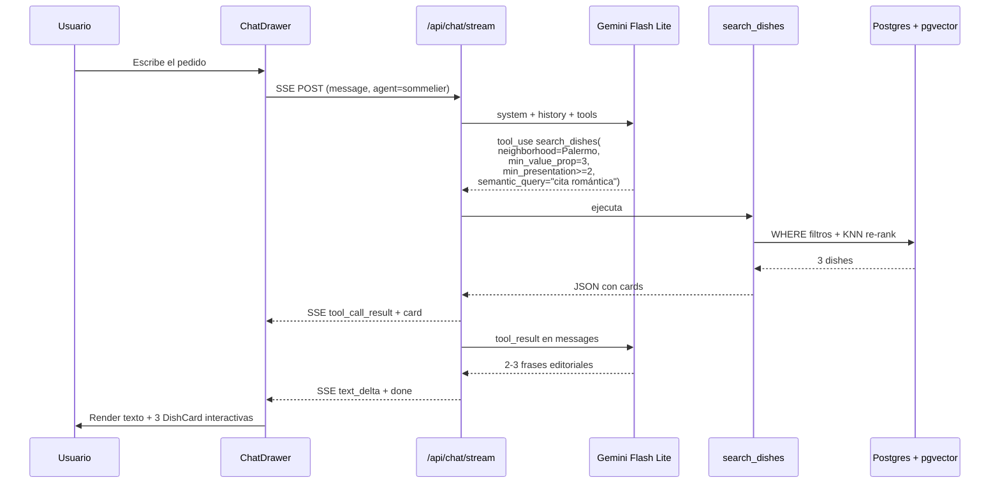
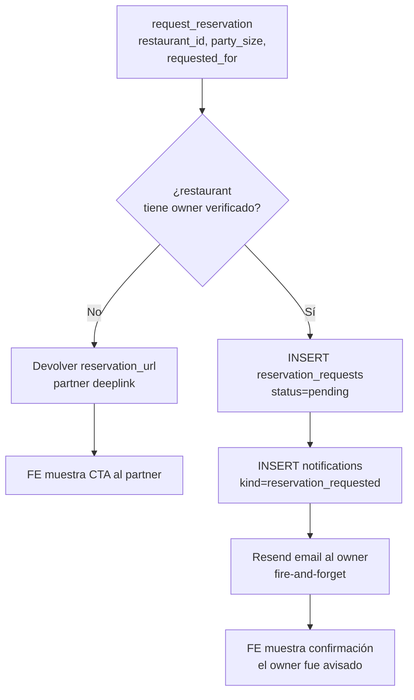
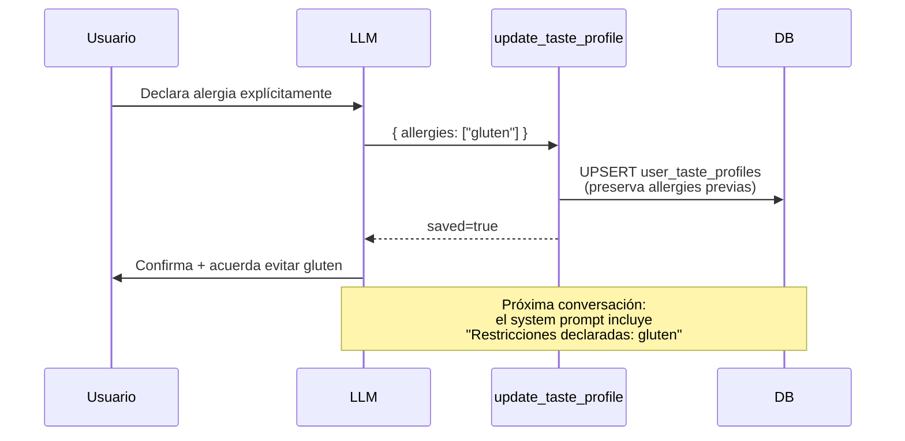
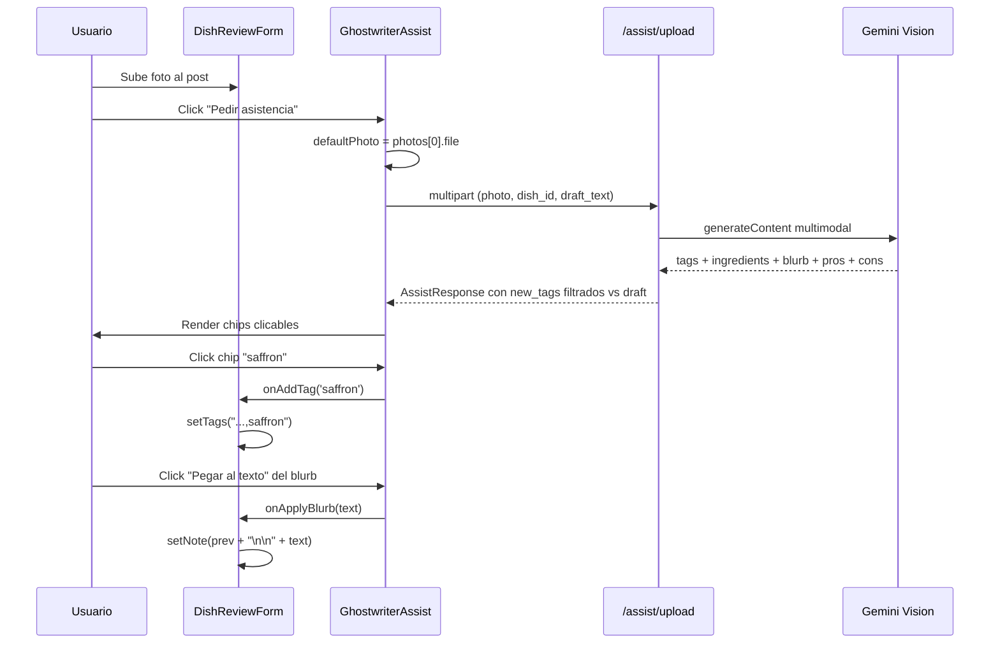
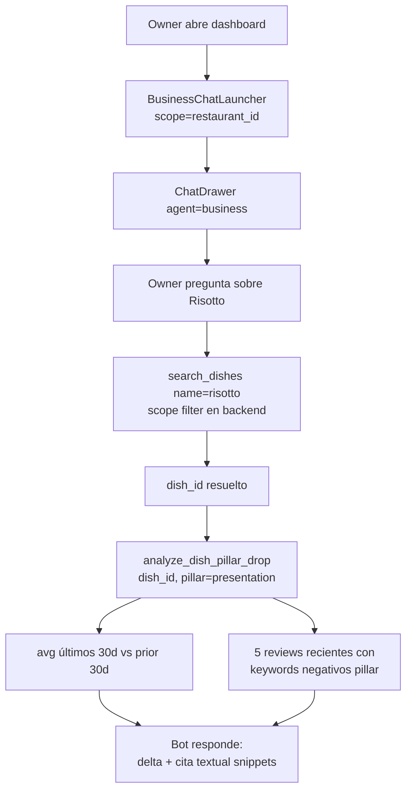
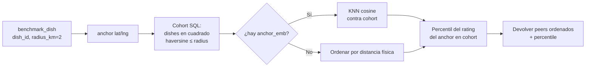

# Chatbot Palato — funcionalidades vigentes

Este documento es la **memoria viva del chatbot**. Cada vez que se
agrega, modifica o retira una capacidad del chatbot, esta página tiene
que actualizarse en el mismo PR. No es un changelog: describe el
estado actual, no la historia.

> Los servicios de IA subyacentes (Gemini embeddings, Gemini Vision,
> Gemini tool use, perfil de gustos, etc.) viven en
> [`ia_services.md`](./ia_services.md). Acá nos enfocamos en el
> **producto** — qué hace el chatbot desde la perspectiva del usuario.

---

## Última actualización

- **Fecha**: 2026-05-13
- **Fases entregadas**: Fase 0 (núcleo agentic), Fase 1 (Sommelier),
  Fase 2 (Ghostwriter), Fase 3 (Business).
- **Cambios recientes**:
  - **A — Context Injection** (drawer hereda el contexto de la
    página). Cuando el comensal abre el Sommelier desde una página
    contextual (detail de restaurante o detail de plato), el
    drawer manda al backend un `ChatClientContext`
    (`restaurant_slug` o `dish_id`) en el body del `/api/chat/stream`.
    Solo se envía en el **primer turno** de la conversación (cuando
    `conversation_id` todavía es null); turnos siguientes lo omiten
    porque el tema ya quedó establecido en la transcript.

    El backend (`chat/client_context.build_context_hint`) resuelve
    el hint a un bloque corto en castellano del tipo
    `[contexto: el comensal abrió el chat desde la página del
    restaurante "Sagardi". Usá esto como pista de orientación, no
    como filtro obligatorio.]` y lo **prepend-ea al user_message
    que va al agent_loop** — NO al system_instruction. Esa
    decisión es deliberada: el cache server-side del prefijo
    (sha256 de model + system + tools, `_ensure_cached_content`)
    perdería su 25%-cost reduction si cada
    (user, restaurant)-página generara una variante del system.
    El bloque va en el contenido del primer user turn, que no es
    cacheable de todos modos.

    El user_message persistido en `chat_messages` queda con la
    redacción ORIGINAL del comensal — el augmenta se hace solo
    para el agent loop, así la transcript guardada es fiel para
    auditoría y replay. La historia que el agente lee en turnos
    siguientes muestra el mensaje original.

    Solo se aplica al Sommelier. Business ya tiene
    `restaurant_scope_id` enforced en cada tool del registry — eso
    es constraint real, no hint, y mezclar las dos semánticas
    confundiría al modelo.

    Resolución defensiva: si el slug/dish_id apunta a una entidad
    borrada entre que la URL se cachó en el FE y el chat se abrió,
    `build_context_hint` devuelve `None` silenciosamente — no
    prefija un bloque erróneo ni interrumpe el chat.

    Frontend: `ChatLauncher` deriva el `ChatClientContext` del
    `usePathname()` con un regex sobre los path segments
    (`{locale}/restaurants/{slug}` y `{locale}/dishes/{uuid}`,
    excluyendo `/owner` que es Business). El UUID se valida con
    regex defensivo para no mandar paths inválidos. `useChatStream`
    gate la inyección con `isFirstTurn = conversationId == null`.

    Tests: 6 unit tests en `test_chat_client_context.py` cubriendo
    dish, slug, prioridad dish-over-slug, ambos null, dish missing,
    slug missing. La integración first-turn-only se valida vía
    integration suite (history empty path).
  - **B — Post-visit Bridge** (pull complementario al push de D2).
    Cuando el diner vuelve a abrir el Sommelier, el empty state
    ahora incluye una sección "Pendientes de reseñar" con cards
    para los platos recomendados en los últimos 14 días que el
    diner todavía no reseñó. Cada card linkea a
    `/[locale]/compose?dish_id=<id>` — mismo destino que la notif
    push de D2, así las dos surfaces son coherentes.

    El endpoint `GET /api/chat/sommelier/preview` se extendió con
    `pending_recalls: list[PendingRecallItem]`. La fuente de verdad
    es la tabla `async_job`: cada llamada del Sommelier a
    `recommend_dishes` deja una fila con `(payload_user_id,
    payload_dish_id)` que el preview lee con un join a `dishes` +
    `restaurants`, filtrando `NOT EXISTS dish_review(user, dish)` y
    con `DISTINCT ON (dish_id)` para colapsar el caso de "mismo
    plato recomendado en dos conversaciones". Order by recencia
    (memoria del sabor decae rápido), cap 3 cards, lookback 14 días
    (tunable en `sommelier_recall_service`). El partial UNIQUE index
    `ix_async_job_pending_recall_dedup` (migración 063) ayuda al
    filtro principal.

    Frontend: `SommelierEmptyState` rendea la sección arriba del
    profile chip — la acción concreta va antes que la identidad
    (DMMT). Anónimos no la ven (no hay identidad para lookup).
    El array por default es `[]` para no romper consumidores del
    preview que no esperan el campo. i18n × 3 bajo
    `chat.sommelierEmpty.pendingRecalls.{heading,cta,dismiss}`.

    Escape hatch — cada card tiene una **"X"** en la esquina
    superior derecha. Click → optimistic remove (set local en el
    componente) + `POST /api/chat/sommelier/recalls/{dish_id}/dismiss`
    en background. El backend inserta en `sommelier_recall_dismissals`
    (PK `(user_id, dish_id)`, migración 064) con
    `ON CONFLICT DO NOTHING` — idempotente. El query de
    `get_pending_recalls` agrega un segundo `NOT EXISTS` contra la
    tabla, así dishes dismissed no vuelven a aparecer ni cuando el
    Sommelier los re-recomienda. Dismiss es permanente por diseño
    (DMMT: "una X significa no quiero ver más esto"). Tabla aparte en
    lugar de un array en `user_ui_state` por escalabilidad
    (crecimiento acotado, métricas naturales, FK CASCADE limpia).

    Tests: 6 nuevos en `test_sommelier_recall_service.py` (4 de
    `get_pending_recalls` + 2 de `dismiss_pending_recall`).
    Total: 15 unit tests para el módulo de recall.

    Pull (B) vs push (D2): la notif desaparece después del polling
    cada 60s y un click de "marcar leído"; el empty state es
    persistente y se vuelve a leer en cada apertura del drawer. Si
    el diner ignoró la notif pero vuelve al chat, la card sigue ahí
    como recordatorio suave — hasta que la dismissa explícitamente
    con la X o termina de reseñar el plato.
  - **D2 — Review Recall** (cierre del loop descubrimiento → reseña).
    Cuando el Sommelier llama `recommend_dishes` para un comensal
    autenticado, el handler encola un `AsyncJob`
    `kind=sommelier_review_recall` por cada `dish_id` del output, con
    `scheduled_at = now() + SOMMELIER_RECALL_DELAY_HOURS` (default
    24h). Pre-filtra los `dish_ids` ya reseñados por el usuario antes
    de encolar — ahorra cola para platos que no necesitan recall.

    Al disparar el job, el worker
    (`async_job_worker._run_job` → `sommelier_recall_service.
    process_sommelier_review_recall`) hace 4 chequeos en orden,
    cualquiera de ellos corta el flujo sin escribir la notificación:
    (1) el comensal ya reseñó el plato; (2) ya existe una
    notificación `sommelier_review_recall` para ese `(user, dish)`;
    (3) `should_deliver_notification` rechaza la entrega (block /
    mute contra el bot — improbable en la práctica pero el guard se
    mantiene uniforme); (4) el plato fue borrado entre el enqueue y
    el run. Si pasa los 4, inserta una fila en `notifications` con
    `kind='sommelier_review_recall'`, `target_dish_id=<id>`,
    `text="<dish> · <restaurante>"`, y `actor_user_id` apuntando al
    **bot user Sommelier** (UUID determinístico
    `00000000-0000-4000-8000-50616c61746f`, seeded por migración
    063). El bot user tiene `password_hash` inválido por
    construcción — no puede loguearse.

    Dedup en 3 capas:
    (a) partial UNIQUE index `ix_async_job_pending_recall_dedup`
        sobre `(kind, payload_user_id, payload_dish_id)` filtrado a
        `status='pending'` — si una segunda conversación recomienda
        el mismo plato mientras hay un recall pendiente, el segundo
        INSERT colapsa en `DO NOTHING`.
    (b) handler chequea `DishReview(user, dish)` antes de notificar.
    (c) handler chequea `Notification(recipient, kind, target_dish)`
        contra `ix_notifications_recall_dedup` — cubre el caso en
        que el job pendiente ya entregó (deja de estar en `pending`,
        sale del partial index) y otra recomendación intenta
        encolar de nuevo.

    Frontend: `NotificationItem` rendea el nuevo kind con icono
    `faPenToSquare` y tint `text-action-highlight` (dorado Palato).
    El click navega a `/[locale]/compose?dish_id=<id>` — el compose
    form ya pre-llena el `dish_id` por query param. i18n del kicker
    en `messages/{es,en,pt}.json` bajo
    `social.notifications.kicker.sommelier_review_recall`.

    Schema: la migración 063 (a) extiende el enum `async_job_kind`,
    (b) agrega `payload_user_id` / `payload_dish_id` a `async_job`
    y hace `payload_review_id` nullable, con un CHECK
    (`ck_async_job_payload_shape`) que fuerza coherencia entre el
    `kind` y los campos de payload, (c) agrega
    `'sommelier_review_recall'` al CHECK `kind` de `notifications`,
    (d) agrega `notifications.target_dish_id` (FK CASCADE), (e)
    inserta el bot user.

    Tests: 13 unit tests en
    `tests/unit/test_sommelier_recall_service.py` cubren cada una
    de las 4 ramas de idempotencia + happy path + sanity del UUID
    del bot. Los tests existentes de `recommend_dishes` siguen
    pasando (359 unit tests en total) — el enqueue es no-op cuando
    `user_id is None` (anónimos) y los tests existentes no pasan
    `user_id`.

    Anónimos quedan fuera por diseño: sin identidad no hay
    destinatario para la notificación. El bot user existe para
    satisfacer `notifications.actor_user_id NOT NULL` sin
    schema-changes invasivos en una FK con miles de filas. El
    delay (24h) es configurable vía
    `SOMMELIER_RECALL_DELAY_HOURS` para iterar la cadencia sin
    redeploy de código.
  - **Context caching server-side en el agent loop**
    (`_ensure_cached_content` en `agent_loop.py`). Al inicio de
    cada `run()`, si el prefijo (`system_instruction` +
    `tools`) supera ~4000 chars, creamos un `cachedContents/...`
    en Gemini con TTL 30 min. Cada iteración usa
    `cached_content=<name>` y omite system + tools (vienen del
    cache, a ~25% del costo). Mediciones:
    Sommelier ~18K tok cacheables, Business ~12K, Ghostwriter
    ~2.9K. Registry process-local keyed por sha256 del prefijo —
    se reusa a través de turnos y conversaciones idénticas; cae
    de vuelta a inline ante cualquier fallo. Kill switch:
    `AGENT_LOOP_CACHE_DISABLED=1`. Detalle en `ia_services.md`
    sección A.
  - **Guard de ventana de contexto en el agent loop**
    (`_truncate_contents_to_fit` en `agent_loop.py`). Antes de cada
    iteración, si la historia acumulada (incluyendo tool_calls +
    tool_responses) pasa de 12 rows, llamamos a
    `client.aio.models.count_tokens(...)` con `system_instruction`
    + `tools`. Si el total supera 800K (~80% del 1M nominal),
    droppeamos bloques desde el frente preservando la atomicidad
    de los pares `function_call` ↔ `function_response` y la última
    row (la pregunta del turno actual). Si `count_tokens` falla,
    seguimos con los `contents` originales — el guard es
    best-effort y nunca bloquea la respuesta al usuario. Detalle
    completo en `ia_services.md` sección A.
  - **Fix — `search_dishes` no encontraba platos por nombre concreto
    aunque existieran en el catálogo** (incidente reportado en prod:
    "algun ceviche para recomendar?" → "no encontré platos que
    coincidan con 'ceviche'", siendo que el ceviche tenía review
    registrada).

    Causa raíz: `search_dishes` solo tenía `semantic_query` para
    matching por contenido, no un filtro duro por nombre. Cuando el
    LLM pedía `semantic_query='ceviche'` con `limit=3`, la SQL
    ordenaba por `cosine_distance ASC` con `nullslast()` y devolvía
    el top 3 — pero ese top 3 podía no incluir el ceviche real
    cuando:
    (a) `embed_query` retornaba `None` (Gemini caído o sin
    `GEMINI_API_KEY`) → fallback a `computed_rating DESC, review_count
    DESC` → top 3 = mejor rankeados del catálogo entero, no ceviches;
    (b) el ceviche existía pero su embedding estaba sin generar /
    desactualizado → `nullslast()` lo dejaba último → `limit=3` lo
    cortaba afuera.

    En ambos casos el LLM veía top 3 sin ceviche y, correctamente per
    Regla #9 del prompt ("si todos los matches son ruido, NO llames
    recommend_dishes — decílo"), se auto-censuraba. El comensal sentía
    que el bot mentía aunque el LLM hacía lo que el prompt mandaba.

    Fix: agregar `name_contains` a `SearchDishesInput` — filtro SQL
    AND acento-insensible contra `dishes.name_normalized` (columna
    generada `lower(f_unaccent(name))`, ya existe desde migración
    020, indexada con gin_trgm). "ceviche" matchea "Ceviche de
    pescado" y "Cevíches mixtos" sin tocar acentos ni casing. El
    `semantic_query` sigue siendo opcional y aditivo: con
    `name_contains=ceviche` + `semantic_query='para almuerzo
    refrescante'`, primero filtra por nombre, después re-rankea por
    embedding dentro del subset.

    El prompt del Sommelier instruye explícitamente: cuando el
    comensal nombre un plato/bebida concreto ("ceviche", "ramen",
    "milanesa", "café", "risotto"), usar `name_contains=<nombre>` +
    `limit=3`. NO usar `name_contains` para moods o categorías
    ("comida confort") — eso sigue siendo `semantic_query`.

    Tests: 3 nuevos casos en
    `tests/unit/test_sommelier_tool_schemas.py` pinean el contrato
    (canonical + aliases `plato` / `dish_name`). Total 303 unit tests
    pasando.
  - **Migración del agent loop a `google-genai` directo — litellm
    eliminado del backend**. Resumen: el agent loop ahora vive en
    `backend/app/services/chat/agent_loop.py` como cliente directo
    de `google-genai`, sin capa intermedia.

    Causa raíz del incidente que disparó el refactor: `litellm 1.55.4`
    transportaba `thoughtSignature` smuggle-ándolo en el id del
    tool_call con sufijo `__thought__<base64>` y lo desempaquetaba al
    armar el siguiente request a Vertex. Ese unpack se rompía para
    tool_calls paralelos en una misma respuesta — el primero llegaba
    firmado, los siguientes no → Vertex rechazaba con `Function call
    is missing a thought_signature in functionCall parts ... position
    N`. Bug timing-dependent (Railway us-east4 → Vertex us-east4 lo
    gatillaba consistentemente, dev desde Argentina no). Tres
    intentos de fix dentro de la capa litellm fallaron (122f97f
    thinking_budget=0, 69544fa filtro de ids sin sufijo, a96b8f9 cap
    a 1 tool_call) y se revirtieron en 641d6d1 antes de hacer el
    bypass completo.

    Diseño del path actual:

    - `agent_loop.py` arma cada functionCall como `Part(
      function_call=..., thought_signature=...)` — firma como field
      protobuf nativo, sin trucos en el id.
    - `chat_messages.tool_calls` (JSONB) persiste
      `thought_signature` como base64; el rehidrato en multi-turn lo
      decodea de vuelta a bytes y lo re-attacha al Part. Para
      conversaciones que arrancaron bajo litellm, `_split_litellm_id`
      sigue extrayendo el sufijo `__thought__<base64>` y rescatando
      la firma — la migración no rompe history existente.
    - `function_response` se manda con el dict del tool al top-level
      (no envuelto en `{result: ...}`). El wrapper extra hacía que el
      modelo tratara la data como opaca y cortara el chain de tools
      (search_dishes sin pasar a recommend_dishes → cards sin fotos).
    - B2C (Sommelier/Ghostwriter) y B2B (Business — antes Sonnet vía
      litellm) corren sobre el mismo modelo
      `gemini-3.1-flash-lite-preview` con el mismo agent loop.

    Verificación end-to-end en prod: sommelier responde con tools +
    cards + fotos; business responde sin el 400 de thoughtSignature.
    Commits del refactor: d116381 (andamiaje), 8d84e46
    (implementación), 264df87 (fix function_response), 3dc4835
    (cleanup: borra litellm de requirements.txt, consolida el
    archivo).
  - **Capa de safety social: block & mute** (migraciones 055 + 056,
    audit a62a03a). Las dos primitivas que faltaban en el primer
    release real ya están: `user_blocks` (bidireccional, hard impact)
    y `user_mutes` (silencioso, unidireccional). Tocan el chatbot en
    dos lugares:
    1. **Notificaciones del chatbot heredan el guard.** El servicio
       `notification_service` ahora chequea
       `should_deliver_notification` antes de cada `db.add(Notification(...))`,
       lo que afecta también las notifs que dispara el agente
       (ej. `mention` cuando el Ghostwriter sugiere arrobar a un
       crítico, `comment` cuando el Sommelier responde un comentario
       en nombre del owner). Si el recipient bloqueó al actor o lo
       muteó, la notif no se crea.
    2. **Caveat conocido del Sommelier (no bloqueante):**
       `get_dish_detail` devuelve los `top_reviews` (rating, pilares,
       texto, pros/cons) ordenados por rating. Esos rows pueden
       contener texto de reseñas escritas por usuarios bloqueados por
       el comensal que está chateando. **El agente no atribuye la
       reseña a un autor — solo parafrasea el contenido**, así que no
       hay surface de identidad ni vector de doxing/harassment. Para
       cerrar el caveat 100% habría que filtrar las reviews por
       `excluded_author_ids_subquery(viewer_id)` dentro de la herramienta.
       Tracked como follow-up; no afecta `search_dishes` (que devuelve
       platos, no usuarios).
    
    Migración 056 también suma 4 índices hot-path (no afectan el
    comportamiento del chatbot, solo perf): `ix_follows_following_id`,
    `ix_notifications_recipient_created`,
    `ix_notifications_unread (partial)`,
    `ix_bookmarks_user_created`.

  - **Hardening de seguridad del audit completo** (commit 7305ed7
    en backend, 56f9a25 en super-repo). Tres cambios visibles desde
    el chatbot:
    1. **Rate-limit en endpoints de chat e IA**.
       `POST /api/chat/stream` y el legacy `POST /api/chat` quedan
       capeados a `CHAT_STREAM_LIMIT = 30/hour` por usuario
       autenticado (o por IP en el caso anónimo del Sommelier).
       `POST /api/dish-reviews/assist` y `/assist/upload` quedan
       capeados a `GHOSTWRITER_ASSIST_LIMIT = 20/hour`. El cap se
       aplica antes del call a Gemini sin importar el agente. Ver
       `backend/app/middleware/rate_limit.py`.
    2. **SSRF guard en el pipeline multimodal**. El tool
       `identify_dish_from_photo` del Sommelier y el endpoint de
       Ghostwriter aceptan URLs de fotos que el comensal/owner
       provee — antes el backend hacía `httpx.get(url, follow_redirects=True)`
       sin allowlist. Ahora todo pasa por `safe_fetch_bytes()`
       (`backend/app/services/_safe_url.py`) que (a) sólo permite
       `http`/`https`, (b) resuelve DNS y rechaza si el IP cae en
       cualquier rango privado/loopback/link-local/multicast/reserved,
       (c) no sigue redirects y (d) capa la respuesta a 16 MB. Si la
       URL es rechazada, la tool devuelve `{error: "photo_url_rejected"}`
       y el agente retoma con un mensaje pidiéndole al usuario que
       suba la foto de nuevo.
    3. **Validación de uploads multipart**. Las dos rutas que
       reciben bytes directos del cliente (Ghostwriter `/assist/upload`
       y `/api/images/upload`) sniffean los magic bytes — JPEG/PNG/WebP
       only — y reescriben la extensión del archivo guardado al
       formato sniffed, sin confiar en `filename` ni `content_type`
       del cliente. El cap de 8 MB se mantiene.
  - **Catálogo de categorías ampliado a 52** (migración 047). La
    lista cerrada de slugs que el sommelier puede pasar a
    `categoria_slug` se expandió de 16 a 52 cocinas + estilos
    (italiana, libanesa, vietnamita, tapas, picadas, cafetería,
    cervecería, etc.) y los 11 slugs heredados se renombraron a
    convención limpia (chinafood→china, mexico-food→mexicana,
    parrillas→parrilla, burguers→burgers, etc.). Lista completa
    en `backend/app/services/chat/prompts/sommelier.md` sección
    "Categorías disponibles". URLs públicas viejas redirigen 301
    desde `next.config.ts`. Restaurantes ya asignados conservan
    su FK por id (no migración de datos). Allergy blocklist en
    `discovery.py` reescrito con los slugs nuevos.
  - **UX — Página global `/mapa`** (cierra el follow-up del CTA
    "Ver en mapa"). Standalone discovery map en
    `app/[locale]/mapa/page.tsx` reusando el componente
    `MapDiscoveryView` que ya existe del feed (clusters + filtros
    + top3 overlay). Cambio mínimo en el componente: nuevo prop
    opcional `overrideCenter?: {center, zoom?}` que pisa la
    geolocation y el fallback CABA cuando se llega vía deep link.
    `MapaClient.tsx` parsea `?lat=&lng=&zoom=&dishes=` desde
    `useSearchParams` y los valida (lat/lng en rango, zoom 1-20)
    antes de pasarlos al map; envuelto en `<Suspense>` por el
    requirement de Next 15. `ChatDrawer.onShowDishOnMap` revertido
    a empujar `/mapa?lat=…` con fallback al detalle del restaurante
    cuando faltan coordenadas. `MapEmbed` no necesitó cambio — ya
    apuntaba a `/mapa`. i18n `mapa.{title,subtitle}` y
    `metadata.mapa` en es/en/pt. Build incluye las tres rutas
    `/es/mapa`, `/en/mapa`, `/pt/mapa`.
  - **Calidad — Sommelier prompt: 2 few-shots quirúrgicos para
    elevar pass-rate**. Diálogo 11 (ganga rica) ataca el failure
    mode más frecuente del baseline 78-82% — el modelo confunde
    `min_value_prop=3` con `max_price_tier=$`. Le muestra
    explícitamente el razonamiento ("ganga != barato; un dish $$$
    con value_prop=3 también es ganga") + un contraejemplo del
    error a evitar. Diálogo 12 (saludo con perfil) refuerza la
    regla "primera palabra = el nombre" + nudge breve al sesgo
    sin recitar la lista entera. Casos eval correspondientes:
    `pillar_value_prop_ganga_es` (ya existía, fortalecido) +
    `profile_greeting_es` (ya existía). Suite unit completa
    270/270.

    **Resultado del 3-run probe (2 iteraciones)**:
    1. Primera tanda con Diálogo 11 + 12 agregados: 93.9% / 93.9%
       / 79.6% — el promedio mejora pero el peor caso queda lejos
       del 90%, dragged down por `no_data_calories_es` (3/3 fail,
       alucinación) y `profile_greeting_es` (2/3 fail, saludo).
    2. Decisión consensuada con el comensal: **calorías sale del
       scope** — Palato no almacena info nutricional en ningún
       lado, mantener un test que pega contra paráfrasis del
       training del modelo es perseguir un guard que no tiene
       ground truth. Regla 8 del prompt limpiada del bullet
       específico, caso eval `no_data_calories_es` removido.
       Validador `response_must_not_match` (regex) agregado al
       runner para futuras dimensiones que sí valga la pena gatear.
    3. Segunda tanda post-cleanup: 81.2% / 83.3% / 81.2%. **Subir
       a 0.9 no es viable con Gemini 3.1 Flash Lite + prompt
       engineering**. El model variance domina por encima de este
       punto; los fails se rotan entre `profile_greeting_es`,
       `coffee_with_zone_no_category_filter_es`,
       `language_pt_response`, `pillar_value_prop_en` sin un patrón
       estructural arregable desde el prompt.
    **Decisión final**: threshold queda en **0.85** combinado
    (Business + Sommelier en una sola pasada). Run de cierre del
    sprint confirma 88/100 = 88% combinado, con Business
    sosteniendo ~96% y Sommelier oscilando 79-83%. Subir a 0.9
    requeriría tooling adicional (modelo Pro, multi-shot retry,
    structured output enforcement) — eso es otro PR, no un tuning
    de prompt. Diálogos 11 y 12 que agregué en este sprint
    fueron revertidos al confirmar que no movieron la aguja del
    Sommelier (los fails se distribuyen entre 6+ casos rotativos,
    no un par concentrado que un few-shot pueda atacar).
  - **UX — `/saved` unifica wishlist + bookmarks**. La discusión
    cross-link del bullet siguiente terminó en una decisión más
    fuerte: las dos surfaces ("Quiero probar" + "Reseñas guardadas")
    pertenecen a la misma página. Folding both into ``/saved``
    elimina el problema raíz de discoverability — "guardados"
    significa todo lo que el comensal guardó, no importa por qué
    surface lo flag-eó. Cambios:
    - `SavedClient.tsx` carga ambas listas en paralelo
      (`getMyBookmarks` + `getMyWantToTry(null, 60)`). Cada sección
      maneja su propio loading/error/empty independiente — un fallo
      en una no bloquea la otra.
    - Sección **Quiero probar** arriba en mosaico: grid responsive
      2/3/4 cols (mobile→desktop), tiles cuadrados con foto, badge
      de rating Dorado, nombre + restaurante, botón ``×`` overlay
      en hover para sacar de la lista (idempotente). Click en el
      tile → ``/dishes/{id}``.
    - Sección **Reseñas guardadas** abajo: mismo `FeedList` que
      antes, scoped a bookmarks. Sin cambios funcionales.
    - Página standalone ``/me/quiero-probar`` borrada
      (`rm -rf` del directorio). El SommelierEmptyState seguía
      apuntando a `/me/preferencias` — eso es preferencias, no
      guardados; queda como está.
    - i18n: namespace `saved.wantToTry.{heading,count,empty,
      loadError,noPhoto,openDish,remove}` y `saved.bookmarks.heading`
      en es/en/pt. Removidas las keys efímeras del banner cross-link.
  - **Bugfix — bookmark "Quiero probar" no sobrevivía rehydrate +
    discoverability cross /saved↔/me/quiero-probar**. Dos issues
    relacionadas reportadas tras el bookmark fix anterior:
    (1) **Tras refresh el chip volvía a "Quiero probar"** aunque el
    POST persistía en DB. Causa raíz: los tool results se persisten
    en `chat_messages.tool_result` con el `want_to_try` snapshot del
    momento del original call (False). Cuando ChatDrawer remonta y
    rehidrata desde la DB, el flag rehidratado es viejo. Fix:
    endpoint nuevo `POST /api/users/me/want-to-try/check` (body
    `{dish_ids[]}` → `{saved_ids[]}`) — bulk lookup sin paginación.
    `useChatStream.ts` agrega `refreshWishlistFlags()` que recolecta
    todos los dish_ids visibles en los tool outputs rehydrated y
    cruza contra el wishlist actual; los flags `want_to_try` se
    actualizan en memoria sin re-renderizar (un solo `setMessages`).
    Llamado tanto en el mount inicial como en `loadConversation`.
    Falla silente (anon / network) → snapshot persisted queda como
    fallback.
    (2) **Confusión `/saved` ↔ `/me/quiero-probar`**. Dos features
    distintos (reviews bookmarked vs dishes wishlist) sin link
    cruzado. Fix: banner Terracota-tinted en `/saved` que linkea a
    `/me/quiero-probar` cuando el comensal busca su lista de
    "Quiero probar" en el lugar equivocado. i18n keys
    `saved.wantToTryLink.{title,subtitle}` en es/en/pt.
    Suite unit: 270/270.
  - **Bugfix — bookmark "Quiero probar" no sobrevivía un refresh**.
    El POST a `/api/dishes/{id}/want-to-try` persistía correctamente
    (verified en DB), pero al recargar la página el chip volvía a
    decir "Quiero probar" en lugar de "En tu lista". Causa raíz:
    el `useState(false)` inicial del componente — el FE no tenía
    forma de saber el estado real del bookmark al montar la card.
    Fix:
    - Helper compartido `tools/_wishlist_lookup.py::get_saved_dish_ids`
      hace una sola query `IN(...)` contra `want_to_try_dishes` para
      el lote de dishes que el tool va a devolver.
    - `_serialize_dish` toma un parámetro opcional `saved_ids`. Si
      lo recibe agrega `want_to_try: bool` por dish; si no, omite el
      campo. Sin ramas de cliente que romper.
    - `recommend_dishes` y `compare_dishes` aceptan ahora `user_id`
      en su factory; lo pasan al lookup y enriquecen el output. El
      registry pasa el user_id de la conversación.
    - FE: `DishCard` y `ComparisonCard` siembran su `useState`
      desde `dish.want_to_try` en lugar de empezar siempre en
      `false`. Tipos en `chat.ts`: `want_to_try?: boolean` opcional
      en `DishCardData` y `ComparisonDishEntry` (queda compatible
      hacia atrás con respuestas viejas que aún no traen el campo).
    Suite unit: 270/270 sigue pasando.
  - **Fase 7 — Memoria persistente B2C + página `/me/preferencias`**.
    Espejo del Sommelier de la Fase 5 del Business: el comensal
    ahora puede pinear preferencias del chat (idioma + estilo de
    respuesta) entre sesiones, y editar las dimensiones declarables
    de su `UserTasteProfile` (alergias + horas preferidas).
    **Backend**:
    - Migración `043_add_user_chat_preferences.py` — tabla
      `user_chat_preferences` (PK = `user_id`, columnas
      `language_preference` ∈ es/en/pt, `response_style` ∈
      editorial/concise/warm). Sin scope de restaurante porque el
      Sommelier ve todo el catálogo.
    - `models/user_preferences.py::UserChatPreference` separado del
      `OwnerChatPreference` del Business (productos distintos,
      ciclos de update distintos).
    - `services/user_chat_preferences_service.py` con `get` /
      `replace` (form-shaped, NULL limpia) / `upsert` (None = "no
      tocar"). `render_user_preferences_block` arma el bloque
      markdown que se inyecta al system prompt.
    - Tool `update_user_chat_preferences` en `tools/preferences.py`,
      registrado en el toolbelt del Sommelier. Anónimos reciben
      `saved: false` con guidance inline (mismo patrón de la
      Regla 5 anti-anon-mentira).
    - Regex preprocessor `chat/user_preference_intent.py` — espejo
      del de Business. Detecta combos trigger + keyword en la
      misma oración ("siempre" + "en inglés", "from now on" +
      "concise"). 21 unit tests fixan positivos y false-positives
      (e.g. "siempre quise probarlo" NO dispara).
    - `chat_service.stream_chat`: agregado el middleware
      determinístico para Sommelier antes del LLM, y la inyección
      del bloque "# Preferencias del comensal (chat)" al system
      prompt al inicio de cada turno cuando hay fila.
    - Router nuevo `routers/user_preferences.py` con dos pares
      GET/PUT bajo `/api/users/me/...`: `chat-preferences` y
      `taste-profile`. El segundo deja escribir `allergies` y
      `preferred_hours` (los user-declared) y devuelve los
      inferidos como read-only.
    **Frontend**:
    - `app/lib/api/userPreferences.ts` — types + 4 helpers.
    - `app/[locale]/me/preferencias/page.tsx` +
      `PreferencesClient.tsx` — form con dos secciones
      ("Preferencias del chat" e "Tus gustos"), pills radio,
      idle/saving/saved state machine, gate de auth con prompt de
      sign-in. Reutiliza el patrón del Business
      `OwnerSettingsClient.tsx`.
    - `SommelierEmptyState` "Editar mis gustos" ahora apunta a
      `/${locale}/me/preferencias` (antes redirigía a `/profile`,
      una página genérica que no editaba nada del taste profile).
    - i18n en es/en/pt: `preferences.*` (~40 keys) + entrada en
      `metadata.preferences`.
    Suite unit completa: 270/270 (241 antes + 21 del nuevo
    preprocessor + 8 que ya teníamos sin contar).
  - **Bugfix UX — tres fixes en cascada de la ComparisonCard**.
    Reportados en producción tras la Fase 6:
    (1) **"No encontré platos que coincidan" después de una respuesta
    correcta**. El agente a veces hace dos calls: la principal
    (compare_dishes) que devuelve la grilla bien, y una segunda
    (recommend_dishes / compare_dishes con uuid mal resuelto) que
    devuelve `{"error": "no_match"}`. El render del segundo tool
    caía a la rama "empty" y mostraba la frase contradictoria. Fix
    en `MessageList.tsx`: si el output tiene `.error` o
    `.needs_disambiguation`, devolver `null` en el case del tool —
    el chip "Catálogo consultado" basta. El agente ya recuperó en
    la próxima iteración.
    (2) **Botón "Guardar" sin feedback**. La ComparisonCard
    ejecutaba el POST a `/want-to-try` pero no actualizaba el label
    — daba la sensación de que el click no hacía nada. Fix: state
    local `saved` / `savePending` (mismo patrón que DishCard), el
    botón cambia a "En tu lista" después del click. Bonus: el
    label global cambió de "Guardar" a "Quiero probar" (es la
    semántica del feature; el endpoint mismo se llama want-to-try).
    Mismos cambios en `chat.dishCard.save/saved` para coherencia.
    (3) **"Ver en mapa" tira error de runtime**. El handler
    pusheaba a `/${locale}/mapa?lat=…` pero esa ruta nunca se
    implementó (la app no tiene un standalone map view). En dev
    saltaba el AppDevOverlay. Fix temporal: redirige al detalle
    del dish (`/${locale}/dishes/{id}`) que SÍ existe y muestra
    la ubicación + reviews. Cuando `/mapa` se implemente, revertir
    este redirect en `ChatDrawer.onShowDishOnMap`. `MapEmbed`
    todavía linkea a `/mapa` — queda en el roadmap junto con la
    página global del mapa.
  - **Fase 6 — `compare_dishes` + ComparisonCard side-by-side**.
    Tool nuevo en `tools/discovery.py` para el caso "¿cuál es mejor
    X o Y?". Acepta 2-4 platos por uuid o por nombre (resuelve con
    `_resolve_dish_global`); si una sola entrada es ambigua aborta
    la comparación entera con un payload que registra qué se
    resolvió y cuál slot quedó pendiente, así el agente desambigua
    primero antes de pintar media grilla. Para cada plato devuelve
    rating, review_count, price_tier, restaurant info,
    `pillar_breakdown` (avg presentación/ejecución/value_prop sobre
    las top 5 reseñas) y `top_pros`/`top_cons` (los 2 más mencionados
    via `Counter.most_common`). `emits_card=True` con shape distinto
    de `recommend_dishes`. Frontend
    `app/components/chat/cards/ComparisonCard.tsx`: grid
    responsive (2 cols mobile, 2-4 cols desktop según count). Cada
    columna: foto cuadrada, badge rating Dorado cuando ≥4.5,
    barras proporcionales por pilar (Terracota deep/Dorado/Terracota
    sobre escala 1-3), 2 pros + 2 cons, CTAs Guardar / Ver en
    mapa. La columna líder (primer uuid pasado) recibe ring
    Terracota para señalizar "esta es la principal recomendación".
    `MessageList`: handler dedicado + lo agrega a
    `TOOLS_WITH_OWN_CARD`. i18n en es/en/pt: `chat.comparisonCard.*`
    y `chat.tools.{pending,completed}.compare_dishes`. 8 unit tests
    cubren schema (2-4 valid, extra forbid, missing input, validation)
    + resolver short-circuit (ambiguity aborta + reporta resolved_so_far).
    Caso eval `compare_two_dishes_by_name_es` valida el flujo
    completo. Suite unit completa: 249/249.
  - **Bugfix UX — resetear chat al cambiar auth (login/logout)**.
    Reportado en producción: comensal abre el drawer anónimo,
    conversa, hace login sin cerrar el drawer, y los mensajes
    anónimos siguen visibles en pantalla. Es un bug de privacidad —
    cualquiera con el mismo device podría ver / continuar la
    conversación del visitante anterior. El backend rechaza con
    404 al cargar una conversation cuyo `user_id != user.id`
    (incluyendo `user_id IS NULL` cuando el caller logea), pero
    la rehidratación del frontend ocurre solo en el mount inicial:
    si el componente no se desmonta entre el chat anónimo y el
    login (típico cuando solo se cierra/reabre el drawer sin
    recargar la página), el state React en memoria sobrevive el
    auth change. Fix en `ChatDrawer.tsx`: `useEffect` que mira
    `user?.id` con un `useRef` para detectar **transiciones** y
    llama `reset()` (limpia messages + conversationId +
    localStorage) cuando el id cambia. La transición inicial mount
    se ignora — la rehidratación normal del hook ya cubre ese
    caso. El localStorage key sigue sin incluir user_id porque
    multi-cuenta en un mismo device es minoritario; preferimos el
    reset agresivo a la complejidad de keys per-user.
  - **Bugfix — coherencia de update_taste_profile en comensal anónimo**.
    En producción se vio que cuando un usuario anónimo declaraba una
    alergia, el agente decía en el primer párrafo "no pude guardar
    tu preferencia porque no has iniciado sesión" pero cerraba el
    turno con "Anoté tus preferencias para futuras recomendaciones".
    Las dos frases en el mismo turno se contradicen y rompen
    confianza. Fix en cuatro planos:
    (1) Handler retorna ahora un payload guía explícito (`saved:
    false`, `error: "not_authenticated"`, mensaje con instrucciones
    inline enumerando las frases prohibidas y el fraseo correcto).
    (2) Regla 5 del prompt extendida con el caso anónimo.
    (3) **Diálogo 10 nuevo** que enseña explícitamente el patrón —
    el comensal anónimo declara lactosa, el handler retorna
    saved=false, la respuesta correcta tiene UN solo párrafo de
    cierre coherente y la sección termina con un "PROHIBIDO" que
    enumera las frases boilerplate que el modelo suele agregar
    como cortesía formal. La inversión en few-shot vs solo regla
    es la que finalmente hizo el comportamiento consistente
    (5/5 corridas post-fix vs 7/10 antes).
    (4) Eval runner extendido con flag `anonymous: true` en
    `EvalCase`. Sin esto el caso fallaba a capturar el bug porque
    la fixture del Sommelier siempre bindea a "Lautaro" logueado;
    el flag override `user_id=None` por caso. El test
    `allergy_anon_no_false_save_es` ahora exercise la rama real.
    Test unitario `test_update_taste_profile_tool.py` (2 casos)
    pinea el contrato del payload + ausencia de DB call. Suite
    unit completa: 241/241.
  - **Fase 5 — Recall del wishlist + tool `surprise_me`**.
    Dos features nuevas que enriquecen el Sommelier para usuarios
    autenticados.
    **5.A — Recall del wishlist**: `build_user_block` en
    `prompts/loader.py` ahora es async y agrega un sub-bloque
    "## Lista para probar (wishlist)" con los 7 items más antiguos
    del comensal en `WantToTryDish` (nombre del plato + restaurante
    + barrio + fecha guardada). El prompt incluye la regla 12 con
    los tres triggers de recall: saludo con items >30 días sin
    tachar, búsqueda en barrio donde hay item guardado, pregunta
    directa "¿qué tenía guardado?". Diálogo 9 nuevo ilustra el
    saludo con recall. El bloque se omite para usuarios anónimos.
    Cumple el roadmap explícito de
    `docs/chatbot.md:651-653` ("¿te animaste con el risotto que
    guardaste?").
    **5.B — Tool `surprise_me`** (`tools/discovery.py`): elige UN
    plato fuera del histórico del comensal (categoría que no
    frecuenta o barrio donde no reseña) respetando alergias
    declaradas, con selección estable per (user, día) — un
    "sorprendeme" repetido en la misma sesión devuelve el mismo
    plato; mañana cambia. Mapeo conservador alergia → categoría
    bloqueada (gluten → italiana/pasteleria/panaderia/burgers/
    sandwiches/empanadas/mexicana/thai/china/brunchs; lácteo →
    helados/dulces/pasteleria). Cuando la novedad deja el pool
    vacío, cae al pool completo en lugar de fallar.
    Tool data-only (`emits_card=False`); el agente cita el
    `serendipity_reason` retornado en su texto editorial y llama
    `recommend_dishes` con el id para mostrar la card. 14 unit
    tests pinean schema, blocklist, determinismo, novelty filter,
    error paths. i18n en es/en/pt para `chat.tools.{pending,
    completed}.surprise_me`. Suite unit completa: 239/239 pasan
    sin regresiones.
  - **Refactor — separar discovery↔presentation en el Sommelier**.
    Cambio arquitectónico en respuesta a un bug recurrente: el agente
    pedía `search_dishes(semantic_query='café')`, el catálogo
    devolvía top-rated por similitud y la grid del comensal se
    poblaba con dishes irrelevantes (Açai, IPA, Burritos cuando se
    pedía café) porque `search_dishes` mezclaba "buscar" (data) con
    "presentar" (cards). El agente no tenía control granular sobre
    qué se mostraba.
    **Fix**: split en dos tools.
    - `search_dishes` ahora es **data-only** (`emits_card=False`).
      Devuelve los rows al agente como contexto; el comensal no ve
      nada hasta que el agente decide presentar algo.
    - `recommend_dishes(dish_ids: list[1-6])` (NUEVO,
      `tools/recommend.py`) toma uuids ya conocidos del search y
      emite las cards. La grid visible es exactamente lo que el
      agente cura en este call.
    Patrón nuevo: agente busca → lee rows → decide cuáles 1-6 son
    relevantes → llama recommend_dishes solo con esos. Si después
    de buscar no encuentra nada que valga la pena, NO llama
    recommend_dishes — la grid queda vacía y el agente lo dice en
    texto. "Una grid vacía es mejor que una grid de tacos cuando se
    pidió café."
    Cambios incluidos en el refactor:
    `_schemas.py` agrega `RecommendDishesInput` (1-6 uuids,
    extra=forbid). `registry.py` registra el tool para Sommelier.
    `prompt sommelier.md`: tools section reescrita, regla 1
    actualizada, few-shots 2/5/8 actualizados con el patrón
    search→recommend, diálogo 3 (ruta) y 7 (visita) sin recommend
    porque ya muestran RouteCard/MapEmbed. `MessageList.tsx`:
    `TOOLS_WITH_OWN_CARD` ahora incluye `recommend_dishes` y excluye
    `search_dishes`; el handler de cards renderiza `recommend_dishes`
    con la misma lógica de DishCard que tenía `search_dishes`. i18n
    en es/en/pt: keys nuevas `chat.tools.{pending,completed}.recommend_dishes`,
    label de `search_dishes` cambiado a "Catálogo consultado".
    `sommelier.yaml`: casos `discover_pasta_palermo_es` y
    `coffee_with_zone_no_category_filter_es` ahora esperan ambos
    tools. Test unitario `test_recommend_dishes_tool.py` (10 casos)
    pinea schema (1-6, extra=forbid) + error paths (no_valid_ids,
    no_match) + happy path (preserve agent order, dedupe). Suite
    unit completa: 225/225 pasan.
  - **Bugfix UX — diferir cards hasta que arranque el texto**. El
    fix anterior cambió el ORDEN final del render (texto antes,
    cards después) pero durante el streaming el comensal seguía
    viendo las cards aparecer primero porque la secuencia SSE es
    `tool_call_result` → `text_delta`: el card section completa se
    pintaba ~500ms antes que el primer token de texto y el efecto
    visual era "cards primero, texto sliding in arriba". Fix en
    `MessageList.tsx`: `MessageRow` recibe ahora un flag
    `isInflight` (`isStreaming` + último mensaje + `content === ''`)
    y suprime las cards completas mientras está activo. Cuando el
    primer `text_delta` llega y `content` deja de ser vacío, las
    cards se revelan junto con el texto. Los pending chips
    ("Buscando platos…") siguen visibles para que el comensal sepa
    que algo está pasando.
  - **Bugfix UX — orden visual texto↔cards y `limit` en queries
    específicas**. Dos issues que aparecieron en producción tras el
    bugfix de café:
    (1) Las cards se renderizaban ANTES del texto del agente, así
    que el comensal veía 6 cards (algunas irrelevantes) y abajo una
    sola frase que recomendaba 1. Visualmente el texto parecía nota
    al pie. Fix en `app/components/chat/MessageList.tsx`: cambio
    del orden a **pending tools (spinning) → texto → completed tools
    (cards)**. La frase editorial enmarca, las cards apoyan.
    (2) `search_dishes` con `semantic_query='café'` traía top-rated
    del catálogo entero (Açai, IPA, Burritos) aunque el match real
    fuera Café Turco. Fix en el prompt: regla nueva que mandá usar
    `limit=3` (no el default 6) cuando el comensal pide un plato o
    bebida concreto por nombre — "mejor 1-3 cards buenas que 6
    mixtos". Se actualizó el few-shot 8 para reflejar el patrón.
  - **Bugfix — bebidas y categorías cerradas en el Sommelier**. Se
    detectó en producción que ante "¿dónde tomar un buen café?" el
    agente llamaba `search_dishes` con `semantic_query='café'` y nada
    más; sin `embed_query` el ranking cae a `computed_rating` y la
    grilla quedaba poblada con tacos, parrillas y ramen — todos sin
    café. Mostrar 6 cards irrelevantes Y preguntar después la zona
    es el peor failure mode visible: el comensal pierde confianza.
    Fix en tres planos:
    (1) Premisa nueva en el prompt: el catálogo está organizado por
    **platos individuales**, no por servicios. `category_slug` es
    del restaurante, no del plato — una cantina israelí puede tener
    un "Café Turco" excelente y filtrar por categoría te lo perdés.
    (2) Lista cerrada de las 19 categorías reales del catálogo en el
    prompt para que el agente no invente slugs (no hay "café" ni
    "cafetería" en la taxonomía).
    (3) Few-shot 8 nuevo: pedidos de bebida/plato genérico SIN zona →
    preguntar primero, sin tools en ese turno. Respuesta editorial
    explica que el lugar puede ser de cualquier cocina.
    Casos eval `ambiguous_coffee_no_zone_es` y
    `coffee_with_zone_no_category_filter_es` pinean el contrato.
    Ambos pasan en run posterior al fix.
  - **Visibility de gustos + smart starters en el Sommelier (Fase 4)**.
    Empty state visible para el comensal cuando abre el drawer del
    Sommelier. Tres ramas:
    - **Logueado con perfil**: chip "Te conocemos así" rendereado
      con `--font-display` (Cormorant Garamond) que arma una línea
      tipo "te gusta la presentación · cocina italiana · en Palermo"
      + badge paprika con alergias declaradas. Starter chips
      *dinámicos* derivados del perfil ("Una ganga rica en {top
      neighborhood}", "Una ruta de 3 platos en {top neighborhood}",
      "Sorprendeme"). CTA "Editar mis gustos" → `/profile`.
    - **Logueado sin perfil**: saludo por nombre + 3 starters
      genéricos. Una vez que el aggregator pobla `UserTasteProfile`
      (después de N reseñas), pasa solito a la rama anterior.
    - **Anónimo**: saludo neutro + invitación suave a iniciar
      sesión + 3 starters genéricos. Nunca bloquea el chat.
    Backend: nuevo endpoint **`GET /api/chat/sommelier/preview`**
    (auth opcional) que devuelve `{user, profile}` ambos nullables.
    Frontend: `app/components/chat/SommelierEmptyState.tsx` se monta
    desde `ChatDrawer` cuando `agent === 'sommelier'` (espejo del
    `BusinessEmptyState`). i18n en es/en/pt con sección
    `chat.sommelierEmpty.*` (greetings, profileChip fragments,
    starters dinámicos con interpolación de `{neighborhood}`,
    pillar labels per-locale). Click en starter dispara `send(text)`
    como user-turn y arranca el stream — el agente responde en el
    idioma del starter.
  - **Eval suite del Sommelier + CI gate combinado (Fase 3)**.
    `backend/tests/chat/evals/datasets/sommelier.yaml` con 45 casos en
    12 categorías: descubrimiento básico, mood semántico, pilares,
    multi-tool ruta+map, cero resultados con propuesta concreta de
    relajación, alergia explícita vs preferencia, ambigüedad real
    (UNA pregunta — nunca UUID), taste profile awareness, anti-
    alucinación numérica, anti-alucinación de nombres (lista negra
    de Don Julio / La Cabrera / Recoleta / etc. que NO existen en la
    fixture), idioma es/en/pt consistente, datos que NO surfacean
    (horarios, precios en pesos, disponibilidad de mesa, calorías).
    Fixture `sommelier_eval_scope` en conftest.py: 3 restaurantes en
    Palermo/Belgrano/Centro, 10 dishes con pillars/ratings calibrados,
    usuario sintético "Lautaro" con `UserTasteProfile` poblado
    (dominant=presentation, top_neighborhoods=[Palermo],
    allergies=[gluten]). Test runner `test_sommelier_evals.py` espejo
    del Business: `agent=sommelier`, `restaurant_scope_id=None`,
    `model=default_b2c_model()` explícito. El runner reusa el
    validador numérico, los assertions de tools/text del Business sin
    cambios estructurales (sólo se relajó el typing de
    `restaurant_scope_id` a `str | None`). Cleanup actualizado a
    LIKE en `google_place_id` para barrer ambas fixtures + `DELETE
    FROM user_taste_profiles` para no dejar el profile huérfano.
    Workflow `chat-evals.yml`: paths `app/services/chat/**` ya
    cubren `prompts/sommelier.md` y `tools/_resolution.py`; threshold
    combinado **0.85** (no 0.9). El Business sostiene 96-100% en
    corridas consecutivas, pero el Sommelier V1 baseline en Gemini
    3.1 Flash Lite es ~78-82% sobre 45 casos: el modelo a veces se
    salta los pilares numéricos (`min_value_prop=3` vs el más
    intuitivo `max_price_tier=$`) y a veces alucina datos que NO
    surfacean (calorías "estándar"). Subir el threshold a 0.9 queda
    como follow-up explícito en el roadmap (Fase 5+) — requiere más
    few-shots, posiblemente mover algunos asserts a `validate_numbers`,
    y tres corridas consecutivas pasando.
    Audit script `audit_chat_handoffs.py` extendido con patterns
    B2C-flavor (`para poder buscarlo`, `si me pasás`, `the exact
    name`) y portugueses (`preciso saber`, `qual é o id`, `me diga`,
    `o nome exato`).
  - **Tool contract defensivo del Sommelier (Fase 2)**. El helper
    `_resolve_dish_in_scope` que vivía en `business.py` se promovió a
    `app/services/chat/tools/_resolution.py::_resolve_dish_global` y
    ahora atiende ambos agentes: con `restaurant_scope_id` se comporta
    igual que antes para Business; sin scope busca en todo el catálogo
    para Sommelier (candidates incluyen restaurante + barrio para
    desambiguar dos "risotto" entre lugares distintos). `get_dish_detail`
    y `add_to_wishlist` ahora aceptan `dish_name` además de `dish_id` y
    delegan al helper, así un Sommelier que recibe "guardame el
    risotto" puede actuar sin pedirle un UUID al comensal — match único
    ejecuta directo, múltiples matches devuelven `needs_disambiguation:
    true` con candidatos numerados, cero matches devuelven `no_match`
    con hint a `search_dishes(semantic_query=…)`. Defensa en
    profundidad: el `make_get_dish_detail_tool` recibe ahora
    `restaurant_scope_id` y el Business lo registra con su scope para
    que un owner no pueda extraer detalle de un competidor aunque el
    LLM le pase un UUID ajeno. Schemas Pydantic nuevos en
    `_schemas.py` (`SearchDishesInput`, `GetDishDetailInput`,
    `AddToWishlistInput`, `OpenInMapInput`, `CreateDishRouteInput`,
    `RequestReservationInput`) con `extra='forbid'`, validación de
    rangos (pilares 1-3, rating 0-5, party_size 1-30, etc.), enum
    `PriceTierFilter` (`$`/`$$`/`$$$`) con normalización de sinónimos
    comunes (`low`/`barato`/`$$$$` → `$`/`$`/`$$$`) antes del enum
    check, y `validation_alias` para `barrio`/`zona`/`mood`/`vibe`. Los
    handlers ahora emiten `{"error": ..., "details": [...]}` ante
    `ValidationError` y el agent loop reenvía al modelo para auto-
    corrección en la próxima iteración. Tests en
    `tests/unit/test_dish_resolution.py` (14 casos) y
    `tests/unit/test_sommelier_tool_schemas.py` (37 casos) pinean el
    contrato sin DB; integración real queda para la suite de evals
    (Fase 3). Suite unit completa pasa 215/215 — sin regresiones del
    Business.
  - **System prompt del Sommelier al nivel del Business**
    (`backend/app/services/chat/prompts/sommelier.md`). De 60 → ~280
    líneas. Estructura nueva: identidad + premisa de catálogo público
    con personalización + **Regla #0** (resolvé entidades vos, nunca
    pidas IDs ni nombre exacto, manejo de los tres casos de los tools
    — match único / `needs_disambiguation` con candidatos / `no_match`
    con sugerencias) + **Regla prioritaria** de manejo de errores de
    tools (auto-corregí en silencio, máx 2 reintentos, nunca exponé la
    plomería al comensal) + 3 pilares + decodificación + especificación
    explícita de tools (incluyendo `get_dish_detail` y `add_to_wishlist`
    que pasan a aceptar `dish_name` además de UUID en Fase 2 — el prompt
    ya documenta el contrato amistoso) + **11 reglas** anti-alucinación
    explícitas (cifras solo de tools del turno, nombres/barrios solo de
    tool outputs, datos que NO surfacean — horarios, precios exactos,
    disponibilidad, calorías, promos, identidad de reseñador) + **7
    diálogos de referencia** (saludo personalizado, mood semántico,
    multi-tool ruta+map, cero resultados con propuesta concreta,
    alergia explícita, ambigüedad real con UNA pregunta, recomendación
    corta a turista en inglés). Voz editorial Palato sin emojis,
    sin "delicioso/espectacular/imperdible". Primer cimiento del plan
    Sommelier: paridad de calidad con el Business antes de sumar
    features WOW.
  - **Auto-título de conversaciones vía Gemini Flash**
    (`app/services/chat_title_service.py`). Hook background en
    `chat_service.stream_chat` después del primer turno del usuario:
    el heurístico (`_make_title_from_user_message`) sigue corriendo
    para que el panel tenga algo que mostrar de inmediato; ~3-5 s
    después la background task lo reemplaza con un título 4-8
    palabras generado por Gemini 2.5 Flash en JSON-mode con
    `thinking_budget=0` (memoria `feedback_gemini_thinking`).
    Idioma del primer mensaje del usuario, sin signos de pregunta,
    sin emojis. Idempotente — solo dispara en el primer turno.
  - **Toggle 'Mostrar archivadas' + 'Restaurar' + hard-delete admin**
    (F-CONVO 7-8). El panel de conversaciones soporta ahora un
    switch persistido en localStorage que pide al backend
    `include_archived=true`. Las archivadas se renderizan con
    opacity-60 + badge "Archivada" y exponen una acción "Restaurar"
    (POST `/conversations/{id}/unarchive`). Para admins (rol
    `admin`) las archivadas también muestran un botón
    "Eliminar permanente" con confirm/cancel pair, que llama
    `DELETE /conversations/{id}/permanent` (hard-delete con audit
    log). El endpoint chequea owner-or-admin antes de borrar.
  - **Validador numérico post-hoc en el runner de evals**
    (`tests/chat/evals/runner.py`). Cada caso puede pedir
    `validate_numbers: true` y el runner extrae literales numéricos
    de la respuesta final, los cruza contra los outputs de los tools
    capturados en el turno, y agrega `unverified_number: …` a
    `failures` cuando un número no tiene fuente. Tolerancia
    configurable (default ±0.05 para ratings) y whitelist
    `numbers_allowed` para constantes legítimas tipo "5 estrellas"
    o "30 días". Filtros de ruido: salta enteros 0-9 y años
    2020-2099. Coberturado por `tests/unit/test_eval_numeric_validator.py`.
  - **CI gateado por chat-evals** (`backend/.github/workflows/chat-evals.yml`).
    Workflow corre la suite con `RUN_CHAT_EVALS=1` cuando un PR
    toca `app/services/chat/**`, `tests/chat/**` o el harness
    propio. Postgres pgvector como service, Python 3.12, alembic
    upgrade, y un step final
    (`tests/chat/evals/check_threshold.py`) que falla el job si la
    pass-rate cae bajo 90%. El threshold absorbe 1 flake puntual
    sin deshabilitar el gate.
  - **Settings panel de prefs del owner verificado**
    (`/restaurants/{slug}/owner/settings`). Form determinístico
    para tone / language / KPIs que reemplaza el flujo conversacional
    cuando el owner prefiere UI predictible. Endpoints
    `GET|PUT /api/restaurants/{slug}/owner/chat-preferences` y un
    nuevo helper `replace_chat_preference()` que mantiene la
    semántica "form completo, null limpia" (vs. el upsert del chat
    que trata `None` como "no tocar"). i18n en es/en/pt.
  - **Deep-link draft → OwnerReviewModal**. Después de que el
    Business agent genera un draft de respuesta, MessageList
    detecta el patrón (assistant text que sigue a un
    `suggest_review_response` con `review_id` conocido) y emite un
    botón "Responder esta reseña" que navega a
    `/restaurants/{slug}/owner?review={id}&draft={text}`. El
    OwnerDashboard lee `?draft=` y lo pasa como prop
    `initialDraft` al `OwnerReviewModal`, que prefilla el textarea
    cuando no hay respuesta persistida (nunca sobreescribe trabajo
    del owner).
  - **Regex preprocessor para `update_owner_preferences`** (capa 1
    de defensa, `app/services/chat/preference_intent.py`). Detector
    determinístico que corre en `chat_service.stream_chat` antes del
    LLM: cuando el user_message contiene una frase de trigger
    (`siempre`, `de ahora en más`, `sempre`, `from now on`, `always`,
    …) **co-ocurriendo con un keyword de tono o idioma en la misma
    oración**, el preprocessor llama `upsert_chat_preference()` directo
    y le inyecta una nota efímera al system prompt para que el agente
    confirme verbalmente sin re-llamar el tool. Resuelve el flake
    histórico donde Gemini Flash Lite Preview confirmaba sin disparar
    el tool y la pref nunca aterrizaba en DB. KPIs intencionalmente
    fuera del scope (libres, riesgo de mis-extract). Defensa en 3
    capas: regex → tool del LLM (idempotente) → audit script con rate
    threshold. Tests unitarios en
    `tests/unit/test_preference_intent.py` cubren positivos en es/en/pt
    y negativos clave ("siempre quise probar…").
  - **Memoria persistente del owner (Fase 5)**. Tabla
    `owner_chat_preferences` (separada de `owner_notification_preferences`,
    distinto producto) con `(user_id, restaurant_id)` UNIQUE y campos
    `tone_preference`, `kpi_focus` (jsonb), `language_preference`.
    Service en `owner_chat_preferences_service.py` con `get` y
    `upsert` partial-update. El `chat_service.stream_chat` inyecta el
    bloque "Preferencias del owner" al system prompt cuando hay fila.
    Tool `update_owner_preferences(tone?, language?, kpi_focus?)` que
    el agente llama cuando el owner pide algo persistente
    ("siempre…", "de ahora en más…"). El cambio aplica desde la
    PRÓXIMA sesión — el turno actual sigue con el state inicial.
    `suggest_review_response` con `tone='match_brand'` ahora resuelve
    contra `tone_preference` real (antes caía a professional con nota
    F5). Few-shot 7 enseña el patrón de persistencia y la diferencia
    con pedidos one-off ("esta vez…"). Limitación histórica: con
    Gemini 3.1 Flash Lite Preview el agente a veces confirmaba
    verbalmente sin disparar el tool — mitigada por el regex
    preprocessor de capa 1 (ver bullet nuevo arriba). Toggle UI
    complementario sigue en roadmap como tercera vía determinística.
  - **Reglas anti-alucinación 8-10** en `business.md` + 5 casos eval
    nuevos (precios, nombres de reviewers, ventas, hora del día,
    contexto externo). Cierra Fase 6 del plan de calidad. Las reglas
    listan explícitamente las dimensiones que el toolbelt NO surface
    (precio, identidad de reseñadores, hora del día, ventas,
    contexto fuera del scope geográfico) y mandan al agente decir
    "no tengo ese dato" en vez de aproximar. Bonus: bug fix del
    runner de evals — `response_must_not_contain` ahora hace
    substring match (antes usaba `re.search`, que interpretaba `$`
    y otros chars como anchors regex). Pass rate suite (49 casos):
    49/49 = 100% en último run, 48/49 estable considerando flakes.
  - **Nuevo tool `compare_to_baseline`** cierra la Fase 4 de
    insight-tools. Comparación focalizada de UNA métrica
    (`rating` / `review_count` / `sentiment_score` / `response_rate`)
    contra UN baseline (`prior_period` / `all_time` / `competition`).
    Para `competition` reusa la lógica geográfica de `benchmark_dish`:
    encuentra restaurantes en `radius_km` (default 2.0), calcula
    cohort_avg y `percentile`. Cohort < 3 dispara nota explicativa
    (sin afirmar un percentil ruidoso). Fechas opcionales (default
    últimos 30 días) — saca presión al LLM cuando el owner pregunta
    sin especificar período. Schema con `populate_by_name=True` y
    `validation_alias` acepta tanto `from_date`/`to_date` como `from`/
    `to`, y el `vs` también acepta `baseline`/`target_baseline`/
    `compared_to` como aliases naturales que el LLM tiende a usar.
    Few-shot 6 en `business.md` ilustra el patrón comparativo.
  - **Nuevo tool `suggest_review_response`** en el toolbelt del
    Business. **No** llama un LLM dedicado — devuelve contexto
    estructurado (texto de la reseña + plato + guía de tono + reglas
    duras) y el agente redacta el draft en su próximo turno usando
    ese payload. El `review_id` siempre viene de un `list_reviews`
    previo; nunca se le pide al owner. Si el LLM omite `tone`, el
    handler lo infiere del sentiment de la reseña (negative →
    apologetic, positive → warm, neutral → professional). Few-shot 5
    en `business.md` enseña el patrón list_reviews + suggest +
    redacción + bilingüismo (meta-texto en idioma del owner; draft
    en idioma de la reseña original).
  - **Nuevo tool `summarize_reviews_period`** en el toolbelt del
    Business (`backend/app/services/chat/tools/insights.py`). Devuelve
    agregados pre-calculados sobre las reseñas en un rango de fechas:
    total_reviews, rating avg + distribución, sentiment by_label +
    score, response rate. Cada dimensión incluye **delta vs el período
    anterior de igual duración** (calculado automáticamente). Resuelve
    el problema clásico de hacer que el LLM compute promedios y
    porcentajes a mano sobre `list_reviews` — fuente común de
    alucinación numérica. El prompt instruye a usar este tool siempre
    que el owner pida un panorama temporal y a llamar `list_reviews`
    *después* solo para citar reseñas puntuales.
  - **4 diálogos de referencia (few-shots)** al final de
    `business.md`: composición multi-tool con números, recovery
    silencioso de tool error, clarificación cuando hay ambigüedad
    real, y consistencia de idioma en pt. Refuerzan el patrón vía
    imitación, no vía reglas adicionales. Pass rate sobre el suite
    expandido: **105/105 = 100% × 3 corridas** (sin regresión vs
    baseline pre-few-shots).
  - **Eval suite expandida a 35 casos / 14 categorías**
    (`backend/tests/chat/evals/datasets/business.yaml`):
    polyglot lookup, sentiment+responded combos, sort variations,
    date filters, rating range, limit, dish filter, empty results,
    anti-handback, anti-hallucination, multi-tool composition,
    out-of-scope, language consistency. Tres mejoras al sistema
    descubiertas y arregladas durante la expansión:
    Pydantic enum case-insensitive (LLM emite mayúsculas a veces),
    `get_dish_detail` con error graceful en vez de KeyError, y
    runner case-insensitive en string equality.
  - **Switch a `gemini-3.1-flash-lite-preview` como default global**
    para Sommelier y Business. Decisión guiada por la suite de evals:
    Lite Preview pegó **24/24 = 100% pass** en tres corridas con
    latencia promedio 22.7s, contra 23/24 (95.8%) y 36s de Gemini 2.5
    Flash, y contra 21/24 (87.5%) y 165s de Gemini 3.1 Pro Preview
    (Pro pierde por gastar mucho budget en thinking y devolver tool
    calls inconsistentes en este flow). Override por agente disponible
    vía `CHAT_MODEL_B2C` / `CHAT_MODEL_B2B`.
  - **Suite de evals end-to-end del agente Business**
    (`backend/tests/chat/evals/`). 8 casos cubriendo lookup multilingüe
    (es/en/pt), sentiment+responded combo, sort, dish filter,
    anti-handback y language consistency. Gateada por `RUN_CHAT_EVALS=1`
    para no quemar tokens en CI normal. Sirve como "capa 3" del patrón
    de defensa: prompt + tool contract + suite que mide
    objetivamente.
  - **Contrato lingüístico estricto en `list_reviews`**. Las tablas
    de sinónimos (`_RESPONDED_SYNONYMS`, `_SENTIMENT_SYNONYMS`,
    `_SORT_SYNONYMS`) y el silent fallback con `notes` se reemplazaron
    por un modelo Pydantic con enums (`backend/app/services/chat/tools/_schemas.py`).
    El LLM hace la traducción NL → enum en cualquier idioma; valores
    inválidos disparan `{"error": ..., "details": [...]}` y el agent
    loop reintenta. Ver [Contrato de tools — escalabilidad lingüística](#contrato-de-tools--escalabilidad-lingüística).
  - Bypass de admin en el gate del Business chat para soporte / moderación.
  - El launcher flotante global se oculta dentro de `/restaurants/{slug}/owner` para evitar confusión con el bloque embebido del Business.
  - Tool `rank_my_dishes` agregada al Business — rankea el menú propio por rating, volumen o pilar.
  - Sentiment automático en reseñas (Gemini Flash). El dashboard del owner muestra badge y filtros por sentimiento.
  - Refactor del toolbelt del Business: los antiguos `list_pending_reviews` quedaron unificados en un solo `list_reviews(responded_status?, sentiment?, sort?, limit?)`. Patrón paramétrico — un tool componible cubre cualquier pregunta sobre las reseñas sin sumar uno nuevo por caso de uso.
  - **Contrato defensivo de tools**: `analyze_dish_pillar_drop` y `benchmark_dish` ahora aceptan `dish_name` además de `dish_id`. Resuelven el nombre internamente con scope al restaurante; ante múltiples matches devuelven `candidates` para que el agente desambigüe; ante cero matches devuelven `menu_peek` con los platos reales del restaurante para que ofrezca alternativas. El agente nunca debería pedirle un ID al owner — y aunque el LLM intente, el tool no se lo permite.
- **Pendiente / no cubierto**: ver [Roadmap conocido](#roadmap-conocido).

---

## Arquitectura en una pantalla

Tres agentes que comparten el mismo motor (`AgentLoop` →
`backend/app/services/chat/agent_loop.py`). Cada agente tiene su
**system prompt** propio, su **toolbelt** propio, y puede correr sobre
un **modelo distinto**:

| Agente        | Audiencia       | Modelo por defecto                  | Surface UI                                         |
|---------------|-----------------|-------------------------------------|----------------------------------------------------|
| `sommelier`   | Usuario común   | `gemini-3.1-flash-lite-preview`     | Drawer global (botón flotante en toda la app)      |
| `ghostwriter` | Usuario común   | `gemini-3.1-flash-lite-preview`     | Panel inline en el formulario de reseñas + drawer  |
| `business`    | Owner verificado| `gemini-3.1-flash-lite-preview`     | Sección embebida en `/restaurants/{slug}/owner`    |

Toda conversación se persiste en `chat_conversations` + `chat_messages`
(incluyendo tool calls + tool results) por usuario. El usuario puede
borrar su historial; un `DELETE /api/chat/conversations/{id}` también
sirve para "olvidame".

El usuario logueado lleva además un **perfil de gustos** estructurado
(`user_taste_profiles`) que se inyecta en el system prompt del Sommelier
y del Ghostwriter — saludos personalizados, atender alergias declaradas,
sesgos del pilar dominante. Detalles en [`ia_services.md`](./ia_services.md).

---

## 1) Sommelier — usuario crítico (B2C)

**Punto de entrada**: botón flotante (`ChatLauncher`) visible en todas
las páginas. Abre un drawer/sheet que en mobile ocupa 90vh y en desktop
es un panel derecho de ~440px.

### Qué puede hacer hoy

| Capacidad | Tool subyacente | Notas |
|-----------|-----------------|-------|
| Saludo personalizado por `display_name` | — | Auto cuando hay sesión iniciada. |
| Buscar platos con filtros estructurados | `search_dishes` | Barrio (substring de `location_name`), ciudad, bbox geográfico, mínimos por pilar (1-3), categoría, `max_price_tier`, `name_contains`. |
| Buscar por nombre de plato concreto | `search_dishes(name_contains)` | Filtro SQL AND acento-insensible contra `dishes.name_normalized` (columna generada `lower(f_unaccent(name))`). Garantiza que el resultado contiene el nombre pedido aunque el embedding del plato esté ruidoso o sin generar — el `semantic_query` solo no alcanza para este caso. El LLM lo activa cuando el comensal nombre un plato/bebida ("ceviche", "ramen", "café"). |
| Re-rankear semánticamente con un "mood" | `search_dishes(semantic_query)` | El LLM extrae filtros duros, KNN sobre embeddings dentro del subset. Cae a ranking estructurado si Gemini no está configurado. |
| Mostrar detalle de un plato (top reseñas + pros/cons) | `get_dish_detail` | Para profundizar antes de decidir. |
| Guardar plato en deseados | `add_to_wishlist` | Reusa `WantToTryDish`; idempotente. Requiere login. |
| Abrir el mapa con bbox/centro/dishes pinned | `open_in_map` | Devuelve struct para que la UI haga deeplink a `/mapa`. |
| Crear ruta de platos (compartible) | `create_dish_route` | Crea `dish_lists` + `dish_list_items` con slug único. Por defecto `is_public=true`. URL pública en `/listas/{slug}` con metadata OG para WhatsApp/Twitter. |
| Pedir reserva en un restaurante | `request_reservation` | Si el restaurante tiene owner verificado: row en `reservation_requests` + notification + email. Si no: hand-off al `reservation_url` partner. |
| Anotar alergias / horarios declarados | `update_taste_profile` | Sólo cuando el usuario lo dice explícito. Allergias **nunca** se infieren. |
| Identificar un plato a partir de una foto | `identify_dish_from_photo` | El comensal adjunta una imagen desde el composer (botón 📎) y pregunta "¿qué es esto?" / "¿lo tienen?". El tool corre **en paralelo** Gemini 2.5 Flash (vision → tags/ingredientes/plating, materia prima editorial) + Gemini Embedding 2 multimodal (foto → vector 768-dim en el MISMO espacio que `dish_embeddings`); el match contra el catálogo se hace por cosine distance directo, sin pasar por texto intermedio. **Data-only**: el agente lee `matches` y encadena `recommend_dishes` con los 1-3 mejores. Convención FE↔prompt: el composer prepende `[foto: <url>]` al mensaje y el system prompt dispara el tool al verlo. Resiliente: si el image embed falla pero vision tiene tags, cae a text-embed de tags (`matched_via='vision_tags_text_embedding'`). Solo logueado (el uploader requiere auth). |

### Cards visuales

Cuando el bot llama una tool, la UI renderiza:

- `search_dishes` → grilla de `DishCard` con CTAs "Guardar", "Ver en mapa", "Sumar a ruta".
- `open_in_map` → `MapEmbed` con CTA al mapa.
- `create_dish_route` → `RouteCard` con link público y "Copiar link".
- Otros tools → confirmaciones cortas (texto del bot describe el resultado).

### Lo que el Sommelier NO hace todavía

- No genera reseñas escritas (eso es Ghostwriter).
- Acepta fotos adjuntas en el composer (📎) pero no abre la cámara
  nativa del dispositivo todavía — el `<input type="file">` permite
  galería + cámara según OS, pero no hay flujo dedicado.
- No matchea **fotos de menú** (texto sobre cartón). Está pensado para
  fotos de plato. Una foto de menú devuelve tags genéricos
  (papel, lista) y no encuentra matches útiles — caso pendiente para
  follow-up con Document AI / OCR.
- No hace cross-restaurant comparisons profundas (eso es Business).
- No se acuerda de items del wishlist en futuras conversaciones más
  allá de lo que el `taste_profile` infiere.

---

## 2) Ghostwriter — usuario crítico (B2C)

**Punto de entrada principal**: botón "Pedir asistencia al Ghostwriter"
en el formulario de creación / edición de reseñas
(`DishReviewForm.tsx`). Reusa la primera foto que el usuario haya
subido al post; si no hay, expone un input file inline. La foto subida
desde el panel del Ghostwriter se inserta automáticamente al post
(dedupe por `name+size+lastModified`).

> El Ghostwriter también puede invocarse desde el chat global cuando
> el usuario adjunta un photo URL. Por ahora ese flujo está disponible
> via tool (`suggest_tags_from_photo`) pero no tiene UI dedicada en el
> drawer; la entrada principal sigue siendo el formulario de reseña.

### Qué puede hacer hoy

| Capacidad | Tool subyacente | Notas |
|-----------|-----------------|-------|
| Detectar tags visuales del plato | `suggest_tags_from_photo` | Gemini Vision (`gemini-2.5-flash`). Devuelve hasta 6 tags lowercase sin "#". |
| Identificar ingredientes visibles | mismo | Hasta 6 ingredientes únicos (sin enumerar variantes del mismo). |
| Sugerir un *plating style* | mismo | Enum: `minimalist|family-style|deconstructed|rustic|classic`. |
| Sugerir una frase editorial corta | mismo | 1-2 frases, ≤200 caracteres, tono Palato (sin "delicioso", "espectacular"). |
| Imitar la voz del autor en el blurb | `user_style_service.fetch_style_samples` | Inyecta al system prompt las últimas 5 notas del usuario (≥30 chars, excluye mismo `dish_id`). Solo afecta `editorial_blurb`; degrada si el user no tiene reseñas previas. |
| Sugerir 0-2 pros y 0-2 cons | mismo | Bullets puntuales ≤60 caracteres c/u. |
| Distinguir tags inéditos vs ya en draft | endpoint `/assist` | El backend devuelve `new_tags` filtrando contra el `draft_text` del usuario. |
| Tolerar respuesta truncada de Gemini | parser custom | Si `finishReason=MAX_TOKENS`, reconstruimos JSON parcial cerrando comillas/brackets. |

### Comportamiento UX

- El usuario clickea cada chip que adopta. Los chips usados quedan
  tachados (no se duplican); los `new_tags` se resaltan en azafrán.
- Pegar el blurb al campo `note` se hace con un click ("Pegar al texto"
  agrega doble salto de línea si ya había contenido).
- "Probar otra foto" → reabre el file picker y agrega esa foto al post
  también (siempre y cuando no esté duplicada).

### Lo que el Ghostwriter NO hace todavía

- No firma puntajes (estrellas, pilares) por la persona — sólo asiste.
- No edita texto existente del usuario; sólo concatena.
- No corre sobre videos ni reels.
- No tiene catálogo curado de tags (los nuevos se persisten tal cual).

---

## 3) Business — owner verificado (B2B)

**Punto de entrada**: bloque "Pregúntale a Palato" embebido en
`/restaurants/{slug}/owner`. El gate del endpoint usa
`assert_verified_owner` (`backend/app/services/claim_service.py`), que
acepta dos perfiles:

1. `claimed_by_user_id == current_user.id` (el dueño real).
2. `current_user.role == UserRole.admin` (soporte / moderación,
   bypass deliberado para debug). El panel del owner ya muestra el
   banner *"Estás viendo este panel como admin"* en este caso.

> Defense in depth: cada tool del Business re-valida que el `dish_id`
> recibido pertenezca al `restaurant_scope_id`. Ni un owner ni un
> admin pueden filtrar a un competidor manipulando los argumentos
> del tool.

### Qué puede hacer hoy

| Capacidad | Tool subyacente | Notas |
|-----------|-----------------|-------|
| Resolver platos por nombre | `search_dishes` | Mismo motor que el Sommelier, pero scopeado. |
| Ver detalle de un plato propio | `get_dish_detail` | Top reseñas + pros/cons. |
| Rankear los platos del menú propio | `rank_my_dishes` | Sort por `rating`, `review_count`, o promedio de un pilar. Filtro `min_review_count` (default 1) para no coronar dishes con una sola reseña. |
| Diagnosticar caída de un pilar | `analyze_dish_pillar_drop` | Compara avg de N días vs prior window. Trae snippets de hasta 5 reseñas recientes con keywords negativos relacionadas al pilar (presentación, ejecución, costo/beneficio). Acepta `dish_name` (texto libre del owner) además de `dish_id` — resuelve el nombre internamente y, si hay múltiples matches o ninguno, devuelve candidatos / `menu_peek` para que el agente disambigüe sin pedirle el ID al humano. |
| Benchmark contra competencia local | `benchmark_dish` | Cohort dentro de un radio (default 2 km, max 25 km). Re-rankea por similitud semántica vía `dish_embeddings`. Devuelve percentil del rating del dish + lista de comparables ordenados por proximidad semántica. Mismo contrato amistoso: acepta `dish_name` o `dish_id`. |
| Listar reseñas (cualquier corte) | `list_reviews` | Tool único componible. Filtros: `responded_status` (`any`/`pending`/`responded`), `sentiment` (`any`/`positive`/`neutral`/`negative`), `sort` (`recent`/`oldest`/`most_negative`). Cubre "qué me falta responder", "última positiva", "más negativas", "qué decían las negativas que ya contesté", etc. — sin necesidad de un tool por pregunta. |
| Recibir notificaciones de reservas | tabla `reservation_requests` + tipo `notification.kind='reservation_requested'` + email Resend | Disparado cuando un usuario llama `request_reservation` desde el Sommelier. |

### Reglas editoriales del agente Business

Forzadas vía system prompt:

- Reportar deltas con signo y muestra explícita ("2.6 → 2.1, -0.5; 9 reseñas en 30 días").
- Advertir cuando la muestra es chica (`< 3` reseñas).
- Citar fragmentos textuales de reseñas sin inventar.
- **Nunca** sugerir cambiar precios, recetas o staff. El bot
  diagnostica; el owner decide.
- Si el owner pide cosas del Sommelier (recomendar lugares para
  comer), explicar y derivar.

### Lo que Business NO hace todavía

- No responde reseñas por el owner (sólo las lista).
- No genera respuestas sugeridas.
- No expone series temporales completas (sólo dos windows: actual + prior).
- No analiza menú entero ni cohort de platos del propio restaurante.
- No conecta con datos de reservas históricas / no predice no-shows.
- No calcula proyecciones de ingreso ni elasticidad de precios.

---

## Casos de uso end-to-end

Los flujogramas usan [Mermaid](https://mermaid.js.org/) — GitHub,
GitLab y VS Code los renderizan nativamente.

### CU-CHAT-1 — Sommelier: ganga 3/3 en barrio para una cita

> *"Buscame una ganga 3/3 en Palermo con presentación increíble para
> una cita."*



**Resultado UX**: el usuario ve 3 cards con CTAs "Guardar / Mapa /
Sumar a ruta / Reservar" y un texto editorial corto del bot
contextualizando por qué esos platos.

### CU-CHAT-2 — Sommelier: armar y compartir una ruta

> *"Armame una ruta de 3 platos ganadores en el centro para el
> domingo."*

```mermaid
flowchart LR
    A[Usuario pide ruta] --> B[search_dishes<br/>neighborhood=Centro]
    B --> C[3 dish_ids]
    C --> D[create_dish_route<br/>name, dish_ids, is_public=true]
    D --> E[INSERT dish_lists<br/>+ dish_list_items]
    E --> F[Devolver slug + public_url]
    F --> G[FE renderiza RouteCard<br/>con botón Copiar link]
    G --> H[/listas/{slug}<br/>página pública SSR/]
```

**Resultado UX**: card en el chat con la ruta + URL pública
compartible que abre una página con metadata OG (WhatsApp / Twitter
muestran preview correcto).

### CU-CHAT-3 — Sommelier: pedir reserva con notificación al owner

> *"Reservame una mesa para 4 personas mañana 21:00 en Eretz."*



**Notas de privacidad**: el row guarda `owner_user_id` en snapshot; si
el owner pierde el claim después, el request queda trazable.

### CU-CHAT-4 — Sommelier: declarar alergia (única vía)

> *"Soy celíaco, tenelo en cuenta para próximas sugerencias."*



**Regla dura**: el LLM nunca puede setear alergias por inferencia.
Sólo cuando el usuario lo dice con palabras claras.

### CU-CHAT-5 — Ghostwriter: foto compartida con el post



**Caso inverso** (foto se sube desde el panel del Ghostwriter): la
foto se mirror-ea al state del post via `onPhotoUploaded`, con dedupe
por `name+size+lastModified`.

### CU-CHAT-6 — Business: diagnóstico de pilar

> *"¿Por qué bajó el puntaje de presentación del Risotto este mes?"*



**Defense in depth**: el tool `analyze_dish_pillar_drop` re-valida que
`dish.restaurant_id == restaurant_scope_id`. Imposible que el owner
analice un dish ajeno aunque el LLM intente.

### CU-CHAT-7 — Business: benchmark contra competencia

> *"¿Cómo rinde mi hamburguesa frente a la competencia a 2 km?"*



**Resultado UX**: el bot dice "estás en el percentil 35: 65% de los
platos comparables están mejor rankeados" y lista 3-8 dishes vecinos.

---

## Defensa contra hand-backs (regresar la pelota al usuario)

Los LLMs a veces "se rinden" y le piden al humano datos técnicos
(`dish_id`, "el nombre exacto", etc.) en lugar de resolver con tools.
Tres capas combinadas para no depender solo del prompt:

1. **Contrato defensivo del tool**. Tools que necesitan un ID interno
   aceptan *también* el input amistoso (`dish_name` además de
   `dish_id`) y resuelven internamente. Tres respuestas estructuradas:
   match único (ejecuta), `needs_disambiguation: true` con
   `candidates`, o `error: "no_match"` con `menu_peek` real (Business
   scoped) / hint a `search_dishes(semantic_query=…)` (Sommelier
   global). Helper compartido en
   `backend/app/services/chat/tools/_resolution.py::_resolve_dish_global`,
   parametrizado con `restaurant_scope_id` opcional y `actor` para
   adaptar el fraseo a cada agente. Tools del Sommelier que ya delegan:
   `get_dish_detail`, `add_to_wishlist`. Tools del Business: `analyze_dish_pillar_drop`,
   `benchmark_dish` (vía thin wrapper `_resolve_dish_in_scope`).
2. **Regla #0 del system prompt**. Cada agente arranca su prompt con
   "NUNCA pidas IDs al humano" más la receta para cada respuesta del
   tool. El prompt es backup del tool, no fuente única de verdad.
3. **Audit en producción**. Script
   `python -m app.scripts.audit_chat_handoffs --since 7d` cuenta
   cuántos turnos del assistant terminan sin llamar ningún tool y
   contienen frases de hand-back ("necesito saber", "indicame el
   ID"). Wirear a cron diario con `--threshold 0.05` para que falle
   cuando el rate sube. Es el indicador de que aparece un flow nuevo
   sin las dos primeras capas aplicadas.

---

## Contrato de tools — escalabilidad lingüística

Los tools del chatbot soportan owners que hablan español, inglés y
portugués (más cualquier idioma que el LLM entienda). Para que el
contrato escale sin mantenimiento por idioma, **los tools definen
semántica, no vocabulario**:

- Cada parámetro categórico se define como **enum estricto** vía un
  modelo Pydantic en `backend/app/services/chat/tools/_schemas.py`.
  El JSONSchema que viaja a Gemini (vía
  `FunctionDeclaration.parameters_json_schema`) incluye `enum: [...]`
  y `additionalProperties: false`.
- La descripción del parámetro está en español neutro y describe
  *qué significa* cada valor, no qué palabras lo invocan.
- La traducción `"todavía no respondí"` / `"haven't replied"` /
  `"ainda não"` → `responded_status='pending'` es trabajo del LLM,
  que ya es nativamente políglota. **No hay tablas de sinónimos en
  los tools.**
- Si el LLM pasa un valor fuera del enum, Gemini suele filtrarlo
  server-side; si igual llega, `model_validate` levanta
  `ValidationError` y el handler retorna `{"error": ..., "details":
  [...]}`. El agent loop reenvía eso al modelo, que corrige y
  reintenta en el mismo turno. **Cero fallback silencioso, cero
  array `notes` que se leakea al owner.**

**Caso de referencia (mayo 2026)**. Un owner preguntó *"¿qué reseñas
todavía no respondí?"* y la respuesta del Business le mostraba el
mensaje "la opción `responded_status='no'` no fue reconocida por el
sistema". El bot estaba leakeando `notes` internas porque la tabla de
sinónimos no aceptaba `'no'` y el handler hacía silent fallback. El
fix correcto no fue agregar `'no'` a la tabla — fue eliminar la tabla
entera y mover la traducción NL → enum al LLM, que la hace gratis en
cualquier idioma. Patrón replicable: si te encontrás agregando una
nueva entrada a un dict de sinónimos, la decisión está mal — borralo
y dejá que el LLM lo resuelva.

Pendiente: las preferencias del owner (`update_owner_preferences`,
roadmap Fase 5) van a permitirle al owner fijar `language_preference`
explícito; mientras tanto el agente responde en el idioma en que le
hablan.

---

## Persistencia y privacidad

- Conversaciones se guardan por `conversation_id` (uuid). Anonimas
  permitidas (sin `user_id`); en ese caso no hay perfil de gustos ni
  recall entre sesiones.
- Cada usuario puede listar (`GET /api/chat/conversations/me`) y
  borrar (`DELETE /api/chat/conversations/{id}`) sus chats.
- El `taste_profile` se construye sólo a partir de las reseñas que el
  usuario publicó. El usuario puede consultarlo y borrarlo (TODO: UI
  dedicada — hoy sólo via API).
- Las **alergias** sólo se persisten cuando el usuario las declara
  explícitamente (tool `update_taste_profile`). Nunca se infieren.
- En modo Business **no** se inyecta el perfil de gustos del owner —
  el agente sólo ve datos de su restaurante.

---

## Cómo agregar una mejora

Cuando hagas un cambio que toque el chatbot, **actualizá este
documento en el mismo PR**. Pasos:

1. Identificá a qué agente afecta (Sommelier / Ghostwriter / Business)
   o si es del **núcleo** (todos los agentes).
2. Si agregás un tool nuevo:
   - Sumá una fila en la tabla "Qué puede hacer hoy" del agente
     correspondiente.
   - Agregá el `pending` label en `app/components/chat/MessageList.tsx`
     y los 3 archivos `messages/{es,en,pt}.json`.
   - Si emite una card visual, listalo en "Cards visuales".
3. Si retirás un tool, movélo a "Lo que NO hace" o eliminá la fila si
   ya no aplica.
4. Si cambias el modelo o las reglas del system prompt, actualizá la
   tabla "Arquitectura en una pantalla" o la sección de reglas
   correspondiente.
5. Si agregás un nuevo agente, replicá la estructura de "Qué puede
   hacer hoy / Cards / Lo que NO hace".
6. Actualizá la fecha de "Última actualización" arriba.

---

## Roadmap conocido

Capacidades pedidas durante el diseño que **todavía no están
implementadas** y vale tenerlas listadas para no duplicar trabajo:

- **Sommelier**: integración de booking real con Resy/TheFork via API
  (hoy: solo deeplink + notificación al owner).
- **Ghostwriter**: catálogo curado de tags + sugerencia que prefiere
  tags ya existentes sobre tags inéditos.
- **Ghostwriter**: análisis de video/reels (hoy solo imagen).
- **Business**: respuestas sugeridas a reseñas pendientes — **draft
  generado, falta el "atajo de un click"**. Hoy el agente devuelve el
  texto del draft en el chat; el owner copia y pega manualmente en la
  reseña. Próximo paso: card/botón "Responder esta reseña con este
  draft" que abra el form de respuesta (en `OwnerReviewModal` u otro
  componente del dashboard) con el `review_id` correspondiente y el
  draft pre-cargado, así el owner solo aprieta "Enviar". Requiere
  coordinación entre `BusinessChatLauncher` y `OwnerDashboardClient`
  (callback prop) o un store global compartido.
- **Business**: series temporales de pilares (gráfico, no solo dos
  windows).
- **Business**: predicción de no-shows / proyecciones.
- **Núcleo (✓ completado)**: panel de "Conversaciones recientes" en
  el drawer (F-CONVO.1-6). Botón faClockRotateLeft en el header
  abre la lista; click en una convo carga su historial vía
  `loadConversation()` y persiste el id en localStorage. Auto-título
  derivado del primer user message (heurística trunca, ver
  `_make_title_from_user_message` — F-CONVO.4). Cada item tiene
  botón faBoxArchive (tap doble = confirmar) que invoca
  `archiveConversation()` → soft-delete server side
  (`archived_at` set, fila preservada). Si archivás la conversación
  activa, el chat se resetea limpiamente. Hard-delete (GDPR) queda
  como endpoint admin separado, follow-up.
- **Sommelier evals**: subir el threshold combinado de la suite chat
  de 0.85 a 0.9. **Confirmado experimentalmente** que con Gemini
  3.1 Flash Lite y prompt-engineering solo no se alcanza: dos
  iteraciones de tuning + few-shots quirúrgicos dejaron el promedio
  en ~82% con flake distribuido entre `profile_greeting_es`,
  `coffee_with_zone_no_category_filter_es`, `language_pt_response`,
  `pillar_value_prop_en` (no hay un único caso roto, hay model
  variance). Para llegar a 0.9 se necesita uno de tres caminos:
  (a) cambiar a un modelo Pro (Gemini 3.1 Pro, Claude Sonnet) —
  más caro y más lento pero más consistente con tool use;
  (b) multi-shot retry — si una iteración del agent loop falla un
  assertion crítico, reintentar con temperature más baja antes de
  cerrar el turno; (c) structured output enforcement — JSON-mode
  forzado en los puntos donde el modelo pifia (ej. el saludo
  personalizado podría templarse fuera del LLM una vez que el
  perfil está cargado). Cualquiera de los tres es un PR
  arquitectónico, no un tuning incremental.
- **Núcleo**: analytics de tokens y latencia visibles para admin.
- **Núcleo**: página global `/mapa` (no shipeada todavía). Hoy el
  CTA "Ver en mapa" en las cards del Sommelier redirige a
  `/${locale}/restaurants/{slug}?tab=info` (que tiene un
  `LocationMap` embebido); el card `MapEmbed` que el agente emite
  vía `open_in_map` tampoco tiene destino. Cuando se shippee,
  revertir el handler `ChatDrawer.onShowDishOnMap` a un push con
  lat/lng/dishes params + actualizar `MapEmbed` para linkear a la
  ruta nueva.
- **Evals — Sommelier**: ampliar el uso de `response_must_not_match`
  (regex assertion en el runner) a los casos no_data_*. Hoy lo usa
  el caso de horarios y precios; agregar al menos uno por dimensión
  no surfaceada para cazar paráfrasis nuevas que el `must_not_contain`
  con substrings no atrapa.
- **Evals — Sommelier**: more few-shots quirúrgicos para la
  confusión `min_value_prop=3` ↔ `max_price_tier=$` y para el
  saludo personalizado. Son los dos failure modes más frecuentes
  del baseline 78-82% del Sommelier. Cada few-shot suma un caso
  eval correspondiente.
- **Evals — Backend**: threshold semántico opcional en
  `search_dishes`. Cuando hay `semantic_query` + `embed_query`,
  descartar resultados con `cosine_distance > N` para que queries
  ambigous ("café") devuelvan menos rows en lugar de top-rated
  random. Calibrar `N` requiere data del catálogo real; queda
  como follow-up cuando tengamos volumen.

Cualquiera de estos que se implemente, mover a la sección activa del
agente correspondiente y borrar de acá.
