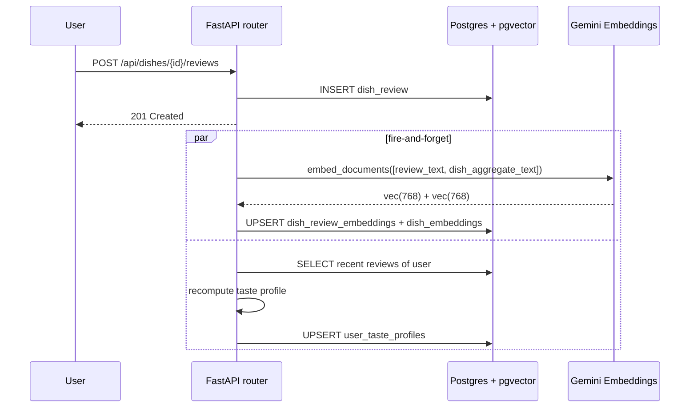
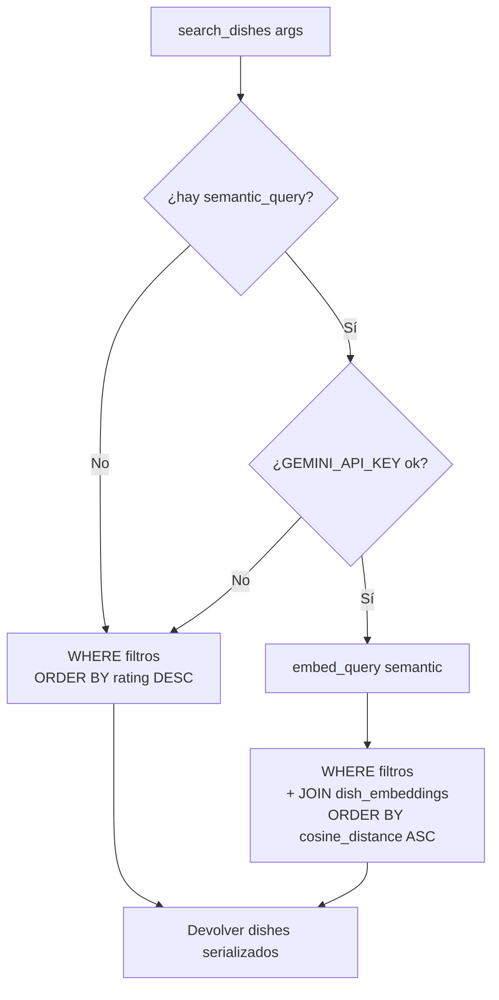
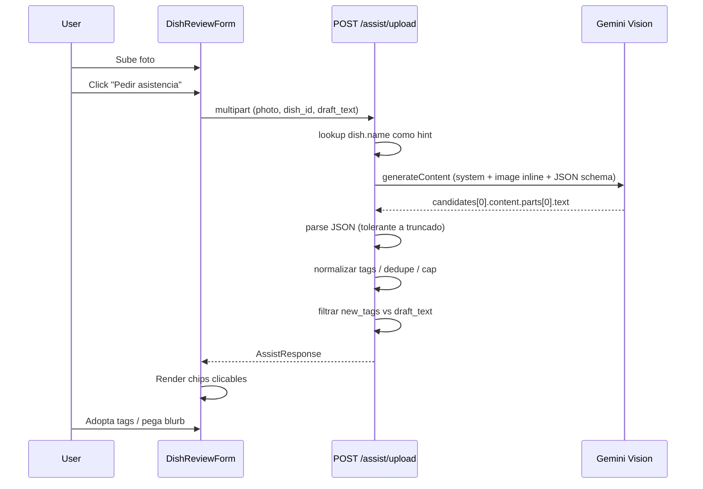
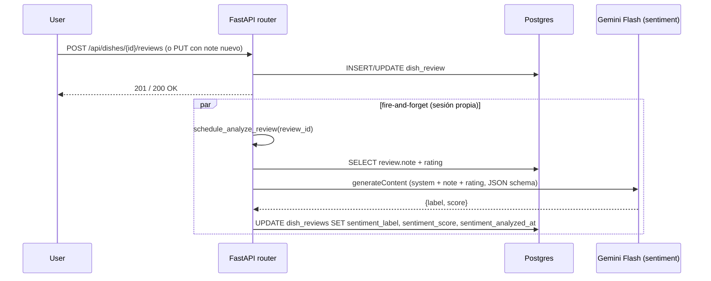
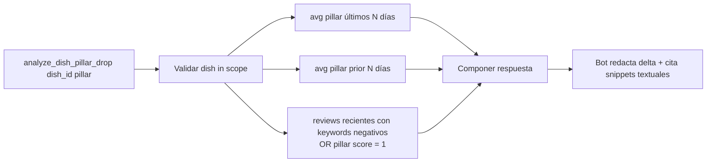

# Servicios de IA en Palato — funcionalidades vigentes

Este documento es la **memoria viva de los servicios de IA** del
producto. Toca actualizarlo en el mismo PR que cambia un servicio. No
es un changelog; describe el estado actual.

> El producto **chatbot** (qué hacen los 3 agentes desde la perspectiva
> del usuario) vive en [`chatbot.md`](./chatbot.md). Este documento se
> enfoca en los **servicios subyacentes** y en quién los consume —
> tanto el chatbot como otros features de la app.

---

## Última actualización

- **Fecha**: 2026-05-12
- **Servicios activos**: agent loop multi-tool, embeddings de
  catálogo, búsqueda híbrida (filtros + KNN), perfil de gustos,
  visión de plato (Ghostwriter + Sommelier multimodal), motor
  editorial de platos, sentiment de reseñas, auto-titulado de
  conversaciones.
- **Cambios recientes (backfill_sentiment vía Batch API)** —
  `backend/app/scripts/backfill_sentiment.py` ahora corre por
  default contra `client.aio.batches.create(model=gemini-2.5-flash,
  src=[InlinedRequest])`, con SLA de 24h y ~50% menos costo que el
  path sync. Comparte `build_sentiment_user_prompt` /
  `build_sentiment_config` / `parse_sentiment_response` con el live,
  así el output es bit-equivalente. Flags `--sync`, `--limit`,
  `--reanalyze`, `--resume`. Detalle completo en la sección G.
- **Cambios recientes (unificación sobre `google-genai` SDK)** —
  migración del transporte y del parsing en los 5 servicios de Gemini:
  - **Transporte único**: `embeddings_service`, `sentiment_service`,
    `vision_service` y `chat_title_service` dejaron de hablar REST
    crudo con `httpx`. Ahora todos pasan por `google-genai`
    (`client.aio.models.generate_content` / `embed_content`), igual
    que `dish_editorial_enricher` y el `agent_loop`. Cada servicio
    expone un `_get_client()` lazy que devuelve `None` cuando
    `GEMINI_API_KEY` está ausente — la degradación graciosa se
    mantiene idéntica a la del path anterior.
  - **Parsing tipado con `response_schema`**: `sentiment_service`,
    `chat_title_service`, `vision_service` y `dish_editorial_enricher`
    le pasan a Gemini un `BaseModel` (`_SentimentSchema`,
    `_TitleSchema`, `_VisionSchema`, `_EditorialSchema`) y leen
    `response.parsed` ya instanciado. Se eliminó el `json.loads` +
    validación defensiva de cada servicio. Las normalizaciones
    semánticas (clip de longitud, dedupe de tags, coerce label↔score,
    drop de `plating_style` fuera del set) siguen vivas como helpers
    *post-parse*, no como recuperación de JSON roto.
  - **Errores**: cada servicio captura `(genai_errors.APIError,
    httpx.HTTPError)` en `_PROVIDER_ERRORS` y degrada (None / dict
    vacío). El SDK envuelve la mayoría de los errores de transporte
    en `APIError`; mantenemos `httpx.HTTPError` por las conexiones
    rotas que pueden filtrarse antes del wrap.
  - **`thinking_budget=0`** se conserva donde ya lo teníamos
    (sentiment, chat_title, editorial). La memoria
    `feedback_gemini_thinking` sigue siendo invariante: Flash 2.5 en
    JSON-mode corto necesita budget cero para no truncar.
- **Cambios anteriores (capa de safety, audit a62a03a)** —
  migraciones 055 + 056:
  - **Notification guard** en `notification_service.py`. Las funciones
    `record_*_notification` (incluyendo `record_mention_notifications`,
    que dispara el Ghostwriter cuando sugiere arrobar) ahora chequean
    `should_deliver_notification(db, recipient_id, actor_id)` antes
    del `db.add(...)`. El guard lee `user_blocks` (cualquier
    dirección) y `user_mutes` (recipient → actor) — primitivas nuevas
    de la migración 055. Cualquier servicio IA que en el futuro emita
    notificaciones debe pasar por este helper para mantener el
    invariante de safety.
  - **Filtro de safety en `get_dish_detail` del Sommelier** — cerrado.
    `make_get_dish_detail_tool` recibe `user_id` opcional; cuando el
    comensal está autenticado, el handler dropea de `dish.reviews` las
    escritas por usuarios que él bloqueó o muteó antes de armar los
    `top_reviews` que ve el LLM. El filtro se aplica en memoria sobre
    el resultado del `selectinload` (las reviews por plato son decenas
    como mucho; reescribir la query no paga). El Business sigue NO
    propagando `user_id` a esta tool — su `get_dish_detail` es
    diagnóstico de pilares para el owner, no consumo social.
    `search_dishes` ya no expone reviews (devuelve platos), así que no
    requería cambio.
- **Cambios anteriores (hardening del audit)** — commit `7305ed7`:
  - **Rate-limit por usuario / IP** en cada endpoint que hace
    salida hacia un provider pago. Constantes vivas en
    `backend/app/middleware/rate_limit.py`:
    `CHAT_STREAM_LIMIT = "30/hour"` para `/api/chat/stream` y
    legacy `/api/chat`; `GHOSTWRITER_ASSIST_LIMIT = "20/hour"` para
    `/api/dish-reviews/assist` y `/assist/upload`. El bucketing
    sigue el patrón existente (`user_or_ip_key`): autenticados por
    `user_id`, anónimos por IP. Cualquier servicio nuevo que llame
    a Gemini / Anthropic / fal.ai debe declarar su propio
    `*_LIMIT` y decorarse con `@limiter.limit(...)`; no apoyarse en
    el cap "ambiental".
  - **SSRF guard** centralizado en `backend/app/services/_safe_url.py`
    (`safe_fetch_bytes`). Reemplaza el patrón previo
    `httpx.AsyncClient(follow_redirects=True).get(...)` que se
    repetía en `vision_service._fetch_image` y en
    `chat/tools/vision.py`. Reglas: scheme allowlist (`http`,
    `https`), DNS resolución upfront con denylist de rangos
    privados/loopback/link-local/multicast/reserved, sin redirects,
    cap de respuesta 16 MB. Cualquier servicio IA que tenga que
    dereferenciar una URL controlada por el usuario debe usar este
    helper — no abrir un `httpx.AsyncClient` directo.
  - **Validación de uploads** en `backend/app/services/_safe_upload.py`
    (`assert_image_or_raise`). Magic-bytes JPEG/PNG/WebP, cap 8 MB,
    extensión derivada del sniff (no del filename del cliente).
    Aplicado en el endpoint de Ghostwriter (`/assist/upload`) y en
    el endpoint de imágenes general (`/api/images/upload`). HEIC
    queda fuera del whitelist hasta que el pipeline re-encode en
    el server.
- **Pendiente / no cubierto**: ver
  [Roadmap conocido](#roadmap-conocido).

---

## Stack de proveedores

| Proveedor | Modelo / endpoint | Uso | Variable |
|-----------|-------------------|-----|----------|
| Google Gemini (vía `google-genai`) | `gemini-3.1-flash-lite-preview` | Sommelier + Business — agent loop con tools, streaming, multi-turn, persistencia nativa de `thoughtSignature`. | `CHAT_MODEL` / `CHAT_MODEL_B2C` / `CHAT_MODEL_B2B` (bare model name, sin prefijo) |
| Google Gemini (vía `google-genai`) | `gemini-3.1-flash-lite-preview` | Editorial blurb del catálogo de platos (one-shot JSON mode) | `EDITORIAL_MODEL` (cae a `CHAT_MODEL`) + `EDITORIAL_API_KEY` (cae a `CHAT_API_KEY` o `GEMINI_API_KEY`) |
| Google Gemini | `gemini-embedding-2` (768 dims con MRL) | Embeddings de reseñas y dishes para búsqueda semántica | `GEMINI_API_KEY` + `EMBEDDINGS_MODEL` |
| Google Gemini | `gemini-2.5-flash` | Visión multimodal para Ghostwriter | mismo `GEMINI_API_KEY` |
| Google Gemini | `gemini-2.5-flash` | Sentiment de reseñas (clasifica el texto en positive/neutral/negative + score) | mismo `GEMINI_API_KEY` |
| Google Gemini | `gemini-2.5-flash` | Auto-titulado de conversaciones de chat (4-8 palabras, JSON-mode) | mismo `GEMINI_API_KEY` |
| Resend | `/emails` | Notificación email a owner cuando se pide reserva | `RESEND_API_KEY` |

Si una key no está configurada, el servicio que la usa **degrada
graciosamente** en vez de romper:

- Sin `GEMINI_API_KEY` → search semántico cae a ranking estructurado;
  Ghostwriter devuelve arrays vacíos pero no falla; embeddings se
  saltan en backfill; el sentiment queda `null` y el dashboard del
  owner no rompe — los filtros por sentimiento simplemente no
  matchean reviews sin clasificar.
- Sin `CHAT_API_KEY` (Gemini) → el endpoint de chat cae a
  `GEMINI_API_KEY` como defensivo; sin ninguna de las dos el bot no
  tiene cómo responder y devuelve un error explícito.
- Sin `RESEND_API_KEY` → `send_email` loguea el payload (dry-run) y
  retorna `True`. Útil en dev.

---

## Servicios IA — catálogo

### A. Agent Loop multi-tool

`backend/app/services/chat/agent_loop.py` — orquestador propio,
agnóstico de framework (sin LangChain/LangGraph). Implementa:

- Registro de tools como `(name, JSONSchema, async handler)`.
- Loop ≤ 5 iteraciones; cada tool con timeout configurable (default 8s,
  visión 30s, business 15s).
- Stream SSE de eventos: `text_delta`, `tool_call_start`,
  `tool_call_result`, `card`, `message_complete`, `done`, `error`.
- Persistencia por mensaje en `chat_messages` con `tool_calls`,
  `tool_result`, `input_tokens`, `output_tokens`.
- Cancellation cooperativo: el cliente puede abortar el `fetch`
  intermedio y la sesión queda consistente.

**Consumidores**: chatbot (3 agentes).

### B. Embeddings — Gemini `gemini-embedding-2` (multimodal nativo)

`backend/app/services/embeddings_service.py`. Vectores L2-normalizados
de **768 dims** (Matryoshka Representation Learning: el modelo emite
3072 nativos y se truncan via `outputDimensionality` para mantener el
schema `pgvector(768)` actual sin migración).

`gemini-embedding-2` es **nativamente multimodal**: texto, imagen,
audio y video se proyectan al MISMO espacio semántico. Eso habilita
comparar un photo-embedding contra un dish-embedding (texto-derivado)
por cosine distance sin necesidad de tablas de embeddings separadas
ni re-indexación del catálogo.

Funciones expuestas:

- `embed_query(text)` — embedding ad-hoc de un query corto. Usado por
  `search_dishes(semantic_query=...)` para re-rankear el subset.
- `embed_documents(texts: list[str])` — batch. Usado para mantener las
  tablas `dish_review_embeddings` y `dish_embeddings` actualizadas.
- `embed_image(photo_bytes, mime_type)` — embedding multimodal de una
  imagen. Usado por `identify_dish_from_photo` (Sommelier) para
  matchear la foto del comensal contra `dish_embeddings`. NO pasa
  `taskType` (la API explícitamente no lo soporta para multimodal).
  Timeout 30s (vs 20s del path texto) por overhead del payload
  base64. Retorna `None` si Gemini está caído o el payload no se
  parsea.
- `reembed_review(review_id)` y `reembed_dish(dish_id)` —
  re-indexación puntual con `source_text_hash` para skipear cuando
  nada cambió.
- `schedule_reembed_review(review_id)` — fire-and-forget invocable
  desde un router después de que una review se crea/edita.

Script one-shot: `python -m app.scripts.backfill_embeddings`.

**Consumidores**:

- `search_dishes` (Sommelier + Business) — re-ranking semántico de
  texto.
- `benchmark_dish` (Business) — vecinos semánticos dentro de un radio.
- `identify_dish_from_photo` (Sommelier) — image embedding directo +
  KNN contra `dish_embeddings`. Aprovecha el espacio semántico
  unificado del modelo: el vector de la foto se compara contra
  vectores texto-derivados sin paso intermedio.

### C. Visión — Gemini `gemini-2.5-flash`

`backend/app/services/vision_service.py`. Multimodal call con
`response_mime_type=application/json` + JSON schema enforcado.

Devuelve: `tags`, `visible_ingredients`, `plating_style`,
`editorial_blurb`, `suggested_pros`, `suggested_cons`.

Robustez:

- Acepta foto por URL (la descargamos con timeout de 10s) o por bytes
  inline (uso típico desde un upload multipart).
- `_parse_partial_json` reconstruye JSON cuando Gemini se queda en
  `MAX_TOKENS` — cierra strings sin terminar y balancea brackets para
  rescatar lo que esté completo.
- Normaliza siempre antes de devolver: dedupe de tags, lowercase,
  límite de items, plating style fuera del enum se convierte en
  `null`.
- **Blurb con voz del autor**: el endpoint del Ghostwriter inyecta al
  `system_instruction` las últimas 5 notas del usuario (≥30 chars,
  excluyendo el mismo `dish_id` para evitar auto-cita) vía
  `backend/app/services/user_style_service.py:fetch_style_samples`.
  El addendum acota el alcance a `editorial_blurb` — tags, ingredients,
  plating, pros y cons siguen siendo observacionales sobre la foto.
  Cuando el usuario no tiene reseñas previas suficientemente largas, el
  bloque se omite y el comportamiento es idéntico al original.

**Consumidores**:

- Ghostwriter — endpoint `POST /api/dish-reviews/assist[/upload]`
  (formulario de reseñas).
- Tool `suggest_tags_from_photo` — disponible al Ghostwriter dentro
  del chat.
- Sommelier — tool `identify_dish_from_photo`
  (`backend/app/services/chat/tools/vision.py`). La foto que adjunta
  el comensal vía el composer del chat (📎 →
  `/api/images/upload` con `entity_type=chat_attachment`) llega
  como prefijo `[foto: <url>]` en el mensaje; el system prompt
  matchea ese patrón y dispara el tool. La handler:
  (1) resuelve la URL a bytes (lectura desde `UPLOAD_DIR` para
  paths locales o fetch httpx con timeout 10s para URLs absolutas);
  (2) corre `analyze_dish_photo` y `embed_image` en paralelo via
  `asyncio.gather` — vision provee tags/ingredients para narración
  editorial, embed_image provee el vector de búsqueda directo;
  (3) llama `execute_dish_search` (helper extraído de
  `make_search_dishes_tool`) pasando el image vector como
  `query_vector`, lo que reusa toda la lógica de filtros, allergy
  guard y serialización. Si el image embed falla pero vision sigue
  ok, cae a un fallback de text-embed sobre los tags (rotulado
  `matched_via='vision_tags_text_embedding'`). La salida es
  **data-only** (no emite cards), igual que `search_dishes`: el
  agente lee `matches` y encadena `recommend_dishes` con los 1-3
  mejores.

### D. Búsqueda híbrida (filtros + KNN)

`backend/app/services/chat/tools/search.py`. La función
`search_dishes` aplica filtros estructurados como `WHERE` (barrio,
ciudad, bbox, mínimos por pilar via `EXISTS`, categoría, price tier)
**antes** del re-ranking semántico. El `semantic_query` opcional pasa
por `embed_query` y se ordena por `cosine_distance` sobre
`dish_embeddings`.

Si el LLM no manda `semantic_query` o Gemini está caído, ordena por
`computed_rating, review_count`. Garantiza que filtros duros nunca se
violen.

**Consumidores**: Sommelier, Business (vía scope).

### E. Perfil de gustos

`backend/app/services/taste_profile_service.py`. Job de aggregación
SQL que recompila para cada usuario:

- `dominant_pillar` — argmax de avg(presentation), avg(execution),
  avg(value_prop). Sólo cuando hay ≥3 ratings en el pilar.
- `top_neighborhoods` — top 3 substrings de `location_name` por reviews.
- `top_categories` — top 3 `Category.slug`.
- `avg_price_band` — bucket low/mid/high del promedio de `price_tier`.
- `favorite_tags` — top 5 de `dish_review_tags`.
- `preferred_hours` — top 3 horas (de `time_tasted` o fallback a
  `created_at.hour`).
- `allergies` — **no inferido nunca**, sólo via tool
  `update_taste_profile`.

Se inyecta en el system prompt del Sommelier y del Ghostwriter como
bloque "Sobre el comensal". El Business **no** lo recibe (los datos del
owner no entran a su agente).

`maybe_refresh_after_review(user_id)` se llama al crear/editar
reviews; el costo es aceptable porque la query es agregada y el set
por usuario es chico.

**Consumidores**: Sommelier (saludo + razonamiento), Ghostwriter
(menciona alergias declaradas).

### F. Notificaciones — emails transaccionales

`backend/app/services/email_service.py`. Wrapper liviano sobre Resend
con templates inline:

- `render_claim_approved`, `render_claim_rejected`, `render_claim_revoked` (claim flow).
- `render_reservation_requested` — disparado por `request_reservation`
  cuando un usuario pide una mesa en un restaurante claimed.

Falla **silenciosa**: el envío nunca propaga excepciones al caller —
sólo loguea. Diseño deliberado: un email caído no debe rollback la
acción del usuario (claim approve, reservation request).

**Consumidores**: tool `request_reservation` (Sommelier), claim flow
(no relacionado con chatbot pero usa el mismo servicio).

### G. Sentiment de reseñas — Gemini `gemini-2.5-flash`

`backend/app/services/sentiment_service.py`. Clasifica el texto de cada
`DishReview` (no las del crítico) en una etiqueta y un score numérico
para que el owner pueda triagear cuáles responder primero. Reusa el
mismo cliente HTTP / patrón JSON-mode del Ghostwriter (sección C).

Funciones expuestas:

- `analyze_review_text(text, rating)` — pura: devuelve
  `SentimentResult(label, score)` o `None` si Gemini no está
  configurado o la llamada falla. Llamada por el hot path y por el
  backfill.
- `analyze_and_persist_review(db, review_id)` — carga la review,
  clasifica y escribe `sentiment_label`, `sentiment_score`,
  `sentiment_analyzed_at`. Caller commitea.
- `schedule_analyze_review(review_id)` — fire-and-forget invocable
  desde un router. Abre **su propia** sesión (`async_session()`) en
  vez de captar la del request, así el job sobrevive al cierre de la
  request y nunca observa una sesión cerrada.

Schema reforzado por Gemini (`response_mime_type=application/json`):
`{label: enum[positive,neutral,negative], score: number ∈ [-1,1]}`.
El servicio reconcilia label vs score si llegan inconsistentes (raro
pero observado): si el modelo dice "positive" con score < -0.15, se
fuerza a "negative" y viceversa.

Visibilidad: el campo es **interno**. Sólo se serializa en
`OwnerReviewItem` (dashboard del owner) y en la salida del tool
`list_reviews` (chatbot Business). `DishReviewResponse`
(público) no lo expone.

Script one-shot: `python -m app.scripts.backfill_sentiment`. **Por
defecto corre vía Gemini Batch API** (`client.aio.batches.create`,
modelo `gemini-2.5-flash`), que tiene SLA de 24h pero cuesta ~50%
menos por request que el path sync. El script:

1. Toma snapshot de las reviews objetivo (id + note + rating) en una
   sesión corta y la cierra; la sesión NO queda abierta mientras el
   batch espera.
2. Construye un `InlinedRequest` por review reusando
   `build_sentiment_user_prompt` y `build_sentiment_config` del
   servicio — ambas paths comparten prompt + schema exactos, así el
   backfill nunca sesga la distribución de labels vs el live.
3. Envía en chunks de 1000 (cada chunk = 1 batch job, logueado por
   `display_name` y `name`).
4. Pollea cada 60s, log de progreso, máx 25h. Si el operador mata el
   proceso, el `name` ya está en stdout y se puede resumir con
   `--resume batches/<name>`.
5. Al estado terminal, walks `batch.dest.inlined_responses` en
   lockstep con los snapshots. **Importante**: en el path de batch
   `response.parsed` viene `None` (el SDK sólo post-procesa el
   `response_schema` en el sync path); `parse_sentiment_response`
   tiene un fallback que valida el JSON crudo de `response.text`
   contra `_SentimentSchema`, así el output es bit-equivalente al
   sync.
6. Si la longitud de respuestas no coincide con los requests
   (`PARTIALLY_SUCCEEDED`), el script REHÚSA persistir y loguea — el
   mapping por posición se rompería y mis-labelearía reviews.

Flags:

- `--reanalyze`: re-clasifica todo el corpus, igual que antes.
- `--limit N`: procesa sólo las primeras N reviews. Útil para smoke.
- `--sync`: cae al path legacy (Semaphore de 5, request por review).
  Necesario si el modelo target no soporta Batch en algún momento.
- `--resume batches/<name>`: pollea un batch ya creado en vez de
  crear uno nuevo. El snapshot tiene que matchear (mismas flags que
  la corrida original).

**Consumidores**:

- Owner dashboard — `GET /api/restaurants/{slug}/owner/reviews?sentiment=negative` y `?sort=sentiment_asc` (más negativas primero).
- Tool `list_reviews` (Business) — filtros componibles `responded_status` + `sentiment` + `sort` para que cualquier pregunta sobre reseñas resuelva con una sola llamada.

### H. Auto-titulado de conversaciones — Gemini `gemini-2.5-flash`

`backend/app/services/chat_title_service.py`. Hermano del sentiment
service: mismo modelo, misma forma (JSON-mode + schema +
`thinking_budget=0`), diferente trabajo. Se dispara desde
`chat_service.stream_chat` después del primer turno del usuario,
toma los primeros 2-4 mensajes (user + assistant) y devuelve un
título de 4-8 palabras en el idioma del primer mensaje del usuario,
sin signos de pregunta y sin emojis. Es **layered sobre el
heurístico**: el primer save de `conversation.title` en stream_chat
sigue siendo determinístico (truncado del primer user message)
para que el panel tenga algo que mostrar de inmediato; el LLM
swap-in ocurre 3-5 s después como background task. Trigger
controlado por `is_first_user_message` para evitar re-titular en
turnos posteriores.

Por qué Gemini Flash y no el modelo del agente: titulado no está
en el critical path del usuario, Flash es ~1¢ por 1k titulados,
JSON-mode es predecible y el `thinking_budget=0` (memoria
`feedback_gemini_thinking`) elimina la regresión histórica de
trunc-JSON en Flash 2.5.

### I. Motor editorial de platos — Gemini `gemini-3.1-flash-lite-preview`

`backend/app/services/dish_editorial_enricher.py`. Genera una
mini cápsula editorial sobre cada plato — origen + curiosidad
cultural — sin referencia al restaurante específico, para
alimentar el bloque "La historia de este plato" en
`/dishes/[id]`.

Output JSON (`response_mime_type="application/json"` con
`thinking_budget=0` para evitar burnear budget en una clasificación
trivial):

- `origin`: etiqueta corta (≤ 5 palabras) que ubica al plato en
  su tradición — "Cocina napolitana", "Sushi · Edo, Japón",
  "Asado rioplatense". Renderiza como chip en `EditorialStoryCard`.
- `story`: 2-3 oraciones (≤ 60 palabras) en español rioplatense
  con origen + una curiosidad concreta (ingrediente clave,
  técnica, anécdota cultural, momento histórico).

Persistencia en `dishes`:

- `editorial_blurb` ← `story`
- `editorial_origin` ← `origin`
- `editorial_blurb_lang` ← `"es"` (los idiomas adicionales están
  en roadmap)
- `editorial_blurb_source` ← `"gemini"` (uso interno; ya no se
  expone al usuario, antes formaba parte de la attribution editorial
  que se quitó por DMMT). Filas viejas pueden tener `"claude"` de
  cuando el enricher corría sobre Anthropic — se reescriben al
  refrescar.
- `editorial_prompt_version` ← `EDITORIAL_PROMPT_VERSION`
  (constante en el módulo) — bumpear esta string invalida los
  blurbs viejos sin tener que tocar el contenido.
- `editorial_cached_at` ← `now()`

**Cache compartida `dish_editorial_cache`**: un mismo plato
("milanesa", "asado", "sushi") puede aparecer en N restaurantes
y la historia es la misma. La cache se keyea por
`(name_key, cuisine_key)` donde `name_key = dish.name_normalized`
(función SQL `public.dish_name_normalized`) y `cuisine_key` es el
primer `cuisine_types` del restaurante en lower (o `''` si no
hay). Lookup antes de llamar al LLM, upsert después con
`ON CONFLICT DO UPDATE` para race-safety. Versionada por
`prompt_version`: cuando bumpea, los lookups de versión vieja
fallan y caen al LLM. El costo escala con el número de **platos
distintos**, no con `count(*) FROM dishes`.

Funciones expuestas:

- `refresh_dish_blurb(db, dish_id, force=False)` — cheque de
  staleness (versión + presencia) → cache → LLM → persistir.
  Idempotente: si nada está stale y `force=False`, retorna
  `False` sin tocar nada.
- `maybe_schedule_blurb_refresh(background_tasks, dish_id)` —
  fire-and-forget desde el endpoint de detalle. La sesión del
  request ya está cerrada cuando corre el task, así que abre
  `async_session()` propia.

**Triggers**:

- Lazy: `GET /api/social/dishes/{dish_id}` enqueue un refresh
  como background task. Próxima visita ve el blurb nuevo.
- Admin/critic: `POST /api/social/dishes/{dish_id}/refresh-editorial`
  (forzar regeneración).
- Backfill: `python -m app.scripts.refresh_editorial_blurbs`
  (solo stale) o `--all` (limpia cache + regenera todo). Útil
  después de bumpear `EDITORIAL_PROMPT_VERSION`.

Degradación: sin `EDITORIAL_API_KEY` (o `CHAT_API_KEY` /
`GEMINI_API_KEY`), el servicio retorna `False` silenciosamente y
el bloque simplemente no se renderiza en el frontend.

**Consumidores**: página de detalle de plato
(`app/[locale]/dishes/[id]`) vía `EditorialStoryCard`.

---

## Casos de uso end-to-end

### CU-IA-1 — Indexación incremental al publicar reseña

Cada vez que un usuario publica o edita una `DishReview`, encadenamos
embeddings + perfil de gustos como un side-effect.



**Notas**:

- El response al usuario llega antes de que terminen los jobs IA. El
  hash en `dish_embeddings.source_text_hash` evita re-embed cuando el
  texto agregado no cambió.
- Si Gemini falla, los vectores no se actualizan y se queda con la
  versión previa (mejor que invalidar todo).

### CU-IA-2 — Búsqueda híbrida con filtros + mood

Cuando el LLM extrae filtros estructurados + un `semantic_query`, el
backend filtra primero en SQL y re-rankea sólo el subset.



**Notas**:

- Filtros son siempre AND. Un mínimo por pilar (ej: `min_value_prop=3`)
  se traduce a `EXISTS (SELECT 1 FROM dish_reviews WHERE dish_id =
  Dish.id AND value_prop >= 3)` para no inflar el join.
- En modo Business, `restaurant_scope_id` agrega un filtro extra:
  `Restaurant.id == scope_id`. Imposible que el LLM lo borre por
  más que se lo pidamos en el prompt.

### CU-IA-3 — Análisis visual del plato (Ghostwriter)



**Notas**:

- Si `finishReason==MAX_TOKENS`, `_parse_partial_json` rescata lo que
  alcanzó a cerrar. Mejor degradar a "tags y blurb sí, pros/cons quizás
  no" que devolver vacío.
- La foto subida desde el panel del Ghostwriter se mirror-ea al post
  del usuario (callback `onPhotoUploaded`).

### CU-IA-4 — Tool loop agentic (común a los 3 agentes)

```mermaid
sequenceDiagram
    participant FE
    participant API as POST /api/chat/stream
    participant Loop as AgentLoop
    participant LLM as Gemini
    participant Tools
    participant DB
    FE->>API: { message, agent, conversation_id }
    API->>DB: persistir user message
    API->>Loop: run(system, messages)
    loop ≤ 5 iteraciones
        Loop->>LLM: stream completion (system + history + tools)
        LLM-->>Loop: text deltas + tool_use blocks
        Loop-->>FE: SSE text_delta…
        Loop-->>FE: SSE message_complete
        alt hay tool_calls
            Loop->>Tools: ejecutar (timeout, validation)
            Tools->>DB: query / mutate
            Tools-->>Loop: result JSON
            Loop-->>FE: SSE tool_call_result + card
            Loop->>Loop: append role=tool message
        else stop_reason=end_turn
            Loop-->>FE: SSE done
        end
    end
    API->>DB: persistir assistant + tool rows
```

**Notas**:

- Cada `message_complete` se persiste apenas se emite. Aborto de
  conexión deja un transcript coherente para auditoría (clave para
  Business).
- Tools que fallan no rompen la sesión: el error se inyecta como
  `tool_result.is_error=true` y el modelo decide cómo recuperarse.

### CU-IA-6 — Sentiment async al crear/editar una reseña



**Notas**:

- `schedule_analyze_review` abre `async_session()` propia: la sesión
  del request ya está cerrada cuando el task corre, así que no se
  puede reusar como sí hace `schedule_reembed_review`.
- En PUT, sólo se schedulea cuando `note` cambió (un edit de rating
  o tags no toca el sentimiento). El servicio igual es idempotente.
- Si Gemini falla o `GEMINI_API_KEY` no está, los campos quedan
  `null`. El próximo edit del usuario o el script de backfill cubren
  el reintento — no hay queue con retries todavía.

### CU-IA-7 — Foto de plato → match contra catálogo (Sommelier multimodal)

```mermaid
sequenceDiagram
    participant User as Comensal
    participant FE as ChatDrawer
    participant Up as POST /api/images/upload
    participant Stream as POST /api/chat/stream
    participant Loop as AgentLoop (Sommelier)
    participant Ident as identify_dish_from_photo
    participant Vision as Gemini 2.5 Flash (vision)
    participant Embed as Gemini Embedding 2 (multimodal)
    participant DB as Postgres + pgvector
    User->>FE: 📎 elige foto + escribe "qué es esto"
    FE->>Up: multipart (file, entity_type=chat_attachment)
    Up-->>FE: { url: "/uploads/abc.jpg" }
    FE->>Stream: { message: "[foto: /uploads/abc.jpg] qué es esto" }
    Stream->>Loop: run(system, messages)
    Loop->>Ident: identify_dish_from_photo(photo_url=...)
    Ident->>Ident: leer bytes de disk (UPLOAD_DIR) o fetch httpx
    par paralelo: vision + image-embed
        Ident->>Vision: analyze_dish_photo(photo_bytes, mime)
        Vision-->>Ident: { tags, visible_ingredients, plating_style, ... }
    and
        Ident->>Embed: embed_image(photo_bytes, mime)
        Embed-->>Ident: vec(768) en el mismo espacio que dish_embeddings
    end
    alt image vector ok (path normal)
        Ident->>DB: execute_dish_search query_vector=image_vector
        DB-->>Ident: top-N dishes (filtrados por allergies)
        Ident-->>Loop: { matches, detected, matched_via='multimodal_image_embedding' }
    else image vector falla pero vision tiene tags (degradado)
        Ident->>Embed: embed_query("ramen shoyu chashu …")
        Embed-->>Ident: vec(768) text-derived
        Ident->>DB: execute_dish_search query_vector=text_vector
        DB-->>Ident: top-N dishes
        Ident-->>Loop: { matches, detected, matched_via='vision_tags_text_embedding' }
    else todo falla
        Ident-->>Loop: { matches: [], no_signal: true | vision_unavailable: true }
        Loop-->>FE: text "no se deja leer la foto"
    end
    Loop->>Loop: elegir 1-3 mejores
    Loop->>Loop: recommend_dishes(dish_ids=[..])
    Loop-->>FE: SSE card + text editorial
```

**Notas**:

- **Por qué multimodal embed directo**: la versión previa pasaba
  `tags + ingredients` por `embed_query` (texto), introduciendo
  pérdida de señal en el paso de tagging. Con
  `embed_image(photo_bytes)` el matching usa toda la información
  visual (color, plating, composición exacta) sin compresión a
  texto, y el vector resultante vive en el mismo espacio que los
  `dish_embeddings` texto-derivados gracias al training cross-modal
  de Gemini Embedding 2.
- **Vision sigue corriendo**: aunque ya no se usa para construir un
  `semantic_query`, su output (`detected.tags`,
  `detected.visible_ingredients`, `detected.plating_style`)
  alimenta la respuesta editorial del agente ("se ve a un ramen
  shoyu con chashu y huevo marinado"). Sin esto el bot no podría
  confirmar verbalmente lo que ve y el comensal pierde la
  certeza de que la foto fue leída.
- **Filtro de alergias**: `execute_dish_search` aplica el mismo
  guard que `search_dishes`, así que las alergias declaradas se
  respetan en el path multimodal sin código duplicado.
- **Resiliencia**: si solo el image embed falla (raro, p.ej. HEIC
  problemático), el fallback de text-embed sobre los tags conserva
  el matching. `matched_via` informa al agente qué path se usó —
  útil para debugging y para evals que quieran filtrar por path.
- **Timeout del tool**: 35s. Como vision + embed corren en paralelo
  via `asyncio.gather`, el wall time es el max de ambos (vision
  ~10-25s, embed ~1-3s).
- **Diferencia con `suggest_tags_from_photo` (Ghostwriter)**: este
  NO emite card, NO genera blurb editorial, NO sugiere pros/cons.
  Devuelve matches contra el catálogo + el dump de visión para que
  el agente lo cite.

### CU-IA-5 — Diagnóstico de pilar (Business)



**Notas**:

- Keywords negativos por pilar son listas en `business.py`
  (`_NEGATIVE_KEYWORDS`). Si la cobertura de keywords queda chica
  para nuevos clusters de queja, ampliar ahí — no hace falta tocar el
  prompt.
- El bot está instruido por system prompt a citar literal sin
  inventar; el snippet ya viene cortado a 280 chars.

---

## Cómo agregar un servicio IA o un consumidor nuevo

1. **Definí el servicio** en `backend/app/services/` con interfaz
   pequeña y degradación graciosa cuando falte la key.
2. **Agregalo al stack de proveedores** arriba en este doc, con la
   variable de entorno y el modelo concreto.
3. **Listalo en el catálogo** (sección correspondiente: A, B, C, D,
   E, F o nueva). Documentá funciones expuestas y consumidores.
4. Si lo expone el chatbot:
   - Sumá el tool en `app/services/chat/tools/<area>.py`.
   - Registralo en `tools/registry.py` para los agentes que aplican.
   - Documentá la capacidad nueva en
     [`chatbot.md`](./chatbot.md) (no acá).
5. **Agregá un caso de uso** end-to-end con flujograma mermaid en la
   sección correspondiente. Si es estructuralmente nuevo (no entra en
   ninguno de los CU-IA-1 a 5 ni en una variante), creá CU-IA-N+1.
6. **Si requiere migración de DB** (vector dim distinto, tabla nueva
   para cache, etc.), documentá en el catálogo la consecuencia
   operacional (correr backfill, etc.).
7. Actualizá la fecha y la lista de servicios activos arriba.

---

## Roadmap conocido

Capacidades discutidas durante el diseño que **todavía no están
implementadas**:

- **Embeddings**: queue real con reintentos (hoy: `asyncio.create_task`
  fire-and-forget; un caller que muere antes de que el task corra
  pierde la indexación). Migrar a Celery / RQ / equivalente cuando el
  volumen lo amerite.
- **Embeddings**: re-indexación masiva incremental (hoy el script
  scanea todos los dishes; con corpus grande hay que paginarlo).
- **Visión**: caché de respuestas por `hash(image_bytes)` para evitar
  re-cobrar Gemini cuando el usuario pega la misma foto en otro
  contexto.
- **Visión**: clasificador local (modelo más liviano) para filtrar
  fotos que claramente no son de plato antes de gastar Gemini.
- **Perfil de gustos**: UI dedicada para que el usuario lea/edite su
  perfil (hoy sólo via API).
- **Perfil de gustos**: versionado del algoritmo (`version` ya está
  en la tabla pero no lo usamos para invalidar masivamente cuando
  cambia la heurística).
- **Notificaciones**: push web/mobile además de email + in-app.
- **Observabilidad IA**: dashboard de tokens consumidos / latencia /
  tasa de error por modelo. Hoy hay logging estructurado, no
  agregación.
- **Modelos**: A/B entre Gemini Flash y Gemini Pro para el Sommelier
  cuando los volúmenes lo justifiquen (Pro razona mejor en queries
  con muchos criterios cruzados, Flash es ~5x más barato y más rápido
  para el caso típico).

Cuando se implemente cualquiera, mover a la sección activa y borrar
de acá.
